>1.NLP自然语言处理实现方式
>
>基于规则->基于统计概率->RNN->transformer
>
>2.NLP和深度学习、机器学习之间的关系
>
>深度学习、机器学习是实现NLP的一种方法

# 一、机器学习

## 1.机器学习概述

### 1.1人工智能概念

>1.人工智能AI
>
>像人一样理性思考、行动
>
>2.机器学习ML
>
>仿智，机器自动学习，从数据中获取规律，通过数据预结果
>
>过程：输入-历史数据-训练-模型-输出
>
>3.深度学习DL
>
>大脑仿生，搭建神经网络，输入层、隐藏层、输出层
>
>4.三者之间的关系
>
>人工智能>机器学习>深度学习
>
>深度学习是机器学习的一个方法
>
>5.算法的学习方式
>
>基于规则的学习
>
>基于模型的学习

### 1.2机器学习发展史

>1.场景：图像识别、自动驾驶...
>
>2.发展史
>
>1956年提出概念-机器学习-深度学-transfromer-AIGC

### 1.3机器学习常见术语

>1.样本train ：一行数据
>
>2.数据集：多个样本的组合，也就是多行数据
>
>分类：训练数据集  测试数据集
>
>占比： 8/2 7/3
>
>3.特征feature：一列数据，也就是属性
>
>4.标签table：模型预测的一列数据
>x_train 训练特征  y_train训练标签
>
>x_test 测试特征  y_test测试标签
>
>x_pre 预测特征 y_pre预测标签

### 1.4机器学习算法分类

>1.有监督学习
>
>定义：有特征、有标签
>
>标签连续-回归问题 标签不连续-分类问题
>
>场景：预测，常用
>
>2.无监督学习
>
>定义：有特征、无标签
>
>场景：聚类
>
>3.半监督学习
>
>定义：数据集有特征、部分有标签
>
>场景：降低标记成本(找专家标注部分)
>
>4.强化学习
>
>定义：环境、状态、行动、奖励？
>
>场景：解决决策问题
>
>5.算法
>
>回归：线性回归
>
>**分类(核心)：**KNN、决策树、随机森林
>
>聚类额外难题：KMeans

### 1.5机器学习建模流程！！！

>1.获取数据
>
>途径：包、离线自己准备
>
>2.数据预处理
>
>原因：获取到的数据可能缺失或异常
>
>方法：填充或删除(pandas)
>
>3.特征工程
>
>原因：特征可能很多，需要判断是否有效
>
>4.模型训练
>
>使用算法进行模型训练
>
>5.模型预测(案例)
>
>看模型是否准确
>
>6.模型评估
>
>有评估标准

### 1.6特征工程

特征工程是处理数据的

>**1.特征提取**
>
>提取和任务相关的特征，构成特征向量
>
>**2.特征预处理**
>
>解决纲量问题，有些特征对模型影响大、有些小（统一单位）
>
>方法：归一化、标准化
>
>3.特征降维
>
>将原始数据维度降低，改变原始数据（图片像素分块)
>
>4.特征选择
>
>原始数据特征很多，选择需要的，进行精简，不会改变原有数据
>
>5.特征组合
>
>把多个特征合并成一个 特征，用加法或乘法完成

### 1.7模型拟合问题

>1.拟合
>
>模型对样本点的拟合情况
>
>2.欠拟合
>
>原因：模型的特征太少、模型简单
>
>在训练集上表现差，测试集上表现也差
>
>解决：增加特征
>
>3.过拟合
>
>原因：模型的特征太多(噪声)
>
>在训练集上表现好，测试集上表现差
>
>解决：减少特征
>
>4.泛化
>
>模型在新数据(非训练集，上线后)上的表现好坏的能力
补充：

>模型预测经过的点越多越好吗？ 不一定，会过拟合

### 1.8机器学习开发环境

>1.安装包：pip install sickit-learn
>
>2.使用包： from sklearn.linear.model import LinearRegression

## 2.回归算法-线性回归

>[[1],[2]] 2行1列？**最内层方括号里的元素个数代表列数，最外层方括号里包含几个“行向量”就代表行数**

### 2.1简介

>1.定义
>
>
>2.分类
>
>一元线性回归： y=kx+b-> y=wx+b  w权重 b偏置
>
>多元线性回归(多个因变量)： y=w1x1+w2x2+w3x3+...+b
>
>w=[[b],[w1],[w2],...]
>
>x=[[1],[x1],[x2],...]
>
>总结：y=w的转置*x

### 2.2线性回归问题的求解

#### 1.线性回归api

>LinearRegressioin 导包，线性回归包
>
>机器建模流程：
>
>1.准备数据
>
>2.模型训练
>
>找个算法 model=LinearRegression()
>
>训练模型(拟合) model.fit(x,y)
>
>3.模型预测 predict()
>
>模型的参数 权重coef_、偏置intercept_

~~~python
from sklearn.linear_model import LinearRegression
# 机器建模流程
# 1.准备数据
x=[[160],[166],[172],[174],[180]] # 身高
y=[56.3,60.6,65.1,68.5,75] # 体重
# 2.数据预处理-缺失、无效(不需要)
# 3.特征工程（不需要）
# 4.模型训练
# 4.1 找个算法（实例化）
model=LinearRegression()
# 4.2 训练模型(拟合)
model.fit(x,y) # 通过特征+标签进行训练
# 5.模型预测
x_pre=[[176]] # 预测的特征
y_pre=model.predict(x_pre) # 预测的标签
print(y_pre)
# 通过模型获取 权重（斜率）+偏置(截距)
print(f'权重：{model.coef_}，偏置：{model.intercept_}')
# 6.模型评估
~~~

#### 2.损失函数

>误差：预测值-真实值
>
>损失函数：衡量误差的函数（求误差最小的，就是线性回归最优的那条线）
>
>损失函数-带平方-防止负数相加抵消为0--只是要求损失最小，而不是损失值

求函数损失的最优解(k)：
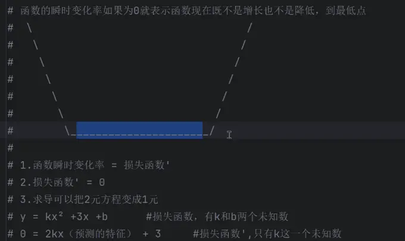

总结：
#### 3.机器学习中的数据表述

>标量：常量，有大小无方向
>
>向量：有大小有方向
>
>矩阵：二位数组
>
>张量：数组

#### 4.求导
>偏导：各求各的
>
>•U是关于x、y、z的函数，记为u(x, y, z)，只在x分量上求导，则为求偏导。
>
>•各个分量上求偏导，会形成一个向量(∂u/∂x, ∂u/∂y, ∂u/∂z ),这就组成了导数

#### 5.线性回归的实现原理

>1.线性回归方程，通过样本x,y可以得到w,b,计算出预测值,对比预测值和真实值，发现有的样本不在拟合上，不一定要穿过所有样本点，但是要减小样本点与拟合之间的距离【找到线性回归最优解(直线)】
>
>2.预测值-真实值=误差 最小！
>
>损失函数(y=ak²+bk+c )就是衡量误差的函数->让误差变小，也就是损失函数最小值
>
>y=ak²+bk+c ->(kx1+b-170)²+(kx2+b-160) 把训练样本(x,y)带入回归方程再求误差的来的

#### 6.实现方法

##### 6.1正规方程法

一元线性方程：损失函数求导=0，求解

多元线性方程：损失函数求偏导，求解

缺点：不一定有解，如果矩阵不可逆

y=ak²+bk+c 的最小值 ->U抛物线，瞬时变化率为0时y是最小值->求导得到
##### 6.2梯度下降算法

1.梯度：指北针(梯度自带方向，一直为上升)
2.梯度是函数上升的方向，沿着梯度的反方向就是函数下降的方向
3.梯度下降公式

一次下降一点梯度，逐步向0靠近
梯度=损失函数求导

学习率范围：0.001~0.01（太小会梯度爆炸，太大会梯度震荡）

4.梯度下降过程
5.梯度下降分类

全梯度下井：取全部样本

随机梯度下降：取一个样本

**小批量梯度下降(常用)：**min-batch 取随机1-n样本

随机平均梯度下降算法：
6.总结

>w新=w旧-学习率*梯度(损失函数求导)
>
>w是抛物线上的位置 就是梯度，也就是U的某个点的瞬时变化率!
>
>梯度更新，那么损失函数求导也一直变化，一直在U上找最优点

### 2.3线性回归模型评估

>MSE 均方误差： (∑（预测值-实际值）²)/n
>
>MAE 平均绝对误差 :(∑|预测值-实际值|)/n
>
>RMSE 均方根误差: mse开根号  (∑（预测值-实际值）²)/n**0.5
>
>总结：RMSE>MAE，且RMSE和MAE无线接近，RMSE如果过大也是异常的表现，MSE大则放大误差

### 2.4拟合问题

#### 2.4.1过拟合(常用)

特征过多，需要删减无用的特征，通过**减少特征权重**的方式，而非直接删除

#### 2.4.2欠拟合

特征过少，需要增加特征（一般需要拉取新的特征，测试一般都是加平方、立方作为测试数据）

~~~python
x_train1=x.reshape(-1,1)
x_train2=x_train1**2
x_train3=x_train1**3
x_train4=x_train1**4
x_train5=x_train1**5
x_train6=x_train1**6
# hstack作用：[[1],[2]] [[3],[4]]-》[[1,3],[2,4]]
x_train=np.hstack([x_train1,x_train2,x_train3,x_train4,x_train5,x_train6])
~~~

#### 2.4.3正好拟合

#### 2.4.4解决过拟合方案-正则化-本质是特征

>损失函数中增加正则化项
>
>惩罚系数越大则权重调整幅度越大，减少对特征的影响
>
>i是下角标


>L1正则化 Lasso
>
>y=损失函数+∑|wi|*惩罚系数
>
>特点：会使得权重趋向于0，甚至等于0，可能废弃特征
>
>导包： from sklearn.linear_model import Lasso


>L2正则化 Ridge 岭回归
>
>y=损失函数+∑（wi）²*惩罚系数
>
>特点：会使得权重趋向于0，一般不等于0，纯粹降低特征权重
>
>导包： from sklearn.linear_model import Ridge

### 2.5总结？

┌─────────────────────────────────────────┐
│           线性回归算法                    │
├─────────────────────────────────────────┤
│                                         │
│  1. 模型 (假设函数)                      │
│     y_pred = wx + b                     │
│         ↓                               │
│  2. 损失函数 (衡量标准)                  │
│     J(w,b) = (1/2m)Σ(y - y_pred)²      │
│         ↓                               │
│  3. 优化算法 (求解方法)                  │
│     梯度下降：w = w - α·∂J/∂w          │
│         ↓                               │
│  4. 最优解                              │
│     找到使 J(w,b) 最小的 w 和 b         │
│                                         │
└─────────────────────────────────────────┘

>假设了真实数据使用线性回归方程表示，结果发现和真实数据不一致，如果真实数据是抛物线，则会欠拟合 ，通过增加新特征的方式去解决欠拟合，刚好就是刚好拟合，如果加的太多了，就是过拟合
>
>因为真实数据是不可控的！！

## 3.KNN算法-分类问题

### 3.1.概念

K近邻算法，选出距离当前数据最近的K的样本

思想：如果一个样本在特征空间中的 k 个最相似的样本中的大多数属于某一个类别，则该样本也属于这个类别

K值过小过拟合，过大欠拟合

### 3.2分类

基于K个样本进行标签的投票，票数最多的就代表我的特征

~~~python
from sklearn.neighbors import KNeighborsClassifier
# 思想：分类问题-预测特征和训练特征之间获取欧式距离（x1-x2 y1-y2 平方开跟 勾股定理），预测的找最近5个欧式距离，投票出结果

# 1.准备数据
x=[[39,0,31],[3,2,65],[2,3,55],[9,38,2],[8,34,17],[5,2,57],[39,0,31],[21,17,5],[45,2,9]]

# 标签
y=['喜剧片','动作片','动作片','爱情片','爱情片','动作片','喜剧片','喜剧片','喜剧片']

# 2.训练模型
# k值得定义默认5!!! 奇数，2的话因为数据少会有50%概率是喜剧
model=KNeighborsClassifier(n_neighbors=5)
model.fit(x,y)

# 3.预测
print(model.predict([[23,3,17]]))
~~~

### 3.3回归

基于K个样本进行标签的统计，求平均值代表我的标签

~~~python
# 思想：算平均值
from sklearn.neighbors import KNeighborsRegressor
# 1.准备数据
x=[[39,0,31],[3,2,65],[2,3,55],[9,38,2],[8,34,17],[5,2,57],[39,0,31],[21,17,5],[45,2,9]]
# 标签（连续的值）
y=[4.9,5.1,5.2,5.5,5.8,6.1,4.9,5.6,6.2] # 电源评分
# 2.训练模型
model=KNeighborsRegressor(n_neighbors=3)
model.fit(x,y)
# 3.预测
print(model.predict([[23, 3, 17]]))
~~~

### 3.4特征工程-特征预处理

解决特征工程的纲量问题(单位问题)

#### 3.4.1归一化MinMaxScaler

公式=（当前特征-特征最小值）/ (特征最大值-特征最小值)

缺点：最大值、最小值的异常会影响当前特征

~~~python
from sklearn.preprocessing import MinMaxScaler
# 1.准备数据
data=[[90,2,10,40],[60,4,15,45],[75,3,13,46]]
# 按列找到特征最大、特征最小
# 2.模型训练
scaler=MinMaxScaler()
new_data=scaler.fit_transform(data) # 没有标准，所以需要先训练再使用！！！
print(new_data)

# 总结
# 归一化依赖最大值、最小值，如果最大值和最小值有异常数据，那么这一列特征将失去参考价值
~~~

#### 3.4.2标准化 StandardScaler

公式=（当前特征-特征平均值）/标准差

标准差=方差**0.5

方差=Σ求和(当前特征-平均值)²/n

~~~python
import numpy as np
from sklearn.preprocessing import StandardScaler
# 手搓
l1=[1,2,3,4,5,6]
l2=[[1,2,3,4,5,6],[21,23,33,45,52,69]]
# 平均值
avg=sum(l1)/len(l1)
# 标准差
sigma_val=(sum([(i-avg)**2  for i in l1])/len(l1))**0.5
# 列表推导式
print([(i - avg) / sigma_val for i in l1])

# api接口
scaler1=StandardScaler()
scaler2=StandardScaler()
new_data1=scaler1.fit_transform(np.array(l1).reshape(-1,1)) # 一维
new_data2=scaler2.fit_transform(l2) # 两行数据求得值不变！！使用三行数据
print(new_data1)
print(new_data2)
~~~

#### 3.4.3鸢尾花案例

>注意点！！！
>
>1.分类问题模型验证+评估方式有两种-准确率
>
>方法一： model自己评估 model.score(x_test,y_test)
>
>方法二：accuracy_score(y_test,y_pre)
>
>2.model.predict_proba()
>
>输出样本属于各个类别的概率值(或置信度)
>
>3.模型预测
>
>可以自己创造数据进行预测
>
>注意x数据要进行标准化！

~~~python
from sklearn.datasets import load_iris
import matplotlib.pyplot as plt
import pandas as pd
from sklearn.metrics import accuracy_score # 模型预测
from sklearn.model_selection import train_test_split # 数据预处理
from sklearn.preprocessing import StandardScaler # 特征预处理-标准化
from sklearn.neighbors import KNeighborsClassifier

# 1.获取数据
datasets=load_iris()
# datas是字典
# {'data':array([],[]) 'target':array([]) 'target_names':array(['','','']),'feature_names':[''] }
# print(datas)

def get_data():
    print(f'特征数据: {datasets.data[:5]}')
    print(f'标签: {datasets.target[:5]}')
    print(f'特征名称: {datasets.target_names}')
    print(f'标签名称: {datasets.data.feature_names}')


def get_draw():
    # 1.处理数据 使用dataframe 特征数据+名称拼接在一起 + 列（标签+名称）
    df_data=pd.DataFrame(datasets.data,columns=datasets.feature_names)
    df_data['target']=datasets.target
    # print(df_data)
    # 2.绘制散点图 plot绘制三次 每次颜色不一样
    colors=['red','blue','green']
    # # 为0类型的x和y  还有1和2类型的
    # df_x=df_data.query('target==0')[datas.feature_names[0]]
    # df_y=df_data.query('target==0')[datas.feature_names[3]]
    # print(df_x)

    # (1)设置画板
    plt.figure(figsize=(10,10))
    # (2)设置x y和颜色 使用散点图
    for i in range(len(colors)):
        df_x=df_data.query(f'target=={i}')[datasets.feature_names[0]]
        df_y=df_data.query(f'target=={i}')[datasets.feature_names[3]]
        # 绘制
        plt.scatter(df_x,df_y,color=colors[i])
    # (3)加标签
    plt.title('iris')
    plt.xlabel(f'{datasets.feature_names[0]}')
    plt.ylabel(f'{datasets.feature_names[3]}')
    # 设置散点说明
    plt.legend(datasets.feature_names)
    # (4)展示
    plt.show()

## 机器建模
def predict():
    # 2.数据预处理
    # random_state 随机种子 固定的话每次划分的数据都不变
    x_train,x_test,y_train,y_test=train_test_split(datasets.data,datasets.target,test_size=0.2,random_state=3)
    # 3.特征工程
    # 特征预处理 统一单位
    transfer=StandardScaler()
    # 先训练给个标准 再转换
    x_train=transfer.fit_transform(x_train)
    x_test=transfer.transform(x_test)
    # 4.模型训练
    # 分类
    model=KNeighborsClassifier(n_neighbors=5) # 问题：k是几比较好？
    model.fit(x_train,y_train) # 模型训练结束了

    # 5.1 模型验证+评估--正确率
    # model自身评分 x_test y_test 输入后自己预测自己对比 得到准确率
    print(model.score(x_test, y_test))
    print(model.predict_proba(x_test)) # 问题2：正确率一条就能评估模型的好坏吗？
    # 5.2 模型验证+评估
    # x_test是要预测的特征，y_pre是模型要预测的标签结果,y_test是真实结果
    y_pre=model.predict(x_test)
    print(accuracy_score(y_test, y_pre))
    # 5.3模型预测（自己准备的数据x,y）
    # 仿照数据集编写
    test_xdata=[[4.2,1.0,1.1,0.1]]
    test_ydata=[0]
    # 准备数据进行标准化!!!
    test_xdata=transfer.transform(test_xdata)
    y_predata=model.predict(test_xdata)
    print(y_predata)


if __name__ == '__main__':
    # 1.查看数据
    get_data()
    # 2.绘制数据
    get_draw()
    # 3.模型预测
    predict()
~~~


### 3.5超参数选择方法

#### 3.5.1交叉验证+网格搜索

（1）交叉验证：数据集的划分，将训练集划分成cv份，分了几次就训练几次，将这几次的结果求平均值来表示模型的能力

>数据集的划分-> 划分的折数cv=4 ->4折验证->分了几折就会训练几次，最后取平均值

比如：cv=4 划分的折数->四折验证

第一次(第一份是验证集，其余3份是训练集,进行训练+评估)

第二次(第二份是验证集，其余3份是训练集,进行训练+评估)

第三次(第三份是验证集，其余3份是训练集,进行训练+评估)

第四次(第四份是验证集，其余3份是训练集,进行训练+评估)

（2）网格搜索：只做最优超参的选择，多个K选择交叉验证结果最好的那个

比如：K=3，N=4

K=1时，划分4份，每份进行训练+评估，得到对应的结果取平均值k1

K=2时，划分4份，每份进行训练+评估，得到对应的结果取平均值k2

K=3时，划分4份，每份进行训练+评估，得到对应的结果取平均值k3

比较K1、K2、K3取最大的，选择对应的k

（3）若K=3模型得分最好，则再使用全部训练集(训练集+验证集)对k=3模型再训练一遍，再使用测试集对K=3模型做评估（model.fit）
#### 3.5.2 交叉验证网格搜索API

>1.导包
>
>from sklearn.model_selection import GridSearchCV
>
>2.API接口
>
>new_model=GridSearchCV(estimator=纯净的模型,param_grid={'n_neighbors':[i for i in range(1,8)]},cv=4)
>
>传入纯净的模型、k值、折数，返回的是具有最优超参能力的模型

~~~python
from sklearn.datasets import load_iris
from sklearn.model_selection import train_test_split,GridSearchCV
from sklearn.preprocessing import StandardScaler
from sklearn.neighbors import KNeighborsClassifier
from sklearn.metrics import accuracy_score #预测 评估
# 1.准备数据
datasets=load_iris()
# 2.数据预处理
x_train,x_test,y_train,y_test=train_test_split(datasets.data,datasets.target,test_size=0.2)
# 3.特征工程
scaler=StandardScaler()
x_train=scaler.fit_transform(x_train)
x_test=scaler.transform(x_test)
# 4.模型训练
model=KNeighborsClassifier() # 纯净模型

# cv交叉+pg网格
new_model=GridSearchCV(estimator=model,param_grid={'n_neighbors':[i for i in range(1,8)]},cv=4)
# 新模型训练
new_model.fit(x_train,y_train) # 使用全部训练集

# 预测 2种方式
print(new_model.score(x_test, y_test))
y_pre=new_model.predict(x_test)
print(accuracy_score(y_pre, y_test)) # 准确率 正确/全部

# 结果展示
print('最高分：',new_model.best_score_) # 最高分 交叉验证最好的结果
print('超参:',new_model.best_params_) # 最优超参
print('模型：',new_model.best_estimator_) # 最优模型
print('cv结果:',new_model.cv_results_) # cv结果
~~~

### 3.6分类问题评估

#### 3.6.1 混淆矩阵

>​                           预测： 正positive      反例Negative
>
>真实-正True                    猜对正TP               FN
>
>真实-反False                           FP                 猜对反TN


>正例真实数据=TP+FN
>
>反例真实数据=FP+TN

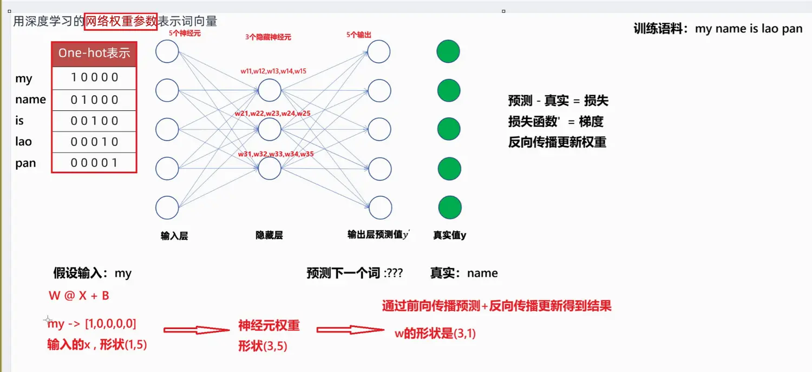

T和F看作猜对和猜错！！

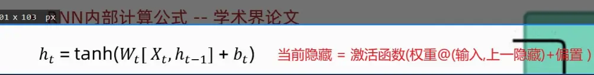

#### 3.6.2分类算法评估标准！

>混淆矩阵： confusion_matrix(真实数据,预测数据,label=[正例,反例])
>
>准确率：猜对的/全部的
>
>精确率： 猜对正样本/猜测的样本=TP/(TP+FP)               --查准不准
>
>召回率：  猜对正样本/真实的样本=TP/(TP+FN)              --查全不全
>
>F1-score:  2* 精准率 *召回率/(精准率+召回率)              --综合指标平衡精确和召回

>**简易描述：**
>
>准确率 = （猜对的正样本 + 猜对的负样本） / 总样本数
>
>精确率 = 猜对正样本 / 猜正样本的总数（猜的里面有多少是对的）
>召回率 = 猜对正样本 / 实际正样本的总数（实际的里面猜中了多少）
>
>eg:
>
>100个样本,正样本60个,负样本40个 猜测是否是苹果
>
>结果：猜测正、负样本各50个，正样本猜对了40个， 猜错了10个，负样本猜对30个猜对了(50-(60-40))，20个猜错了
>
>准确率：7/10
>
>精确率：4/5
>
>召回率：4/6

~~~python
from sklearn.metrics import confusion_matrix # 混淆矩阵
from sklearn.metrics import accuracy_score # 准确率
from sklearn.metrics import recall_score # 召回率
from sklearn.metrics import precision_score # 精确率
from sklearn.metrics import f1_score # 衡量精确率和召回率
y_true = ['恶', '恶', '恶', '恶', '恶','恶', '良', '良', '良', '良'] # 6 4
y_pre1=['恶', '恶', '恶','良', '良', '良', '良','良', '良', '良'] # 3 7
y_pre2=['恶', '恶', '恶','恶', '恶', '恶', '恶', '恶', '恶', '良'] # 9 1

print(confusion_matrix(y_true,y_pre1,labels=['恶','良']))
print(confusion_matrix(y_true, y_pre2, labels=['恶', '良']))

print('混淆矩阵：',confusion_matrix(y_true,y_pre1,labels=['恶','良']))
print('准确率: ',accuracy_score(y_true,y_pre1))
print('精确率：',precision_score(y_true,y_pre1,pos_label='恶'))
print('召回率：',recall_score(y_true,y_pre1,pos_label='恶'))
print('F1-score: ',f1_score(y_true,y_pre1,pos_label='恶'))

print('混淆矩阵：',confusion_matrix(y_true,y_pre2,labels=['恶','良']))
print('准确率: ',accuracy_score(y_true,y_pre2))
print('精确率：',precision_score(y_true,y_pre2,pos_label='恶'))
print('召回率：',recall_score(y_true,y_pre2,pos_label='恶'))
print('F1-score: ',f1_score(y_true,y_pre2,pos_label='恶'))
~~~

## 4.决策树-分类问题

### 4.1构建决策树的流程

>1.强制二分
>
>分类问题：是xx/不是xx
>
>回归问题: x>=30/x<30
>
>2.选择有价值的指标
>
>判断指标(特征)是否有价值
>
>（1）基尼值 ，越小代表越好越有价值
>
>gini值=2(p正)（1-P正）
>
>（2）信息增益商-了解
>
>信息增益商= (p正*n正)+（p反 *n反）/（n正+n反）
>
>3.重复1，重复逐层划分
>
>4.剪枝
>
>为了防止过拟合，设置最大层数，设置叶子节点的数量，设置分叶的最小数量
### 4.2解决分类问题

>1.API接口
>
>model=DecisionTreeClassifier()
>
>2.独热编码one-hot
>
>让字符串转为布尔值(一个数值)
>
>通过 新数据=pandas.get_dummies(数据)
>
>eg:sex = ['male','female']   ->   sex_male =[True,False]  ,  sex_female = [True,False]

~~~python
import pandas as pd
from sklearn.model_selection import train_test_split
from sklearn.tree import DecisionTreeClassifier,plot_tree
from sklearn.metrics import accuracy_score,f1_score,recall_score,precision_score,classification_report
import matplotlib.pyplot as plt
# 1.准备数据
df=pd.read_csv('./titanic_train.csv',sep=',',encoding='utf-8')
# # print(df)
# print(df.head(5))
# # 详细信息 行列解读 得到age的数据有异常部分没有
# df.info()

# 2. 数据预处理
# 2.1数据清洗
# 选取有用的特征
x=df[['Pclass','Sex','Age']]
x=x.copy() # 防止修改时的警告！！
# 标签
y=df['Survived']
# 处理Age异常
x['Age'].fillna(x['Age'].mean(),inplace=True)
# sex数据为英文字符串 转为布尔值(转成一个数值)
# (独)热编码 one-hot get_dummies
x_new=pd.get_dummies(x)
print(x_new)

# 2.2数据划分
x_train,x_test,y_train,y_test=train_test_split(x_new,y,test_size=0.2)
# 3.特征工程（暂时不需要）
# 4.模型训练
model=DecisionTreeClassifier() # max_depth限制树的增长
model.fit(x_train,y_train)
# 5.模型预测
y_pre=model.predict(x_test)
# 6.模型评估
print(accuracy_score(y_pre,y_test))
print(precision_score(y_pre,y_test,pos_label=1)) # 1生存
print(recall_score(y_pre,y_test,pos_label=1))
print(f1_score(y_pre,y_test,pos_label=1))
# 分类问题报告
print(classification_report(y_test,y_pre))

# 决策数的绘制
# 设置画板
plt.figure(figsize=(50,50))
plot_tree(model,max_depth=5, filled=True) # 不要绘制太多层
# 将绘制的内容保存成一张图片
plt.savefig('./titanic.png')

~~~

### 4.3解决回归问题

>决策树CART :classification and regression tree
>
>from sklearn.tree import DecisionTreeRegressor
>
>model=DecisionTreeRegressor(max_depth=层数)
>
>评估指标：mse mae rmse

~~~python
# 波士顿房价预测 案例
import pandas as pd
import numpy as np
from sklearn.model_selection import train_test_split
from sklearn.preprocessing import StandardScaler
from sklearn.tree import DecisionTreeRegressor
from sklearn.metrics import mean_squared_error,mean_absolute_error,root_mean_squared_error

# 1.准备数据(506行-样本，13列-特征)
# 1.1数据需要实例化
# data_url = "http://lib.stat.cmu.edu/datasets/boston"
raw_df = pd.read_csv('./Boston.txt', sep="\s+", skiprows=22, header=None)
# 样本506行
data = np.hstack([raw_df.values[::2, :], raw_df.values[1::2, :2]])
# 标签：一列预测的数据
target = raw_df.values[1::2, 2]
print(data[:5])
# print(target[:5])
print(data.shape) # 形状

# 2.数据预处理
x_train,x_test,y_train,y_test=train_test_split(data,target,test_size=0.2)

# 3.特征工程
#  标准化
scaler=StandardScaler()
x_train=scaler.fit_transform(x_train)
x_test=scaler.transform(x_test)

# 4.模型训练
model=DecisionTreeRegressor()
model.fit(x_train,y_train)

# 5.模型预测
# 预测值
y_pre=model.predict(x_test)

# 6.模型评估 mse rmse mae
# 真实值-预测值 rmse>mae
print('mse:',mean_squared_error(y_test,y_pre))
print('mae:',mean_absolute_error(y_test,y_pre))
print('rmse:',root_mean_squared_error(y_test,y_pre))

~~~

### 4.4剪枝

>作用：防止过拟合
>
>预剪枝：边划分边计算，若当前节点的划分后泛化性能提升，则停止划分并将当前节点标记为叶节点
>
>后剪枝：生成完成后，自底向上对非叶子节点进行排查，若该节点对应的自述替换为叶子节点能带来决策树泛化性能提升，则将该子树替换为叶节点

## 5.集成学习-随机森林

>集成学习：多个模型(弱学习器)组合成一个高精度模型
>
>分类：
>
>​          Bagging: **随机森林(默认多个决策树)**
>
>​                           1.有放回的抽样(训练集有交集和差集) -随机选数据和选特征
>
>​						   2.并行
>
>​						   3.平权投票/平均票
>
>​		  Boosting:Adaboost、GBDT
>
>​						   1.每个弱学习器都是基于上一个学习器的问题强化训练
>
>​						    2.串行
>
>​						    3.加权投票/加权平均(权重系数不同)

>**随机森林API**
>
>from sklearn.ensemble import RandomForsetClassifier
>
>RandomForsetClassifier(n_estimators,max_depth)
>
>参数：
>
>​				n_estimators: 决策树数量，默认10
>
>​			     Criterion : 判断最佳节点的算法 gini(默认)、entropy
>
>​				max_depth：树的最大深度

~~~python
# 泰坦尼克号生存预测
# 决策树 随机森林 随机森林超参优化
import pandas as pd
from sklearn.model_selection import train_test_split,GridSearchCV
from sklearn.tree import DecisionTreeClassifier
from sklearn.ensemble import RandomForestClassifier
from sklearn.metrics import f1_score,accuracy_score,precision_score,recall_score
# 1.准备数据
datas=pd.read_csv('./titanic_train.csv',sep=',',encoding='utf-8')
# print(datas.info())
# 2.数据预处理
# 2.1 清洗数据
x=datas[['Pclass','Sex','Age']]
x=x.copy() # 防止警告
y=datas['Survived']
# 处理age异常
x['Age'].fillna(x['Age'].mean(),inplace=True)
# 独热编码 sex转数值
x_new=pd.get_dummies(x)
# print(x_new)
# 2.2 数据划分
x_train,x_test,y_train,y_tset=train_test_split(x_new,y,test_size=0.2)
# 3.特征工程(暂时不需要)

# 4.模型训练+预测
# 4.1 决策树
# random_state固定随机种子 让每次数据集一致
model1=DecisionTreeClassifier(random_state=3)
model1.fit(x_train,y_train)
y_pre1=model1.predict(x_test)
# 4.2 随机森林
model2=RandomForestClassifier(random_state=3)
model2.fit(x_train,y_train)
y_pre2=model2.predict(x_test)
# 4.3 随机森林(超参优化)
model3=RandomForestClassifier(random_state=3)
# None表示无限增长
new_model=GridSearchCV(estimator=model3,param_grid={'n_estimators':[10,30,50],'max_depth':[6,8,10,None]},cv=4)
new_model.fit(x_train,y_train)
y_pre3=new_model.predict(x_test)

# 5.模型评估-准确率 精准率 召回率 f1sore
print(f'model1准确率：{accuracy_score(y_tset,y_pre1)}')
print(f'model1精准率：{precision_score(y_tset,y_pre1,pos_label=1)}')
print(f'model1召回率：{recall_score(y_tset,y_pre1,pos_label=1)}')
print(f'model1-f1sore：{f1_score(y_tset,y_pre1,pos_label=1)}')
print('\n')

print(f'model2准确率：{accuracy_score(y_tset,y_pre2)}')
print(f'model2精准率：{precision_score(y_tset,y_pre2,pos_label=1)}')
print(f'model2召回率：{recall_score(y_tset,y_pre2,pos_label=1)}')
print(f'model2-f1sore：{f1_score(y_tset,y_pre2,pos_label=1)}')
print('\n')

print(f'model3准确率：{accuracy_score(y_tset,y_pre3)}')
print(f'model3精准率：{precision_score(y_tset,y_pre3,pos_label=1)}')
print(f'model3召回率：{recall_score(y_tset,y_pre3,pos_label=1)}')
print(f'model3-f1sore：{f1_score(y_tset,y_pre3,pos_label=1)}')
print(f'最优参数：{new_model.best_params_}')
~~~


## 6.聚类算法KMeans-聚类问题

>聚类算法->只有特征，没有标签->无监督学习->解决聚类问题
>
>
>
>**KMeans执行流程：**
>
>1.先确定当前分的簇的数量K
>
>2.随机取K个样本作为簇心
>
>3.计算每个样本到簇心的距离，取最小的距离作为自己的分类
>
>4.重新计算当前簇的簇心
>
>5.重复3，4步，直到新的簇心位置和上一个簇心的位置相同，停止
>
>
>
>**评估指标(通过下属方法找到最合适的簇数K)：**
>
>SSE肘部法:每簇每个样本到簇心的距离(欧氏距离|p=m|²)  sse值越小聚类效果越好、图中拐点就是最优的K(一般周围几个点都要测试一下)
>
>SC轮廓系数
>
>CH轮廓系数:簇间分散度/簇内聚合度=簇心之间距离/簇心样本与簇心的距离->结果越大越好


>客户用户画像划分案例流程：
>
>1.先明确当前的数据需要分为几个簇
>
>2.按照指定的簇数，将数据进行分类
>
>接口API:
>
>from sklearn.cluster import KMeans
>
>KMeans(n_clusters=簇数,random_state=随机种子每次训练集固定)

~~~python
难点：布尔索引
import numpy as np
arr = np.array([4,3,4,2,0,1])  #预测的簇
print(arr-5) #加减运算
print(arr>5) #比较运算-布尔值->布尔索引
print(arr[arr>5])  #布尔索引可以起到筛选作用,只保留布尔值为True的内容
print(arr==0) #找出索引为0的簇的布尔索引
print(data[arr==0]) #利用布尔索引去原数据中做筛选，筛选出的就是索引为0的坐标
~~~

~~~python
import os

os.environ['OMP_NUM_THREADS'] = '1'
import pandas as pd
import matplotlib.pyplot as plt
from sklearn.cluster import KMeans
from sklearn.metrics import silhouette_score, calinski_harabasz_score

# 1.准备数据
df = pd.read_csv('customers.csv', sep=',')
# print(df.head())


def find_best_k():
    # 2.找最优划分簇的数量
    x = df.values[:, [3, 4]]  # 所有行 ，指定列
    # 参考价值：sse肘方法 sc轮廓系数法 ch轮廓系数法
    sse_list = []
    sc_list = []
    ch_list = []

    # 划分簇在2~20之间找最优的
    for i in range(2, 20):
        model = KMeans(n_clusters=i, random_state=3)
        # 训练+预测
        pre = model.fit_predict(x) #模型预测得到的是分类！！！
        # sse_list.append(model.inertia_) # 获取sse

        # sc=silhouette_score(x,pre)
        # sc_list.append(sc)
        #
        # ch轮廓系数会无线增长，参考价值较小
        ch = calinski_harabasz_score(x, pre)
        ch_list.append(ch)

    # 绘制
    # plt.scatter(range(2,20),sse_list)
    # plt.scatter(range(2,20),sc_list)
    plt.scatter(range(2, 20), ch_list)
    plt.xticks(range(2, 20))
    plt.show()
    # 最优划分簇数为5


x=df.values[:,[3,4]]
model=KMeans(n_clusters=5,random_state=3)
pre=model.fit_predict(x)
# 单次绘制没办法绘制图例
plt.scatter(x[:,0],x[:,1],c=pre) # 颜色是分类
colors=['r','b','g','c','m']
targets=['Standard','Traditional','Normal','Youth','TA']
# print(x[:5]) # 前5条数据
# print(pre[:5])
# print(pre==4) # 1.布尔值，作为索引去特征里面筛选数据
# print(x[pre==4]) # 2.从x数据取出布尔索引作为True,取出索引为4的簇的所有数据
# print(x[pre==4][:,0]) # 3.要绘制的x坐标
# print(x[pre==4][:,1]) # 4.要绘制的y坐标
# 总结： x[pre==4] 其实是行数一样，刚好可以对应起来，可以作为索引进行筛选--布尔索引

# print(model.cluster_centers_) # 当前所有簇心

# 绘制样本数据
for i in range(len(targets)):
    plt.scatter(x[pre==i][:,0],x[pre==i][:,1],label=targets[i],c=colors[i])

# 绘制簇心 s为大小 label是说明
plt.scatter(model.cluster_centers_[:,0],model.cluster_centers_[:,1],s=100,c='black',label='centroids')
plt.legend()
plt.title('c of customers')
plt.xlabel('money($)')
plt.ylabel('pay %')
plt.show()
~~~

# 二、深度学习-ANN

## Pytorch

>**什么是pytorch？**
>
>基于python语言的深度学习框架，将数据转为张量tensor进行处理
>
>提供工具，用于构建、训练和部署机器学习和深度学习模型

## 1.API

### 1.1创建张量

>import torch
>
>**(1)tensor**
>
>通过数据创建-0维张量、1维张量、2维张量
>
>默认类型int64
>
>(2)Tensor
>
>通过数据、维度(形状)去创建
>
>默认类型float32
>
>(3)IntTensor、FloatTensor
>通过指定类型创建，支持数据、维度

>Int16 Int32 Int64
>
>torch.ShortTensor()
>
>torch.IntTensor() 最多
>
>torch.LongTensor(0)
>
>
>
>Float16 Float32 Float64
>
>torch.HalfTensor()
>
>torch.FloatTensor()
>
>torch.DoubleTensor()

~~~python
import torch
import numpy as np

# print(torch.__version__) # 获取版本

# 1.tensor 数据（掌握！！！） 默认类型 int64
# 1.1 多种维度的张量
# 0维张量-标量 1维张量-数组/列表 2维张量-矩阵
t1=torch.tensor(10)
print(f't1:{t1}')
print(f't1类型:{t1.dtype}')

t2=torch.tensor([1,2,3])
print(f't2:{t2}')
print(f't2类型:{t2.dtype}')

t3=torch.tensor([[1,2,3],[1,2,3]])
print(f't3:{t3}')
print(f't3类型:{t3.dtype}')
# 1.2 基于numpy和列表创建
data=np.random.randn(2,3) # 2行3列
t4=torch.tensor(data)
print(f't4:{t3}')
print(f't4类型:{t4.dtype}')# float64 根据数据产生的
# 1.3 指定维度创建张量
# t5=torch.tensor(2,3)
# print(t5) # 报错

# 2.Tensor 数据(列表,np)+形状(数字) 默认类型float32
# 2.1 多种维度的张量
t6=torch.Tensor(10) # 一行10列 是一维张量非0维张量
# t11=torch.Tensor(10,1) #10行一列
print(f't6:{t6}')
print(f't6类型:{t6.dtype}')
t7=torch.Tensor([1,2,3])
print(f't7:{t7}')
print(f't7类型:{t7.dtype}')
t8=torch.Tensor([[1,2,3],[1,2,3]])
print(f't8:{t8}')
print(f't8类型:{t8.dtype}')
# 2.2 基于numpy和列表创建
data=np.random.randn(2,3)
t9=torch.Tensor(data)
print(f't9:{t9}')
print(f't9类型:{t9.dtype}')
# 2.3 指定维度创建张量(不报错)
t10=torch.Tensor(2,3)
print(f't10:{t10}')
print(f't10类型:{t10.dtype}')

# 总结：
# tensor 数据           默认类型int64
# Tensor 数据(列表或数组)+维度(形状) 默认类型float32 如果传入的是0维张量那么会默认是一行N列的一维数组

# 3.通过指定类型创建：既支持形状，又支持数据
# 3.1 IntTensor int32
tt1=torch.IntTensor(2,3)
# 如果类型不对会自动进行类型转换
d1=torch.IntTensor([1,2.1])
print(f'tt1:{tt1}')
print(f'tt1类型:{tt1.dtype}')
print(f'tt1形状:{tt1.shape}')
print(f'd1:{d1}') #[1, 2]
print(f'd1类型:{d1.dtype}')
print(f'd1形状:{d1.shape}')

# 3.2 FloatTensor float32
tt2=torch.FloatTensor(2,3) # 2行3列
print(f'tt2:{tt2}')
print(f'tt2类型:{tt2.dtype}')
print(f'tt2形状:{tt2.shape}')
# 3.3 DoubleTensor float64
tt3=torch.DoubleTensor(2,3)
print(f'tt3:{tt3}')
print(f'tt3类型:{tt3.dtype}')
print(f'tt3形状:{tt3.shape}')

tt4=torch.DoubleTensor(2)
print(f'tt4:{tt4}') # [0.,0.]float64

# Int16 32 64
# torch.ShortTensor Int16
# torch.IntTensor Int32(最多)
# torch.LongTensor In64

# Float16 32 64
# torch.HalfTensor Float16
# torch.FloatTensor Float32(最多)
# torch.DoubleTensor Float64
~~~

### 1.2张量的区间划分

>arange(开始,终止,步长) 按步长划分，包头不包尾
>
>linspace(开始,终止,分几份) 按均匀划分，包头包尾
>
>注意：划分的时候，开始和终止各占一份

~~~python
import torch

# arange(起始,终止,步长) 区间步长划分 包头不包尾(重点)
t1 = torch.arange(0, 10)
t2 = torch.arange(0, 5, 2)
print(t1)
print(t1.dtype)  # int64
print(t2)
print(t2.dtype)

# linspace(起始,结束，分成几份) 区间均分划分 包头包尾
# 注意 划分的时候起始和终止各算一份！
t3 = torch.linspace(0, 5, 5)
t4 = torch.linspace(0, 5, 2)
print(t3)  # [0.0000, 1.2500, 2.5000, 3.7500, 5.0000]
print(t3.dtype)  # f loat32
print(t4)
print(t4.dtype)  # f loat32
~~~

### 1.3随机张量

>1.随机种子：
>
>查看 initial_seed()
>
>设置 manual_seed(种子)
>
>2.随机浮点数
>
>0-1 torch.rand(size=(2,3)) size为形状
>
>-3~3 torch.randn(size=(2,3))
>
>3.随机整数
>
>torch.randint(起点,结束,size=(2,3)) 包头不包尾

~~~python
import torch

# 1.查看随机种子（修改前）
print(torch.random.initial_seed())

# 2.设置随机种子
torch.random.manual_seed(460985711298300)
print(torch.random.initial_seed()) # 修改后

# 3.创建随机浮点数类型张量(0~1\正态分布-3~3)
t1=torch.rand(2,3) # 形状
print(t1)
print(f't1类型：{t1.dtype}')
print(f't1形状：{t1.shape}')

t2=torch.randn(2,3)
print(t2)
print(f't2类型：{t2.dtype}')
print(f't2形状：{t2.shape}')

# 4.创建随机整数类型张量
t3=torch.randint(0,10,(2,3)) # 起始 终止 形状 包头不包尾
print(t3)
print(f't3类型：{t3.dtype}')
print(f't3形状：{t3.shape}')

# 总结
# 1.会使用、设置和还原 随机种子
# 2.会随机浮点(0-1 -3~3)，整数类型张量
~~~

### 1.4特殊张量

>1.全0：通过形状、数据的方式创建
>
>torch.zeros(size=(2,3))
>
>data=torch.tensor([[1,2],[1,2]])
>
>torch.zeros_like(data) # 传输数据必须为tensor对象，仿照对象形状
>
>2.全1：通过形状、数据的方式创建
>
>torch.ones((size=2,3))
>
>torch.ones_like(data) # 仿照tensor对象形状，2行2列

~~~python
import torch
# 1.全0：形状、数据
t1=torch.zeros(2,3)
print(f"t1:",t1)
data=torch.tensor([[1,2],[3,4],[5,6]]) # 3行2列
# 需要传入具体的数据，仿照传入数据的类型进行生成
t2=torch.zeros_like(data)
print(f't2:',t2)
# 2.全1：形状、数据
t4=torch.ones(2,3)
print(f't4:',t4)
t5=torch.ones_like(data)
print(f't5:',t5)
t6=torch.ones_like(torch.tensor([[1,2],[1,2]]))
print(t6)
~~~

### 1.5创建指定张量

>full(形状，填充值)  按形状创建 形状->size\tuple\list
>
>full_like(张量，填充值) 按数据张量创建

~~~python
import torch
# torch.full(形状，填充值)
t1=torch.full((2,3),10)
print('t1:',t1)
# torch.full_like(张量,填充值)
data=torch.tensor([[1,2,3],[2,3,4],[3,4,5]])
t2=torch.full_like(data,10)
print('t2:',t2)

# 也可以全0全1
t3=torch.full((2,3),0)
t4=torch.full((2,3),1)

# 拓展 均是形状填充
# 1.tuple
t5=torch.full((2,3),5)
# 2.list(列表)
t6=torch.full([2,3],5) # 2行2列
print('t6:',t6)
# 3.Size
t7=torch.full(data.size(),5)
print('t7:',t7)
~~~

### 1.6数据类型转换

>1.type方式转换
>
>data.type(torch.指定的类型) int16\int32\float16\float64..
>
>data.type(torch.IntTensor)  了解即可
>
>2.指定函数名转换 half\float\double short\int\long
>
>data.half() data.int() 了解即可

~~~python
import torch

data=torch.tensor([[1,2,3],[4,5,6],[7,8,9]])
print(data.dtype)
# 1.type方式转换
# int16(推荐这种)
data=data.type(torch.int16)
print(data.dtype)
# float32
data=data.type(torch.float32)
print(data.dtype)
# int32
data=data.type(torch.IntTensor)
print(data.dtype)

# 2.指定函数名转换
# int 16 32 64 / short int long
# float 16 32 64/ half float double
data=data.double()
print(data.dtype) # 64
~~~

### 1.7tensor与numpy互相转换

>1.tensor转numpy 共享
>
>data=torch.tensor([[1,2],[1,2]])
>
>**n=data.numpy()**
>
>2.tensor转numpy 不共享copy
>
>data=torch.tensor([[1,2],[1,2]])
>
>**n=data.numpy().copy()**
>
>3.numpy转tensor 共享
>
>n=np.array([1,2])
>
>**d=torch.from_numpy(n)**
>
>4.numpy转tensor 不共享
>
>(1)copy
>
>n=np.array([1,2])
>
>**d=torch.from_numpy(n.copy())**
>
>(2)重新创建一个tensor张量
>
>n=np.array([1,2])
>
>**d=torch.tensor(n)**  # 传递n的值
>
>5.如果张量只有一个元素可以通过item获取
>
>n=torch.tensor([1])
>
>print(n.item())

~~~python
import torch
import numpy as np
# 1.tensor->numpy 共享
data1=torch.tensor([[1,2,3],[2,3,4]])
n1=data1.numpy()
n1+=1
print(data1)
print(n1)

# 2.tensor->numpy 不共享
data2=torch.tensor([[1,2],[3,4],[4,5]])
n2=data2.numpy().copy()
n2+=1
print(data2)
print(n2)

# 3.numpy->tensor 将数组转为张量 共享
n3=np.arange(1,10,2)
t3=torch.from_numpy(n3)
t3+=1
print(n3)
print(t3)

# 4.numpy->tensor 不共享
# copy
n4=np.array([1,2])
t4=torch.from_numpy(n4.copy())
t4+=1
print(n4)
print(t4)
# 创建新的张量
t5=torch.tensor(n4) # 传递n4的值
t5+=1
print(n4)
print(t5)
# 6.如果张量只有一个元素可以通过item获取
t6=torch.tensor(10)
print(t6.item())
t7=torch.tensor([3])
print(t7.item())
t8=torch.item([1,2])
# print(t8.item())# 报错
~~~

### 1.8基本运算

>加+           减-        乘*         除/          负号*-1      **（掌握！！！）**
>
>add         sub       mul_       div_           neg_            t1.add(t2) # t2加到t1
>
>add_       sub_      mul_       div _          neg_           会修改原数据

~~~python
# 加减乘除 取负号
# +-*/
# add sub mul div neg

import torch

# 1.准备数据
data=torch.tensor([[-1,2],[2,3],[3,4]])

# 加法：加常数
t1=torch.tensor([[1,2],[2,3],[3,4]])
print(data+1)
# 加法：加tensor
print(t1.add(data))
# 把data加到t1上，并更新t1
t1.add_(data)
print('更新:',t1)

# 2.其他运算演示
print(data-t1)
print(data.sub(t1))
print(data*t1)
print(data.mul(t1))
print(data/t1)
print(data.div(t1))

# 3.取负号
print(data.neg())
print(data*-1)

# 掌握
# 1.+ - * /
# 2. pytorch中，所有带_都表示更新原数据

~~~

### 1.9点积和点乘

>**掌握**：@ ！！！！
>
>点乘：mul   *
>
>​           两个形状相同的张量相乘，每个位置相乘
>
>点积：matmul @
>
>​          1.前提：A列=B行
>
>​           2.过程：A行每个元素*B列的每个元素
>
>​           3.结果：A行B列

~~~python
import torch

# 1.点乘mul *
# 形状相同 每个位置进行相乘
t1=torch.tensor([[1,2],[2,3]])
t2=torch.tensor([[2,3],[3,4]])
print(t1*t2)
print(t1.mul(t2))

# 2.点积@ torch.matmul  掌握@！！！
# a@b 和b@a是两个东西
t3=torch.tensor([[1,2],[2,3],[3,4]])
# A列=B行才可以
print(t3@t2)
print(torch.matmul(t3,t2))

# 补充
# 取余
print(t3.fmod(2))
# 平方
print(t3.square())
# 带符号的全1
print(t3.sign())

~~~


### 1.10运算函数

>**掌握：**sum(dim)！！！！
>
>1.求和 sum(dim=维度)
>
>eg:
>
>[
>
>第0维 将下面括号内的（[]+[]）内容进行数据求和，合并成1条
>
>第1维 将下面每个括号里面的（[1+2+3]）内容进行数据求和，合并成1条
>
>[1,2,3],
>
>[3,4,5]
>
>]
>
>第0维：最外面一层[]中的内容 进行数据求和，合并成1条
>
>第1维：最外面一层[]中的下一层[[]]中的内容 进行数据求和，合并成1条
>
>2.平均mean(必须是浮点数) 最大max 最小min
>
>3.开方sqrt(必须是浮点数) 平方square 幂pow 绝对值abs\absoulte
>
>4.指数exp()
>
>5.对数 log\log2\log10

~~~python
import torch
# 1. 求和sum(dim=维度) 掌握！！！
data=torch.tensor(
    [
        # 第0维 将下面括号内的（[]+[]）内容进行数据求和，合并成1条
        # 第1维 将下面每个括号里面的（[1+2+3]）内容进行数据求和，合并成1条
        [1,2,3],
        [4,5,6]
    ])
print(data.sum(dim=0))  # 第0维 列求和
print(data.sum(dim=1))  # 第1维 行求和
# print(data.sum(dim=2))  # 报错，没有第二维了！！
print(data.sum()) # 整体求和

data1=torch.tensor(
    [
        # 0维
        [
            # 1维
            # 里面是2维
            [1,2],
            [1,2],
            [1,2]
        ]
    ])
print('三维')
print(data1.sum(dim=0))  # 第0维 只有一个[]数据
print(data1.sum(dim=1))  # 第1维 列求和
print(data1.sum(dim=2))  # 第2维 行求和
print(data1.sum()) # 整体求和
# 2. 平均 最大 最小
# mean max min
# mean必须是浮点数类型，否则会报错！！
# tensor默认是int64的数据 需要转成float
data=data.type(torch.float32)
print(data.mean())
print(data.max())
print(data.min())

# 3.开方 平方 幂 绝对值
# 开方
data.sqrt_()
print(data)
# 平方
data.square_()
print(data)
# 幂 2**3 data.pow(幂数)
data.pow_(2) # 2**2
print(data)
# 绝对值
# 转成负数
data.neg_()
print('负数：',data)
data.abs_()
data.absolute_()
print(data)
# 4.指数 以e为底
print(data.exp())
# 5.对数 2为底的2/10等于log的对数
print(data.log())
print(data.log2())
print(data.log10())
~~~

### 1.11索引

**掌握所有**

~~~python
data=torch.randint(1,10,(3,4))
# 第0维，外层[]中内容
[
    # 第1维，里面元素
    [5, 6, 2, 4],
    [4, 7, 3, 8],
    [8, 1, 3, 3],
]
~~~

#### 1.11.1简单行列索引

>1.行  data[0]
>
>取第0行，逻辑：取0维的第一个
>
>语法糖，完整写法data[0,:]
>
>2.列  data[:,0]
>
>取第1列，逻辑：取0维所有，取1维的第一个

#### 1.11.2列表索引

>语法：data[[行索引],[列索引]]
>
>逻辑：[[0维索引],[1维索引]]
>
>data[[0,1],[1,2]] 取的是(0,1) (1,2)
>
>data[[1,2],[3,4]] 取的是(1,3)(2,4)

#### 1.11.3范围索引(切片)

>切片包头不包尾
>
>第一个参数行的切片，第二个参数列的切片
>
>data[:3,:4] # 取前2行，前3列

#### 1.11.4布尔索引

>data[]>5 # 得到布尔值索引
>
>data[data[]>5] # 获取原数据布尔值索引为True的数据

#### 1.11.5多维索引

>第0维数据-0轴（最外层[]里面 的内容 就是第0维数据）
>
>第1维数据-1轴（[[]]外层里面下一层 的内容 就是第1维数据-[9,8,9,1,5]行）
>
>第2维数据-2轴（[[[]]]外层里面下一层中的下一层 的内容 就是第2维数据-9元素）

~~~python
import torch
# 1. 简单的行列索引
data=torch.tensor([[0,1],[1,2],[2,3]])
# 取第0行
print(data[0])
# 取所有行的第1列
print(data[:,1])
# 切片语法 data[起始索引:终止索引:步长] 包头不包尾

# 2. 列表索引
# 语法： data[[行索引(所有)],[列索引(所有)]]
torch.manual_seed(3)
data=torch.randint(1,10,(4,5))
        # [[5, 6, 2, 4, 2],
        # [4, 7, 3, 8, 2],
        # [8, 1, 3, 3, 1],
        # [5, 4, 7, 9, 9]]
# 返回(0,1)(1,2) 两个位置的索引
print(data[[0,1],[1,2]])
# 返回(1,2)(3,4)
print(data[[1,3],[2,4]])
# 返回(1,3)(2,4)(1,4)(2,3)
print(data[[1,2,1,2],[3,4,4,3]])
# 返回(1,3)(2,4)(1,4)(2,3)(1,1)(2,2)
print(data[[1,2,1,2,1,2],[3,4,4,3,1,2]])
# 【拓展】面试题被拷打过的一个例子
# 第0行的2、3个元素 第2行的2、3个元素
print(data[[[0],[2]],[2,3]])
# print('test',data[0,1])

# 3. 范围索引
# 包头不包尾 0 2
print(data[:3:2])
# 第0行的2、3个元素 第2行的2、3个元素
print(data[:3:2,[2,3]])
# 前3行 前2列（索引）
print(data[:4,:3])
# 第2行到最后 前2列（索引）
print(data[2:,:3]) # 切片包头不包尾


# 4. 布尔索引
# 第3列大于5的行数据
print(data[:,3])
print(data[:,3]>5) # 作为筛选索引
print(data[data[:,3]>5]) # 第3列大于5的数据 对应的行数据
# 第2列大于5的列数据
print(data[:,2]) # 所有行的第二列 【2，3，3，7】
print(data[:,2]>5) #[f,f,f,t]
print(data[data[:,2]>5,2]) # 此时第一个参数代表的是行，所以是满足这个条件的行，第二参数是列
print(data[data[:,2]>5])


# 5. 多维索引
mul_data=torch.randint(1,10,(3,4,5))
# print(mul_data)
# [
#   第0维数据-0轴（最外层[]里面 的内容 就是第0维数据）
#    [
#     第1维数据-1轴（[[]]外层里面下一层 的内容 就是第1维数据-[9,8,9,1,5]行）
#           第2维数据-2轴（[[[]]]外层里面下一层中的下一层 的内容 就是第2维数据-9元素）
#          [9, 8, 9, 1, 5],
#          [1, 6, 1, 8, 7],
#          [8, 9, 1, 1, 3],
#          [5, 2, 4, 3, 5]
#     ],
#
#     [
#          [7, 8, 2, 6, 5],
#          [6, 1, 7, 1, 8],
#          [6, 9, 8, 8, 1],
#          [3, 6, 2, 9, 9]
#     ],
#
#     [
#          [9, 5, 2, 6, 1],
#          [1, 1, 9, 6, 5],
#          [5, 3, 9, 8, 7],
#          [5, 3, 5, 7, 8]
#      ]
# ]
# 取出0轴第1个数据
print(mul_data[0]) # 语法糖 第0轴里面第一个
print(mul_data[0,:,:]) # 第0轴里面第一个
print(mul_data[1,:,:]) #第0轴里面第二个
# 取出1轴第1个数据
print(mul_data[:,0,:])
# 取出2轴第1个数据 每个0轴里的1轴里的2轴里的 第1个数据
print(mul_data[:,:,0])


# 总结：多维度索引每一个维度都要考虑到，
# 如果没有明确说明要或不要，那表示全都要
~~~

### 1.12修改数据的形状

>**掌握**：reshape squeeze unsqueeze transpose permute
>
>1.reshape(0维,1维,2维)
>
>不改变原数据的前提下，改变形状
>
>-1表示自动计算
>
>2.view(0维,1维,2维)    **了解**
>
>修改连续数据的形状  data.contiguous().view(0维,1维,2维)
>
>contiguous 转成连续数据(表现形式与存储形式--步长 一致)
>
>3.升维和降维
>
>升维unsqueeze(dim=0/1)   0是行维度的提升  1是列维度的提升  在原数据维度上提升一个维度
>
>降维squeeze()                     在原数据维度上删除所有为1的维度
>
>4.维度交换
>
>transpose(原维度1,原维度2)   交换任意两个维度
>
>premute(原维度3,原维度1)     交换任意个数维度   原维度放到哪个位置就变成第几维度/维度位置交换


### 1.13张量拼接

>**掌握** 全部
>
>cat([张量1,2],dim=维度)     不会提升维度 除了拼接的维度不一样，其他维度必须一样
>
>stack([张量1,2],dim=维度)  会提升维度 所以后数据的维度必须完全一致
>
>
>
>总结：
>
>cat 其他维度不变，拼接维度做加法
>
>stack 其他维度不变，升哪个维度，哪个维度就等于拼接的数据条数

~~~python
import torch
# cat拼接(不会提升维度)
# 要求：两个数据进行执行维度的拼接，除了指定的维度数可以不一样，其他数量必须一样
data1=torch.tensor([[1,2,3],[4,5,6]]) # 2行3列
data2=torch.tensor([[1,2,3],[4,5,6],[7,8,9]]) # 3行3列
# 1.按照dim=0进行拼接 0维度[[],[]]
data=torch.cat([data1,data2],dim=0)
print(data) # [[],[],[],[],[]]
# 2.按照dim=1进行拼接 0维度[[1],[1]]
data3=torch.tensor([[1,2,3,4],[2,3,4,5]]) # 2行4列
data=torch.cat([data1,data3],dim=1)
print(data) # 2行7列
# [[1, 2, 3, 1, 2, 3, 4],
#         [4, 5, 6, 2, 3, 4, 5]]

# stack拼接(会提升维度)
# 要求：必须所有维度都一致
data4=torch.tensor([[1,2,3],[4,5,6]]) # 2,3
data5=torch.tensor([[1,2,3],[4,5,6]]) # 2,3
data6=torch.tensor([[1,2,3],[4,5,6]]) # 2,3

data=torch.stack([data4,data5,data6],dim=0) # 0维度进行提升
print(data,data.shape) # 3,2,3

data=torch.stack([data4,data5,data6],dim=1) # 1维度进行提升
print(data,data.shape) # 2,3,3

data=torch.stack([data4,data5,data6],dim=2) # 1维度进行提升
print(data,data.shape) # 2,3,3

# 总结：其他维度不变，升哪个维度，哪个维度就等于数据的条数和
~~~

## 2.模拟线性回归模型

### 2.1自动微分

>**只支持标量张量对向量张量求导**
>
>设置标量张量：W=torch.tensor(10,dtype=torch.float64,requires_grad=True)
>
>损失函数：Loss=2*W**2
>
>API： 损失函数.backward()  ->W.data权重 W.grad梯度 W.gard.zeros_() 梯度会累加，需要清空
>
>前提：损失函数必须是设置了require_grad的相关函数

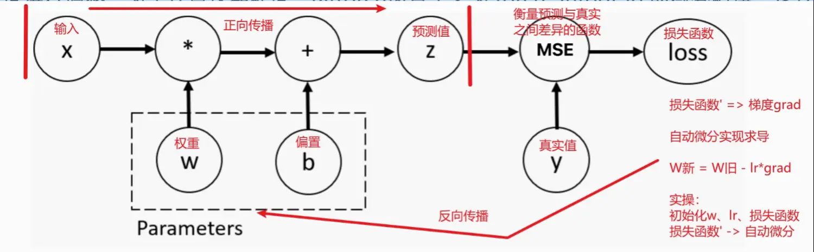

~~~python
import torch
# 1.定义一个W旧，requires_grad=True 表示需要计算梯度
# 初始值为10
W=torch.tensor(10,dtype=torch.float64,requires_grad=True)

for i in range(100):
    # 2.模拟一个损失函数
    Loss = 2 * W ** 2
    # 3.对损失函数自动微分
    Loss.backward()
    # 注意：自动微分完成后，梯度会自动更新
    print(f'自动微分后的梯度：{W.grad}')

    # 4.利用梯度下降公式求出W新
    # W.data表示当前的权重，假设学习率是0.1
    W.data = W.data - 0.1 * W.grad
    # 注意：清空上一次的w.grad,否则w.grad会累加，造成梯度震荡
    W.grad.zero_()
    print(f'第{i+1}轮梯度下降后的权重:{W.data:.20f}')
~~~

>x = torch.linspace(-20,20,1000,requires_grad=True)
>y = torch.sigmoid(x)  #定义一个函数
>y.sum().backward()    #对函数求导

### 2.2自动微分的使用

~~~python
import torch

# 1.准备数据
# 1.1准备输入的训练集(x_train,y_train)
# 样本数量2，特征数量5
X=torch.ones(2,5)
# 权重5行3列的数据- 5,3 初始值是随机的
W=torch.randn(5,3,requires_grad=True,dtype=torch.float32)
# 偏置 是为3的标量-3 因为预测结果是2,3 所以给了3？
B=torch.randn(3,requires_grad=True,dtype=torch.float32)
# 计算 预测值-2，3
Z=X@W+B
# 准备 真实值-2，3
Y=torch.zeros(2,3)

# 2.损失函数定义
loss_fn=torch.nn.MSELoss()
# 进行正向传播，计算了Z=WX+B
loss=loss_fn(Z,Y)

# 3.自动微分(pytorch只支持标量张量的求导,loss必须是标量)
print('loss:',loss)
loss.backward()
# 更新W
print('W.grad',W.grad)
# 更新B
print('B.grad',B.grad)
~~~

**注意点：设置了requires_grad的张量不能直接转为numpy,需要重新生成detach(),再转numpy**

~~~python
import torch
# 如果一个张量设置了支持自动微分，那么就不能再转换为numpy数据
t1=torch.tensor(10)
t2=torch.tensor(10,requires_grad=True,dtype=torch.float32)
print(t1,t1.numpy())
# 报错后 加上detach()重新生成一份数据 再numpy()则可以转换成功
print(t2,t2.detach().numpy())

~~~

### 2.3构建线性函数流程

>1.构造数据 make_regressor(样本数量，特征数量，标签数量，噪声，权重coef，bias偏置，随机种子)
>
>2.准备
>
>​     2.1 数据准备：
>
>​							数据->张量tensor->数据集dataset->数据加载器dataloader
>
>​     2.2 模型准备：
>
>​							模型创建torch.nn.linear(in=1,out=1)、
>
>​							优化器创建optimizer=optim.SGD(model.parameters(),lr=0.01)
>
>3.模型训练： 训练几轮，每轮训几批，每批训几条
>
>​        3.1模型预测
>
>​				y_pre=model(x_train)
>
>​		3.2定义损失函数
>
>​				loss_fn=MSELoss()
>
>​		3.3计算损失
>
>​			    loss=loss_fn(y_pre,y)
>
>​		3.4自动微分
>
>​			    loss.backward()
>
>​		3.5更新梯度
>
>​			    optimizer.step()
>
>​		3.6梯度清零
>
>​			   optimizer.zero_gard()

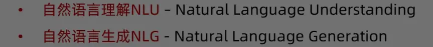

~~~python
import torch
from sklearn.datasets import make_regression # 创建线性回归数据
from torch.utils.data import TensorDataset # 张量数据集
from torch.utils.data import DataLoader # 数据加载器
from torch import optim #优化器
from matplotlib import pyplot as plt
import matplotlib
# matplotlib中文支持
matplotlib.rcParams['font.sans-serif']=['SimHei']
matplotlib.rcParams['axes.unicode_minus']=False


def create_data():
    # 1.构造数据
    # Z= W @ X + B
    # 已知X Z  用于训练模型，让模型可以预测
    # 已知W B  用户验证模型最终预测的结果 和真实结果 是否一致
    x,y,coef=make_regression(
        n_samples=100,  # 样本
        n_features=1,   # 特征
        n_targets=1,    # 标签
        bias=3,         # 偏置B
        random_state=3, # 随机种子固定，固定样本
        coef=True,      # 是否计算权重(斜率)
        noise=10        # 给定噪声，为了让真实数据样本不是一个一元线性方程，线的两边有零散的数据
    )
    # print(x.shape) # (100，1) 100行1列
    # print(y.shape) #(100,) 100行 需要和X一致
    # print(coef) # 权重W=27.478050549563925
    # coef是numpy数据
    return x,y.reshape(-1,1),coef


def train(x,y,coef):
    # 1.模型准备
    # 数据->张量->数据集->数据加载器(多轮训练的依赖)
    # 1.1转张量
    x=torch.tensor(x,dtype=torch.float32)
    y=torch.tensor(y,dtype=torch.float32)
    # 1.2转数据集
    dataset=TensorDataset(x,y)
    # 1.3转数据加载器
    # 参数
    # 第一个 数据集-100条数据
    # 第二个 批量训练数据量-16条数据，每次从100条中取出16条，训练7次才能结束
    # 第三个 数据是否随机
    dataloader=DataLoader(dataset,batch_size=16,shuffle=True)
    # 查看数据
    # for x_train,y_train in dataloader:
    #     print(x_train.shape)
    #     print(y_train.shape)

    # 2.模型训练
    # 模型创建 参数：特征数据 标签数据
    model=torch.nn.Linear(in_features=1,out_features=1)
    # 优化器创建 参数：模型的参数 学习率
    # 实际原理是小批量下降算法min-batch m个样本中选出x(x<m)个样本进行迭代?
    optimizer=optim.SGD(params=model.parameters(),lr=0.01)
    # 5.计算损失
    # 5.1 总损失-记录每一次的损失 700
    loss_list=[]
    # 训练100轮=每轮7次
    for i in range(100):
        # 5.2 记录每一轮的详细损失：每轮损失/次数=平均损失
        # 拆包
        total_loss,train_count=0,0
        # 训练7次，每次16条数据-》一轮
        # 100->16/16.../4 每次16条数据 之间互斥
        # 每轮结果做平均计算
        for x_train, y_train in dataloader:
            # ---------前向传播--------
            # 1.模型预测
            y_pre = model(x_train)
            # 2.损失函数
            # 【一条直线更好的拟合所有点(样本)->看离散的点(真实值)到直线上的(预测值)距离y=∑（k*x已知+b-真实）²
            # ->损失函数 每个样本的真-预 结果最小(y=0时为最小,k=-b/2a，或者通过一个优化方法得到k、b的值)，就是最优的K->y=kx+b】
            # 损失函数的种类:mse mae rmse 都可以表达损失函数
            # 梯度下降->利用梯度逐渐逼近损失函数最优解
            loss_fn = torch.nn.MSELoss()
            loss = loss_fn(y_pre, y_train)
            # # 记录每个损失到列表中
            # loss_list.append(loss)
            # 记录每一轮的总损失
            total_loss+=loss.item()
            # 每轮训练次数
            train_count+=1
            # ---------反向传播--------
            # 3.自动微分：获取梯度
            # 只能用标量张量对向量张量求导，如果时向量张量，则求平均mean\sum
            loss.backward()
            # 4.更新梯度：优化器实现
            optimizer.step()
            # 5.梯度清零
            optimizer.zero_grad()
        print(f'第{i+1}轮训练，平均损失:{total_loss/train_count}')
        # 每一轮的平均损失
        loss_list.append(total_loss/train_count)
    # 训练结束,训练结果在模型身上
    print(f'训练结束，查看模型结果:{model.state_dict()}')
    print(f'训练结束，查看真实结果：{coef} 3')

    #6.数据可视化
    # 6.1绘制损失下降曲线
    print(len(loss_list))
    plt.scatter(range(len(loss_list)),loss_list)
    plt.title('损失下降曲线')
    plt.xlabel('训练次数')
    plt.ylabel('损失值')
    plt.show()

    # # 6.2 绘制样本数据的点
    # plt.scatter(x,y)
    # # 6.3绘制真实的直线
    # # y=x*coef+3
    # plt.plot(x,x*coef+3,color='red')
    # # 6.4绘制预测的直线
    # plt.plot(x,[i.detach().numpy() for i in model(x)],color='green')
    # plt.title('结果对比')
    # plt.xlabel('特征值')
    # plt.ylabel('标签值')
    # plt.legend(['样本数据','真实直线','预测直线'])
    # plt.show()


if __name__ == '__main__':
    # 已知x特征 y标签 w权重 b偏置
    x,y,coef=create_data()
    # 模型训练 需要x y 自己计算w b
    train(x,y,coef)


# 模型训练总结：（神经元加权求和）
# 1.数据准备:数据->张量->数据集->数据加载器(分批取出)
# 2.模型准备：模型创建 优化器创建(后续梯度下降计算使用)
# 3.模型训练: 训练多少轮？每轮训练几批？每批几条数据?
# 4.训练流程：
# 正向传播：模型预测/损失函数/损失
# 反向传播：自动微分/更新梯度/梯度清零

# 神经元(加权求和|激活函数)

~~~

```
# 【一条直线更好的拟合所有点(样本)->看离散的点(真实值)到直线上的(预测值)距离y=1/n∑（k*x已知+b-真实）²
# ->损失函数 每个样本的真-预 结果最小(y=0时为最小,k=-b/2a，或者通过一个优化方法得到k、b的值)，就是最优的K->y=kx+b】
# 损失函数的种类:mse mae rmse 都可以表达损失函数
# 梯度下降->利用梯度逐渐逼近损失函数最优解
```

## 3.人工神经网络

>神经网络：由多个神经元构成，仿生
>
>人工神经网络：输入层 |隐藏层|输出层
>
>全连接层：每一个神经元都是和上一层所以的神经元相连接，每一层的神经元互不连接
>
>神经元(加权求和|激活函数)
>
>加权求和：线性转换
>
>激活函数(4)：非线性因素

### 3.1激活函数

>1.隐藏层(导函数)
>
>relu：值域0-1    深层  **小于0会有神经元死亡问题，权重无法更新(导致反向传播乘积为0)**
>
>tenh：值域0~1  浅层
>
>2.输出层(原函数)
>
>sigmoid：值域0~1 导函数值域 0~0.25 二分类 5层之内梯度会消失
>
>softmax：多分类 将数据映射成**概率**，取概率值最高的那个
>
>identity:回归问题，只有加权求和，没激活函数

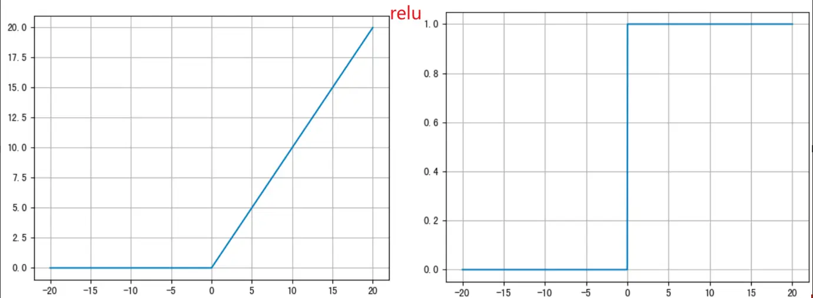

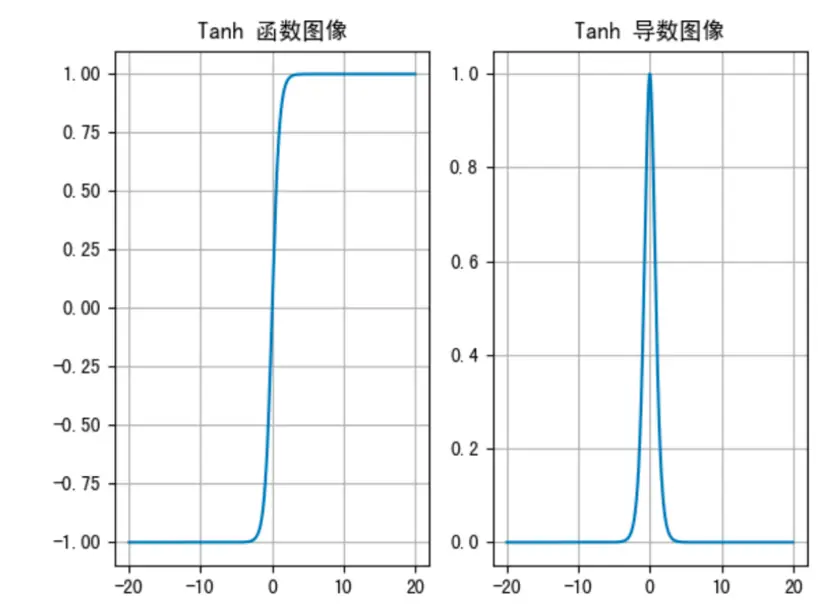

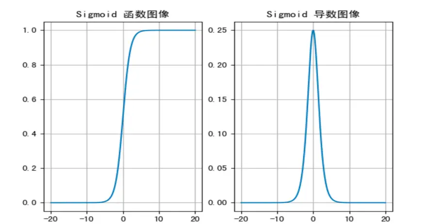

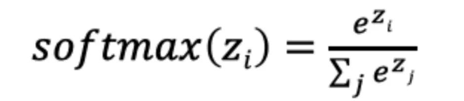

### 3.2神经网络

#### 3.2.1参数初始化

>1.参数初始化指的是神经网络种每层的权重W和偏置B
>
>2.在创建每层神经网络时都会有初始化权重和偏置，是随机值
>
>3.修改初始化值，通过以下7种方法：
>
>​           语法：torch.nn.init.方法(fc.weight)
>
>​           **3.1 均匀分布(0-1)                       uniform_**
>
>​           **3.2 正态分布(-3-3)                      normal**
>
>​           **3.3 全0**                                         zeros     一般用来设置偏置
>
>​           3.4 全1                                         ones
>
>​           3.5 固定值                                   constant(fc.weight,0.123)
>
>​           **3.6He(kaiming)初始化**             kaiming_normal  kaiming_uniform
>
>​                                                                关注输入神经元数据数量，和Relu激活函数适配
>
>​           **3.7xavier**                                    xavier_normal      xavier_uniform
>
>​                                                                关注输入+输出，和sigmoid、tenh激活函数适配

#### 3.2.2 搭建神经网络(掌握)

>1.定义一个模型类，继承nn.Module
>
>2.重写__ init __ 方法，实现神经网络层
>
>def __ init __(self):
>
>​          2.1 继承父类方法
>
>​	             super().__ init __ ()
>
>​          2.2 搭建神经网络层
>
>​                  self.fc1=torch.nn.Linear(输入特征/上一层输出的数量,当前层神经元)
>
>​				  self.fc2=torch.nn.Linear(上一层输出的数量,当前层神经元)
>
>​				  self.out=torch.nn.Linear(上一层输出的数量,当前层神经元/输出的标签)
>
>​            2.3 初始化每层权重
>
>​                  torch.nn.init. xavier_normal(self.fc1.weight)
>
>​                  ......
>
>​            2.4 初始化每层偏置
>
>​                  torch.nn.init. ones(self.fc1.bias)
>
>​                  ......
>
>3.定义一个forward方法，实现前向传播
>
>def forward(self,x):
>
>​            每层输入加权求和，激活函数输出结果，再传递到下一层
>
>​            x1=torch.sigmoid(self.fc1(x))
>
>​            x2=torch.sigmoid(self.fc2(x1))
>
>​            result=torch.sigmoid(self.out(x2))
>
>​            return result

>1.查看模型参数大小
>
>summary(要查看的模型,input_size参数数量,batch_size样本数量)
>
>2.查看模型各层详细信息-权重、偏置
>
>model.named_parameters()

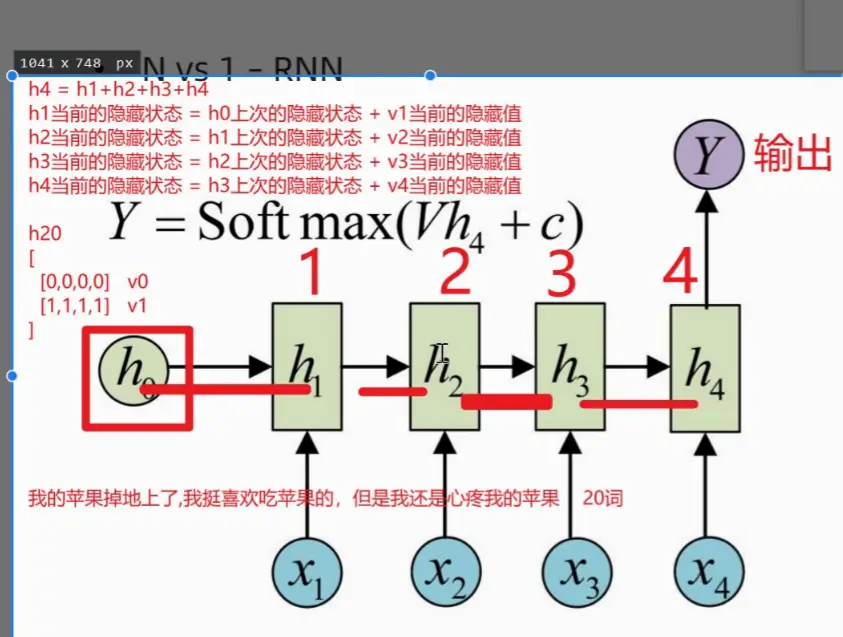

~~~python
import torch.nn
from torchsummary import summary # 需要安装


# 1.定义模型类，继承Module
class Model(torch.nn.Module):
    # 2.实现__init__函数，定义神经网络层数
    def __init__(self):
        # 2.0 重新父类__init__方法
        super().__init__()
        # 2.1 定义网络层数
        # 隐藏层1 输入特征3，本层3个神经元 --去除+1神经元
        self.fc1 = torch.nn.Linear(3, 3)
        # 隐藏层2 上一层输出3，本层2个神经元
        self.fc2 = torch.nn.Linear(3, 2)
        # 输出层 上一层输出2，本层2个神经元
        self.out = torch.nn.Linear(2, 2)
        # 2.2 初始化每层权重
        torch.nn.init.xavier_normal_(self.fc1.weight)
        torch.nn.init.kaiming_normal_(self.fc2.weight)
        # 2.3 初始化每层的偏置
        torch.nn.init.ones_(self.fc1.bias)
        torch.nn.init.ones_(self.fc2.bias)

    # 3.定义forward函数，实现正向传播
    def forward(self,x):
        # x1 是第一个隐藏层的输出(通过加权求和 和 激活函数)
        x1=torch.sigmoid(self.fc1(x))
        # x2 是第二个隐藏层的输出(通过神经元加权求和和激活函数)
        x2=torch.relu(self.fc2(x1))
        # 将x2作为输入传递到输出层(只有加权求和) 输出结果
        result=torch.softmax(self.out(x2),dim=-1)
        return result


if __name__ == '__main__':
    # 测试模型的正向传播
    model=Model()
    # 2个样本，3个特征(和第一个隐藏层输入特征一致)
    data=torch.randn(2,3)
    # 没报错 就正常
    pre=model(data)

    # 查看模型参数大小summary(要查看的模型,input_size参数数量,batch_size样本数量)
    # (要查看的模型,input_size(样本，参数))
    summary(model,input_size=(2,3))
    # summary(model,input_size=(3,),batch_size=2)

    # 查看模型各层详细信息named_parameters(权重、偏置)
    for name,param in model.named_parameters():
        print(name,param)

~~~

### 3.损失函数

>作用：衡量真实值与预测值之间误差的函数
>
>1.分类问题
>
>BCELoss 二分类
>
>CrossEntropyLoss 多分类  使用softmax将某类别预测分数转为概率的形式
>
>2.回归问题
>
>L1Loss                                图：V     不会出现梯度爆炸
>
>MSELoss(L2Loss)              图：U    0点可求导
>
>SmoothL1Loss                  图：\                  /     不会出现梯度爆炸，0点可求导，介于L1和L2之间
>
>​                                                       \             /
>
>​                                                           \-------

### 4.神经网络总结！！

~~~python
# 流程：
# 1.搭建神经网络
#   1.1定义一个类
#   1.2重写init方法  -  定义神经网络层数以及各层的权重和偏置
#   1.3定义forward方法  -  定义每一层使用的激活函数


# 2.准备模型
#    2.1准备数据   data -> 张量 -> 数据集 -> 数据加载器
#    2.2训练模型 - 反向传播的原理(了解)
#             准备模型
#             准备优化器
#             模型预测 - 第1轮(非常差) xxx.......  第100轮(接近真实值)
#                       反向传播->计算这个误差->准备一个损失函数->分类问题or回归问题？
#             100轮训练结束,得到了可以使用的模型


# 3.真实场景使用(模型部署)
#     用户输入真实数据  ->>>>>>>>>>>>>>>>>  你的神经网络(W,B) >>>>>>>>>>>>>>>>> 预测结果
~~~

**ps:深度学习注重逻辑，代码次要！！！**

## 4.神经网络-网络优化方法

### 4.1梯度下降算法思想

>梯度：函数增长速度最快的方向，也是损失函数求导
>
>梯度下降：函数减少速度最快的方向
>
>w新=w旧-学习率*梯度
>
>梯度下降分类(本质是batch-size不同)：全梯度下降算法BGD(全样本) 随机梯度下降算法SGD(1个样本) 小批量梯度下降算法min-batch

### 4.2模型训练概念

>epoch：训练轮次
>
>iteration：每一轮训练几批
>
>batch_size：每批多少条数据

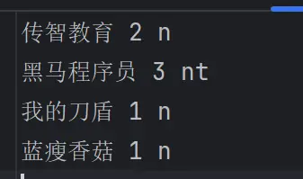

### 4.3正向传播与反向传播原理

>1.前向传播
>
>数据输入到神经网络中，通过输入层->隐藏层->输出层，逐层向前传播，直到输出层为止，得到**预测值**
>
>隐藏层每层神经元对上一层输出结果进行加权求和，再使用激活函数计算输出
>
>每一层的单个神经元和上一层的所有神经元相连接，不同的权重w
>
>eg:
>
>隐藏层1输入 z_in1=w1 * x1+w2 * x2+...+b
>隐藏层1输出 z_out =   sigmoid(z_in1)
>隐藏层2输入 z_in2  =   z_out1 * w1+z_out2 * w2+...+b
>隐藏层2输出 z_out2  =  sigmoid(z_in2)
>
>2.损失函数
>
>误差=预测值-真实值
>
>损失函数是用来衡量误差的
>
>3.反向传播
>
>利用损失函数求导，求每层激活函数的偏导、加权求和的偏导--》从输出层逐层传递到输入层，依次计算偏导
>
>eg：
>
>d_total         d_total      d_z_out2      d_z_in2        d_z_out1     d_z_in1
>————  =  ———— *  ———— *  ————  *  ————  * ————
>w1           d_z_out2      d_z_in2       d_z_out1       d_z_in1           w1

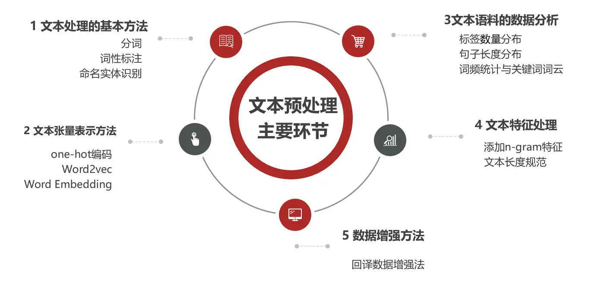

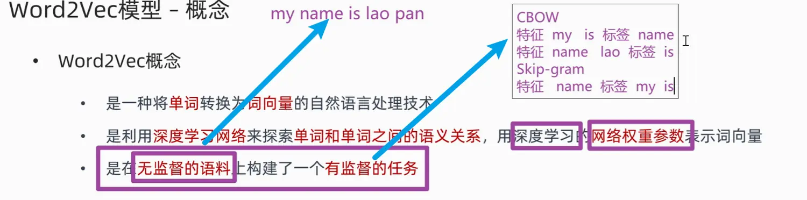


### 4.4梯度下降优化方法

>**思想：指数移动加权平均法**，距离越近的数据约有参考价值


#### 随机梯度下降(默认)

>optim.SGD(要更新的参数,lr=0.01)

#### 动量法-梯度

>**optim.SGD(params=[w],lr=0.01,momentum=0.9)**
>
>要更新的参数  学习率 动量率0.9~0.99
>
>
>
>公式：s_t=βs_t-1+(1-β)g_t
>
>s_t-1为历史指数加权平均梯度、 g_t为当前时刻梯度
>
>缺点：当前的变化会受到之前梯度的影响，转向不及时

~~~python
# 1.自定义一个 W权重
w=torch.tensor(10,requires_grad=True,dtype=torch.float32)
# 2.准备优化-优化器
# 参数说明
# params要更新的权重，是个列表
# lr是学习率0.001-0.01
# momentum是动量率0.9-0.99
optimizer=optim.SGD(params=[w],lr=0.1,momentum=0.9)
for i in range(100):
    # 3.自定义 损失
    loss = w ** 2 / 2
    # 4.自动微分
    loss.backward()
    # 5.参数更新/梯度更新
    # 手动更新 w.data=w.data-0.1*w.grad
    optimizer.step()
    # 6.梯度清零
    optimizer.zero_grad()
    print(f'度量法更新的结果:{w.data}')
~~~

#### Adagrad-学习率

>**optim.Adagrad(params=[w],lr=0.01)**
>
>要更新的参数  学习率


>公式：新学习率=旧学习率/（累计梯度平方**0.5+小常数）
>
>梯度的累计是不断增大的，意味着学习率是在不断的减小
>
>先大步的走，找到合适的方向，降低学习率，寻找最优解

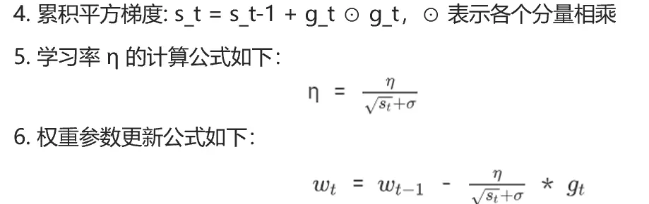

#### RMSprop-学习率

>**optim.RMSProp(params=[w],lr=0.01,alpha=0.9)**
>
>要更新的参数  学习率 alpha度量的系数0.9~0.99
>
>**使用指数加权平均梯度**


>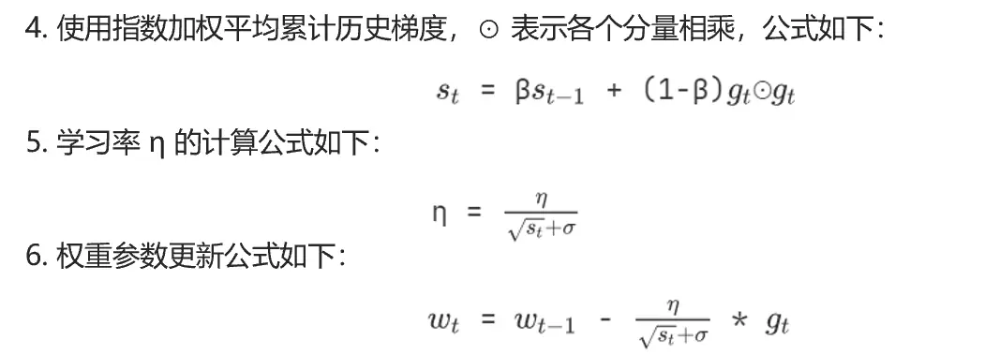

#### Adam-梯度+学习率

>**optim.Adam(params=[w],lr=0.01,betas=(0.9,0.99))**
>
>betas梯度的系数+学习率的系数
>
>Momentum 和 RMSProp 算法结合在一起，修正梯度和学习率
>
>adamw 在adam上增加了权重衰减（decay），每次更新参数后再减去一个很小的值，防止参数过大，提高泛化性

### 4.5学习率衰减策略3种

**为什么要学习学习率衰减的方案？ 学习率设置不当可能出现梯度下降缓慢以及梯度震荡的情况**

~~~python
import os
os.environ['KMP_DUPLICATE_LIB_OK'] = 'True'

import torch
import matplotlib.pyplot as plt

# x看成是权重，y看成是loss，下面通过代码来理解学习率的作用
def func(x_t):
    return torch.pow(2*x_t, 2)  # y = 4 x ^2

# 采用较小的学习率，梯度下降的速度慢
# 采用较大的学习率，梯度下降太快越过了最小值点，导致不收敛，甚至震荡
def dm01():

    x = torch.tensor([2.], requires_grad=True)
    # 记录loss迭代次数，画曲线
    iter_rec, loss_rec, x_rec = list(), list(), list()

    # 实验学习率： 0.01 0.02 0.03 0.1 0.2 0.3 0.4
    # lr = 0.1    # 正常的梯度下降
    # lr = 0.125      # 当学习率设置0.125 一下子求出一个最优解
                    # x=0 y=0 在x=0处梯度等于0 x的值x=x-lr*x.grad就不用更新了
                    # 后续再多少次迭代 都固定在最优点

    lr = 0.1      # x从2.0一下子跨过0点，到了左侧负数区域
    # lr = 0.3      # 梯度越来越大 梯度爆炸
    max_iteration = 4
    for i in range(max_iteration):
        y = func(x)   # 得出loss值
        y.backward()  # 计算x的梯度
        print("Iter:{}, X:{:8}, X.grad:{:8}, loss:{:10}".format(
            i, x.detach().numpy()[0], x.grad.detach().numpy()[0], y.item()))
        x_rec.append(x.item())      # 梯度下降点 列表
        # 更新参数
        x.data.sub_(lr * x.grad)    # x = x - x.grad
        x.grad.zero_()
        iter_rec.append(i)          # 迭代次数 列表
        loss_rec.append(y.item())  # 损失值 列表，这里将y改为y.item()以获取标量值
    # 迭代次数-损失值 关系图
    plt.subplot(121).plot(iter_rec, loss_rec, '-ro')
    plt.grid()
    plt.xlabel("Iteration X")
    plt.ylabel("Loss value Y")
    # 函数曲线-下降轨迹 显示图
    x_t = torch.linspace(-3, 3, 100)
    y = func(x_t)
    plt.subplot(122).plot(x_t.detach().numpy(), y.detach().numpy(), label="y = 4*x^2")
    y_rec = [func(torch.tensor(i)).item() for i in x_rec]
    print('x_rec--->', x_rec)
    print('y_rec--->', y_rec)
    # 指定线的颜色和样式（-ro：红色圆圈，b-：蓝色实线等）
    plt.subplot(122).plot(x_rec, y_rec, '-ro')
    plt.grid()
    plt.legend()
    plt.show()

dm01()
~~~

#### 等间距学习率衰减-步长+衰减率

>衰减的步长5 衰减率0.1
>
>初始学习率=0.1，则每五轮epoch学习率发生次变化
>
>1 -> 0.1
>
>2 -> 0.1
>
>3 -> 0.1
>
>4 -> 0.1
>
>5 -> 0.1
>
>6 -> 0.01

>1.设置学习率衰减策略
>
>**scheduler=optim.lr_scheduler.StepLR(优化器,step_size=5,gamma=0.1) **
>
>epoch=step_size 轮次即步长
>
>2.更新学习率
>
>scheduler.step()
>
>3.查看学习率
>
>scheduler.get_last_lr()

~~~python
import torch
from torch import optim

# 准备预测值
y_true = torch.tensor(10, requires_grad=True, dtype=torch.float32)
# 准备特征
x = torch.tensor(2, requires_grad=True, dtype=torch.float32)
# 准备权重
w = torch.tensor(2, requires_grad=True, dtype=torch.float32)
# 准备优化器
# momentum 动量法梯度优化
optimizer = optim.SGD([w], lr=0.01, momentum=0.9)
# 1.给优化器设置学习率下降策略(步长和衰减率)
# optimizer 优化器
# 步长：5 代表每5轮学习率变化一次 epoch
# 衰减率：0.1 代表每次变化为 上次*0.1->lr = lr * gamma
scheduler = optim.lr_scheduler.StepLR(optimizer, step_size=5, gamma=0.1)
for i in range(50):
    # 2.查看当前学习率
    print(f"第{i + 1}轮学习率：{scheduler.get_last_lr()[0]:.10f}")
    # 损失函数-自定义
    loss = (y_true - w * x) ** 2 / 2
    # 自动微分
    loss.backward()
    # 更新梯度
    optimizer.step()
    # 梯度清零
    optimizer.zero_grad()
    # 3.更新学习率
    scheduler.step()
    print(f'第{i + 1}轮更新权重w的结果:{w.data:.20f}')
~~~

#### 指定间距学习率衰减-步长+衰减率

>指定更新的步长范围[3,5,10] 衰减率0.1
>
>1.设置学习率衰减策略
>
>**scheduler=optim.lr_scheduler.MultiStepLR(优化器,milestones=[3,5,10],gamma=0.1) **
>
>2.更新学习率
>
>scheduler.step()
>
>3.查看学习率
>
>scheduler.get_last_lr()

#### 按指数学习率衰减-衰减率

>1.设置学习率衰减策略
>
>**scheduler=optim.lr_scheduler.ExponentialLR(优化器,gamma=0.9)**
>
>2.更新学习率
>
>scheduler.step()
>
>3.查看学习率
>
>scheduler.get_last_lr()

## 5.正则化

### 5.1dropout正则化

>目的：
>
>​				防止以一个神经元为主，一个神经元过强，为了让所有的神经元都训练到
>
>作用时机：
>
>​				1.缓解过拟合问题
>
>​				2.**训练模型**的时候使用
>
>​				3.激活函数后使用
>
>逻辑：
>
>​				训练过程中(隐藏层)，以p概率随机让神经元失活，未失活的神经元以1/(1-p)概率进行缩放（让w权重发生改变）
>
>**语法：**
>
>​                1.实例化-自动挡(自动读取全局的训练模式)dropout=torch.nn.Dropout(p=0.2) # p为失活概率
>
>​                2.API-手动挡(主动告知当前的训练模式)dropout=torch.dropout(data,p=0.2,train=True) # p为失活概率 train为是否开启

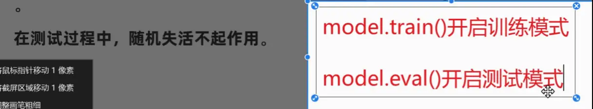

### 5.2BN批量归一正则化

>作用时机：
>
>​					加权求和之后，激活函数之前
>
>逻辑：
>
>​					1.每个神经元输出的内容标准化 2.对标准化的内容学习一个λ系数和β偏置 (防止标准化后数据被ReLU进行杀死，以及数据的有效性)
>
>**语法：**
>
>​                     bn=torch.nn.BatchNorm1d() # 全连接层，最多3
>
>​                     bn=torch.nn.BatchNorm2d() # 卷积层，最多4
>
>​                     bn=torch.nn.BatchNorm3d() # 医学图像，最多5

## 6.案例

>1.流程
>
>准备数据
>
>数据预处理(划分数据集和测试集)
>
>准备模型(全连接神经网络)
>
>训练模型(使用训练数据，前向传播+反向传播)
>
>保存模型(为了模型预测时使用)
>
>模型预测(使用测试数据,加载模型)
>
>模型评估(分类问题还是回归问题)
>
>模型优化
>
>2.优化方法
>
>修改优化器类型
>
>新增隐藏层
>
>学习率
>
>按指数衰减学习率
>
>数据标准化/添加BN层
>
>增加训练轮数

~~~python
import pandas as pd
import numpy as np
import torch.nn
from sklearn.model_selection import train_test_split
from torch.utils.data import TensorDataset
from torch.utils.data import DataLoader
from torchsummary import summary
from torch import optim
import time
from sklearn.preprocessing import StandardScaler


# 1. 准备数据
# 2. 数据预处理
def create_data():
    # 1.获取数据
    data = pd.read_csv('手机价格预测.csv', sep=',', encoding='utf-8')
    # 2.数据划分为特征和标签
    x = data.iloc[:, :-1]  # 包头不包尾
    y = data.iloc[:, -1]  # 取最后一列
    # 3.划分数据集(测试集和训练集)
    # 8/2 随机值
    x_train, x_test, y_train, y_test = train_test_split(x, y, test_size=0.2, random_state=0)

    # # -----优化点3-特征工程-数据标准化,只对特征做处理，和后面的批量归一化互斥----
    # scaler=StandardScaler()
    # x_train=scaler.fit_transform(x_train)
    # x_test=scaler.transform(x_test)
    # # -----优化点-特征工程-数据标准化！----

    # 4.封装训练集和测试集(x_train+y_train)
    # numpy数据->张量->数据集
    # # pandas.core.frame.DataFrame
    # print(type(x_train),x_train[:5])
    # print(type(y_train))
    # # numpy.ndarray
    # print(x_train.values,type(x_train.values))
    # print(y_train.values, type(y_train.values))
    train_dataset = TensorDataset(torch.tensor(x_train.values, dtype=torch.float32), torch.tensor(y_train.values))
    test_dataset = TensorDataset(torch.tensor(x_test.values, dtype=torch.float32), torch.tensor(y_test.values))

    # print(x.shape) #(2000, 20) 特征20
    # unique进行去重 得到列表[0，1，2，3]
    # 5.因为搭建神经网络需要知道入参和出参是多少，所以封装两个参数
    return train_dataset, test_dataset, x.shape[1], len(np.unique(y))


# 3.准备模型(构建神经网络层，全连接层)
class PhonePriceModel(torch.nn.Module):
    def __init__(self, input_dim, output_dim):
        super().__init__()
        # 1.初始化神经网络层
        super().__init__()
        # 优化点1：增加隐藏层！
        self.fc1 = torch.nn.Linear(input_dim, 128)
        self.fc2 = torch.nn.Linear(128, 256)
        self.fc3 = torch.nn.Linear(256, 512)
        # 优化点4---批量归一化作用在加权求和后，激活函数前
        self.bn1=torch.nn.BatchNorm1d(num_features=128)
        self.bn2=torch.nn.BatchNorm1d(num_features=256)
        self.bn3=torch.nn.BatchNorm1d(num_features=512)
        # 优化点4---批量归一化作用在加权求和后，激活函数前
        self.out = torch.nn.Linear(512, output_dim)
        # 2.初始化权重、偏置-第一步有随机的，所以暂时不做操作

    def forward(self, x):
        # 优化前----------------
        # x1 = torch.relu(self.fc1(x))
        # x2 = torch.relu(self.fc2(x1))
        # x3 = torch.relu(self.fc3(x2))
        # 优化后----------------
        x1 = torch.relu(self.bn1(self.fc1(x)))
        x2 = torch.relu(self.bn2(self.fc2(x1)))
        x3 = torch.relu(self.bn3(self.fc3(x2)))
        # 输出层 只做加权求和，不做激活函数
        # 后续损失函数底层已实现softmax 这里不写
        result = self.out(x3)
        return result


# 4.模型训练(训练得到的模型，使用训练数据)
def train(data, input_dim, output_dim):
    # 4.1将数据集转成数据加载器
    dataloader = DataLoader(data, batch_size=16, shuffle=True)
    # 4.2 创建模型、优化器
    model = PhonePriceModel(input_dim, output_dim)
    # 优化器传入要优化的参数以及学习率
    # 优化点2：优化器选择更好的-梯度+学习率！
    # optimizer = optim.SGD(model.parameters(), lr=0.001)
    optimizer = optim.Adam(model.parameters(), lr=0.001,betas=(0.9,0.999))
    # 优化点5：按指数衰减学习率
    scheduler=torch.optim.lr_scheduler.ExponentialLR(optimizer,gamma=0.9)
    # 4.3 训练模型
    # model.train() 模型开启训练模式 model.eval()模型开启测试模式
    model.train()
    # 模型训练轮次 每轮几批 每批多少个数据batch_size-16
    for i in range(100):
        # 计算每轮损失和耗时
        total_loss, count, start = 0, 0, time.time()
        for x_train, y_train in dataloader:
            # 4.3.1 前向传播-模型预测
            pre = model(x_train)
            # 4.3.2 前向传播-损失函数-底层包括softmax激活函数，解决多分类问题
            loss_fn = torch.nn.CrossEntropyLoss()
            # 4.3.3 前向传播-计算损失
            loss = loss_fn(pre, y_train)
            # 4.3.4 反向传播-自动微分-损失函数求导
            loss.backward()
            # 4.3.5 反向传播-参数更新/梯度更新-优化w b
            optimizer.step()
            # 4.3.6 反向传播-梯度清零
            optimizer.zero_grad()
            # 额外看下每轮平均损失，看是否一直在下降接近最优，看下模型的好坏
            # 细节点：如果张量只有一个元素可以通过item()获取
            # print(loss)  # tensor(1.3929, grad_fn=<NllLossBackward0>) 打印结果
            total_loss += loss.item()
            count += 1
        # 每轮更新一次学习率
        scheduler.step()
        print(f'第{i + 1}轮的平均损失为{total_loss / count:.5f},耗时:{time.time() - start}')
    # 模型训练结束，保存模型训练的参数（为了在模型预测的时候可以使用）
    # print(model.state_dict())
    torch.save(model.state_dict(),'PhonePriceModel.pth')


# 5.模型预测（使用训练的模型，使用测试数据）
def predict(data,input_dim,output_dim):
    # 5.1将数据集转成数据加载器
    # 是否打乱数据(训练打乱，测试不打乱)
    dataloader=DataLoader(data,batch_size=8)
    # 5.2准备模型(创建后，加载模型参数)
    model=PhonePriceModel(input_dim,output_dim)
    model.load_state_dict(torch.load('PhonePriceModel.pth',weights_only=True))
    # 模型开启测试模式
    model.eval()
    # 5.3模型预测-使用准确率来评估
    score=0
    for x_test,y_test in dataloader:
        pre=model(x_test)
        # print(pre) # [[-29.1845,  -6.1417,   1.1308,   0.8809],[]]
        # # 需要转成分类
        # # 从数据中找到最大的值对应索引，索引就是分类(预测的的)
        # print(torch.argmax(pre,dim=1)) # [0, 2, 2, 1, 1, 0, 2, 1]
        # # 需要猜对的计数，先获得布尔索引
        # print(torch.argmax(pre,dim=1)==y_test)
        # # sum求和ture
        # print(sum(torch.argmax(pre,dim=1)==y_test))
        score+=sum(torch.argmax(pre,dim=1)==y_test).item()
    print(f"预测结束，当前的准确率：{score/400:.4f}") # 小数点后四位


if __name__ == '__main__':
    # 1.准备数据
    train_dataset, test_dataset, input_dim, output_dim = create_data()
    # 2.准备模型
    # model = PhonePriceModel(input_dim, output_dim)
    # # 查看模型参数 36,740参数-0.0003b
    # summary(model,input_size=(input_dim,))
    # 3.模型训练
    train(train_dataset, input_dim, output_dim)
    # 4.模型加载，预测
    predict(test_dataset,input_dim,output_dim)
~~~


# 三、深度学习-CNN卷积神经网络

>前置图像知识：
>
>1.图片是由像素点构成，彩色图由RGB3通道构成，[0,255],0为黑、255为白
>
>2.图像形状为HWC（高，宽，三通道）
>
>3.绘制图形：plt.imshow()
>
>4.读取图像：plt.imread()

>CNN
>
>1.概念：拥有卷积层的神经网络
>
>2.组成：输入图片->卷积层(自动学习、提取图像特征)->池化层(降维)->全连接层(输出结果)

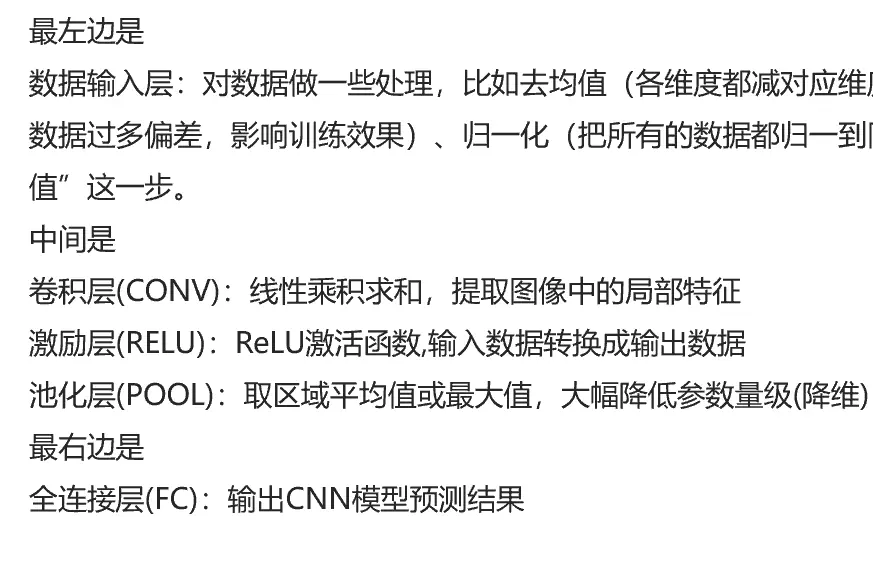

## 1.卷积层-提取图像特征

>1.过程:输入图像->卷积核->特征图（1乘2加）
>
>卷积核和输入数据做点积，得到特征图
>
>2.填充Padding：在输入图像的边界周围添加额外的像素(一般为0)，从而解决卷积操作时边缘信息丢失的问题
>
>3.步长Stride：卷积核在图像上移动的像素点
>
>4.多通道卷积计算：每个通道的特征图最后相加
>
>5.多卷积核卷积计算：各算各的，最后堆叠在一起 [[A],[B]]->（3，3，2）

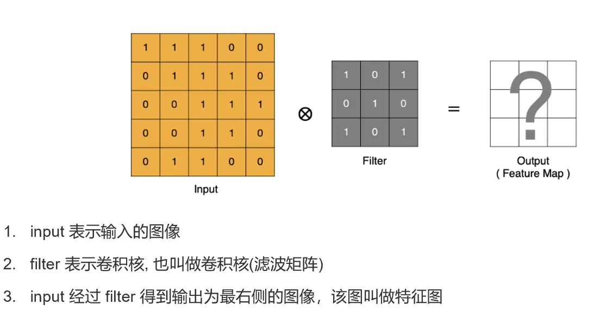

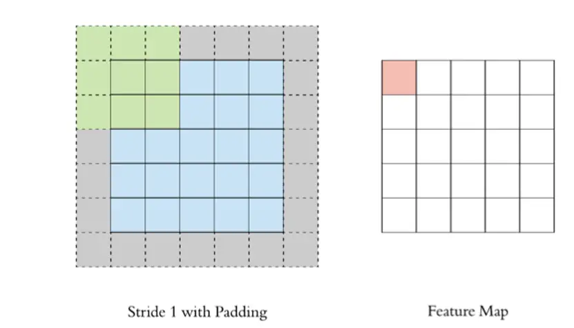

>**卷积层API**：
>
>1.创建卷积层
>
>conv=torch.nn.Conv2d(in_channels,out_channels,kernel_size,stride,padding)
>
>in_channels: 输入通道数
>
>out_channels：输出通道数
>
>kernel_size：卷积核大小
>
>stride：卷积核移动步长
>
>padding：填充
>
>2.使用
>
>data=conv(data)
>
>**注意：图片数据是HWC，需要转为通道、宽、高且升维后进入卷积层**

~~~python
import os

os.environ['KMP_DUPLICATE_LIB_OK'] = 'TRUE'
import matplotlib.pyplot as plt
import torch

data = plt.imread('img.jpg')
data = torch.tensor(data, dtype=torch.float32)
print(data.shape)  # 640,640,3

# HWC需要转为通道、宽、高
# 维度交换
data = data.permute(2, 0, 1)
print(data.shape)
# 升维
data.unsqueeze_(0)
print(data.shape)

# 目标：将图片送入卷积层
# 1.创建卷积层
# in_channels输入通道数| out_channels输出通道数 |kernel_size 卷积核的大小
# 步长默认为1  stride: int | tuple[int, int] = 1,
# 填充默认为0  padding
conv = torch.nn.Conv2d(in_channels=3, out_channels=3, kernel_size=(5, 5), stride=2)
# 2.将图片的数据送入卷积层
data = conv(data)  # [1, 3, 640, 640]
print(data.shape)
# 3.提取图片内容-降维
data = data[0]  # [3, 638, 638]
# 4.还原HWC
data = data.permute(1, 2, 0)
print(data.shape)
# 5.绘图
# print(data)
plt.imshow(data.detach().numpy())
plt.show()

~~~

## 2.池化层-降维

分类：最大池化、平均池化

>1.最大池化：自定义卷积核，取最大的
>
>**API：pool=torch.nn.MaxPool2d(kernel_size,stride,padding)**
>
>kernel_size:池化大小3或(3,3)
>
>padding填充
>
>stride步长
>
>2.平均池化：自定义卷积核，取平均
>
>**API:pool=torch.nn.AvgPool2d(kernel_size,stride,paddin)**
>
>3.多通道池化层：分别对每个输入通道分别池化，不进行相加**（池化层的输入和输出通道数相等）**

~~~python
import os

os.environ['KMP_DUPLICATE_LIB_OK'] = 'True'
import matplotlib.pyplot as plt
import torch

# 1.读取图片数据
data = plt.imread('img.jpg')
print(data.shape)  # (640, 640, 3)
# print(type(data)) numpy
# 2.numpy转向量
data = torch.tensor(data, dtype=torch.float32)
# 3.维度交换HWC
data = torch.permute(data, (2, 0, 1))
# 3.升维
data.unsqueeze_(dim=0)
print(data.shape)  # [1, 3, 640, 640]

# 创建卷积层
# 输入通道已知 其余自己填充
conv = torch.nn.Conv2d(3, 5, 4, 2)

# 创建池化层 最大、平均-入参尺寸
pool = torch.nn.MaxPool2d((3, 3))
# pool=torch.nn.AvgPool2d()

# 进入卷积和池化
data = conv(data)
data = pool(data)

# 结果
print(f'data池化后结果:{data.shape}')  # [1, 5, 106, 106]

# 绘图，池化后有5个通道
data = data[0]
data = data.permute(1, 2, 0)  # 转成HWC
print(data.shape)
plt.imshow(data[:, :, 0].detach())
# plt.imshow(data[:,:,1].detach())
# plt.imshow(data[:,:,2].detach())
# plt.imshow(data[:,:,3].detach())
# plt.imshow(data[:,:,4].detach())
plt.show()

~~~

## 3.案例-图像识别分类

~~~python
import time
from torchvision.transforms import ToTensor  # 转为向量
from torchvision.datasets import CIFAR10  # 读取数据集
import torch
from torch import nn
from torch.utils.data import DataLoader
from torchsummary import summary
from torch import optim


# 1.准备图片数据(训练集5W和测试集1W)
def create_data():
    # 参数说明：数据存放位置 是否是训练集 转换为张量
    # .是因为当前文件和数据平级 当前只有一个文件夹
    train = CIFAR10(root='.', train=True, transform=ToTensor())
    test = CIFAR10(root='.', train=False, transform=ToTensor())
    return train, test


# 2.准备模型-构建卷积神经网络
class ImageModel(nn.Module):
    def __init__(self):
        # 继承父类
        super().__init__()
        # 创建卷积层-池化层-全连接层(linear)
        self.conv1 = torch.nn.Conv2d(in_channels=3, out_channels=6, kernel_size=3)
        self.pool1 = torch.nn.MaxPool2d(kernel_size=2, stride=2)
        self.conv2 = torch.nn.Conv2d(in_channels=6, out_channels=16, kernel_size=3)
        self.pool2 = torch.nn.MaxPool2d(kernel_size=2, stride=2)
        self.fc1 = torch.nn.Linear(in_features=576, out_features=120)
        self.fc2 = torch.nn.Linear(in_features=120, out_features=84)
        self.out = torch.nn.Linear(in_features=84, out_features=10)

    def forward(self, x):
        # 使用卷积神经网络
        # 卷积层-激活函数-池化层
        x1 = self.pool1(torch.relu(self.conv1(x)))
        x2 = self.pool2(torch.relu(self.conv2(x1)))
        # 池化层-全连接层fc1、fc2
        # 注意要转换形状
        x3 = torch.relu(self.fc1(x2.reshape(-1, 576)))
        x4 = torch.relu(self.fc2(x3))
        result = self.out(x4)
        return result


# 3.模型训练
def train(data):
    # 3.1准备数据
    # 数据集->数据加载器
    dataloader = DataLoader(dataset=data, batch_size=8, shuffle=True)
    # 3.2准备模型、优化器
    model = ImageModel()
    # 准备优化器
    optimizer = optim.Adam(model.parameters(), lr=0.001, betas=(0.9, 0.99))
    # 前向传播-损失函数设置-多分类问题，选择多分类交叉熵
    loss_fn = torch.nn.CrossEntropyLoss()
    # 3.3模型训练
    # 总共5轮
    for i in range(5):
        # 每一轮（x批次，每批8条数据）
        total_loss, count, start = 0, 0, time.time()
        for x_train, y_train in dataloader:
            # 前向传播-预测值
            pre = model(x_train)
            # 前向传播-计算损失
            loss = loss_fn(pre, y_train)
            # 反向传播-自动微分
            loss.backward()
            # 反向传播-优化参数/梯度更新
            optimizer.step()
            # 反向传播-梯度清零
            optimizer.zero_grad()
            # 累积损失
            total_loss += loss.item()
            count += 1
        print(f'第{i + 1}轮的平均损失为：{total_loss / count:.4f},耗时为：{time.time() - start}')
    # 训练结束，保存模型和模型参数
    torch.save(model.state_dict(), 'ImageModel.pth')


# 4.模型预测!
def predict(data):
    # 1. 准备数据
    dataloader = DataLoader(data, batch_size=8)
    # 2. 准备模型
    model = ImageModel()
    # 3.加载模型
    model.load_state_dict(torch.load('ImageModel.pth'))
    # 4.模型预测
    score, total = 0, 0
    for x_test, y_test in dataloader:
        pre = model(x_test)
        # 获取最大概率的索引
        pre = torch.argmax(pre, dim=1)
        # # 得到预测的布尔索引
        # print(pre == y_test)
        # # 计算猜对的数量
        # print(sum(pre==y))
        # 5.计算准确率
        score += sum(pre == y_test)
        total += len(x_test)
    print(f'正确率：{score / total:.4f}')


if __name__ == '__main__':
    # 1-准备数据
    train_data, test_data = create_data()
    # # 查看长度
    # print(len(train_data), len(test_data))
    # # 2-准备模型/查看模型
    # model = ImageModel()
    # summary(model, input_size=(3, 32, 32))
    # 3-模型训练
    train(train_data)
    # 4-模型预测
    predict(test_data)

# 输入图像->卷积层->激活函数->池化层->全连接层

# 池化层没有参数 为0
# 测试数据 不学习新知识 不用打乱

~~~

# 四、深度学习-RNN循环神经网络

## 1.RNN

>RNN：专门处理序列数据的神经网络,具有循环结构，能够处理和记住前面时间步的信息
>
>序列数据特点：后面的数据和前面的数据有关系
>
>应用：自然语言处理、时间序列预测、语音识别、音乐生成

自然语言处理概述：文本-分词-词嵌入层转为向量化-循环层-全连接层


## 2.词嵌入层

>**作用：将文本转换为(词)向量**
>
>1.词汇表
>
>结巴分词+索引，把词和编号对应起来，得到词汇表(字典）
>
>~~~python
>{‘a’:0,'b':1}
>│  │  "我"  →  0   │      │
>│  │  "爱"  →  1   │      │
>│  │  "AI"  →  2   │      │
>│  │  "你"  →  3   │      │
>│  │  "是"  →  4   │      │
>~~~
>
>2.词向量矩阵
>
>根据索引取对应的向量语义
>
>(词汇数量v，维度d) 维度就是不同角度的语义
>
>```
>词嵌入矩阵（形状: V×D = 5×4）
>
>    维度0  维度1  维度2  维度3
>索引0(我) → [ 0.12, -0.34,  0.56,  0.01 ]
>索引1(爱) → [-0.23,  0.45, -0.12,  0.78 ]
>索引2(AI) → [ 0.89, -0.01,  0.34, -0.56 ]
>索引3(你) → [-0.67,  0.23, -0.89,  0.45 ]
>索引4(是) → [ 0.34, -0.78,  0.12, -0.23 ]
>```

>词嵌入层工作流程：
>
>1.**初始化词向量**:词向量矩阵的数据**随机**初始化
>
>2.**输入索引**：输入文本->分词->每个词转为相应索引（词汇表）
>
>3.**查找词向量**：将单词索引映射为对应的词向量(词向量矩阵)
>
>4.**输入到RNN，RNN输出预测的结果**

>**词嵌入层创建API**
>
>**torch.nn.Embedding(num_embeddings,embedding_dim)**
>
>num_embeddings:词的数量
>
>embedding_dim:多少维度向量来表示每个词

~~~python
import jieba
import torch.nn

# 1.文本分词-jieba
words=jieba.lcut('今天天气不错，阳光明媚，万里无云，我爱中国')
print(words) # ['今天天气', '不错', '，', '阳光明媚', '，', '万里无云', '，', '我', '爱', '中国']
# 需要集合去重(逗号等)，转列表
words=list(set(words))

# 2.构建词嵌入层-使得输入词可以向量化（句子-词-向量）
# 参数：词数量，词的维度
embed=torch.nn.Embedding(len(words),4)
print(embed) # Embedding(8, 4)

# 3.把词嵌入层中的信息进行打印
for i,word in enumerate(words):
    print(i,word) # i为每个词的索引，将词转为词向量，需要将索引进行向量化
    # embedding只支持long类型的值作为词向量
    word_to_vector=embed(torch.tensor(i))
    print(word_to_vector)

~~~

## 3.循环网络层

>目的：**为了表示数据的序列关系**，因为文本数据具有序列特性，如果顺序颠倒了，那可能意思就不太同
>
>逻辑：单个神经元循环
>
>输入x0、上一时刻的隐藏状态h0->神经元->输出 下一个时间的隐藏状态h1和x1
>
>隐藏状态：序列数据中的历史信息
>
>**循环网络层API：**
>
>1.创建
>
>**torch.nn.RNN(input_size,hidden_size,num_layers)**
>
>input_size:输入数据的维度（词向量的维度->每个词的词向量维度->词向量矩阵维度）
>
>hidden_size:隐藏层h的维度，也是当前层神经元的输出维度
>
>num_layers:隐藏层h的层数，默认为1
>
>2.使用
>
>output,hn=rnn(x,h0)
>
>x：数据形式[seq_len句子的长度,batch每批样本大小,input_size词向量的维度]
>
>h0:[num_layers隐藏层的层数,batch大小,hidden_size隐藏层的维度]
>
>output:[seq_len,batch,hidden_size输出向量的维度]
>
>hn:和h0一样，[num_layers隐藏层的层数,batch,hidden_size]


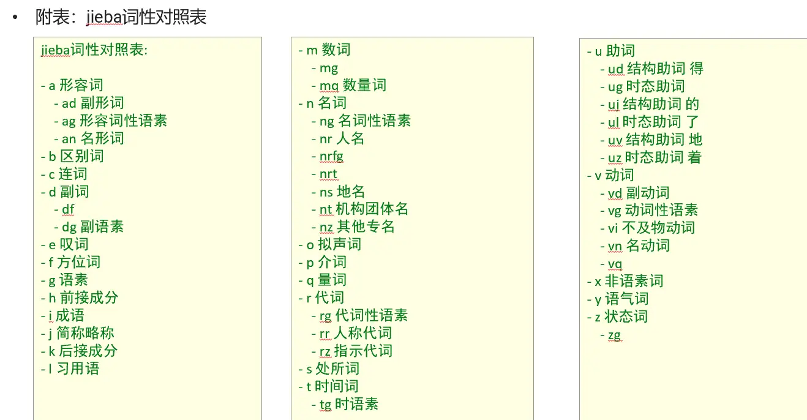

## 4.案例-歌词预测

# 五、NLP自然语言处理

**核心：最后学习章节-迁移学习**

## 1.自然语言处理概述-了解

>NLP：计算机理解和生成人类的语言


## 2.文本预处理-了解

>**概念：准备模型需要的数值化x,y，让其符合模型输入要求，再传送给模型**
>
>作用：降低模型学习难度，提升模型的评估指标，指导模型超参数的选择
>
>文本预处理环节：文本处理基本方法-文本张量表示方法-文本语料的数据分析-文本特征处理-数据增强方法


## 3.文本处理的基本方法

### 3.1分词

>将文本|语句划分成语义理解的最小单元**词**

#### 3.1.1精准模式

不会重复，带有语义，适合文本分析

>**jieba.cut(sentence,cut_all=False) **
>
>cut_all默认未false,可省略
>
>cut结果是生成器generator,通过next()或[i for i in result]得到结果
>
>**jieba.lcut(sentence,cut_all=False) **
>
>lcut结果是列表

#### 3.1.2全模式

尽可能的多切，词全但不注重语义

**jieba.cut(sentence,cut_all=True)**-结果生成器

**jieba.lcut(sentence,cut_all=True)**-结果为列表

#### 3.1.3搜索模式

将长词切为短词，介于上述两者之间

**jieba.cut_for_search(sentence)**-结果生成器

**jieba.lcut_for_search(sentence)**-结果为列表

#### 3.1.4 用户自定义字典

>1.自定义字典格式：xx.txt
>
>|  词   | 词频  | 词性 |
>
>| 传智|   10   |    n    |

>2.加载自定义词典
>
>**jieba.load_userdict(‘文件’)**
>
>3.使用用户字典
>
>jieba.cut(sentencce)
>
>注意：如果词与词之间是包含关系，需要设置的大一些才能修改是否切词

~~~python
import jieba

sentence = '传智教育是一家上市公司，旗下有黑马程序员品牌，我是在黑马这里学习人工智能。今天身体不舒服，蓝瘦香菇。我的刀，我的刀盾。'
# 未使用用户自定义词典
result1=jieba.lcut(sentence)
print(result1)

# 加载用户字典
# 1.准备字典
# 2.定义用户指定词
# 词 词频 词性
# 为什么有词频？决定优先级
# 3.加载字典load_userdict
jieba.load_userdict('./userdict.txt')

# 使用用户字典
result2=jieba.lcut(sentence)
print(result2)
~~~


#### 3.1.5支持繁体字切分

~~~python
import jieba
sentence='煩惱即是菩提，我暫且不提'

# 1.精准模式-适合文本分析，只分词不看语义
result1=jieba.cut(sentence)
# 2.全模式-尽可能的切分，词全但不注重语义
result2=jieba.cut(sentence,cut_all=True)
# 3.搜索模式-适合搜索引擎，介于两者之间
result3=jieba.cut_for_search(sentence)

# cut结果是生成器对象 lcut结果是列表
l1=[i for i in result1]
print(l1)
l2=[i for i in result2]
print(l2)
l3=[i for i in result3]
print(l3)
~~~

### 3.2命名实体识别NER

>面试题：NER是什么？是命名实体识别
>
>命名实体：人名、机构、地名等专有名称统称命名实体，也是人类理解文本的基础单元
>
>命名实体识别：识别出文本中的命名实体

### 3.3词性标注POS

>面试题：pos是什么？是词性标注，标注出一段文本每个词的词性
>
>词性：句子中名词、动词、形容词
>
>将词与词性组成一个新的元组，以列表形式返回[(分词,词性),(分词,词性)]
>
>**API**
>
>from jieba import posseg
>
>posseg.cut(sentence)-结果是生成器
>
>posseg.lcut(sentence)-结果是列表


~~~python
from jieba import posseg as pseg
sentence = '传智教育是一家上市公司，旗下有黑马程序员品牌，我是在黑马这里学习人工智能'
# pseg.cut切词结果：元组（词，对应词性）
result=pseg.cut(sentence)

print(result)

l=[i for i in result]
print(l)

result1=pseg.lcut(sentence)
print(result1)
~~~

## 4.文本张量表示方法

**为什么要把文本转为张量？因为计算机不认识文本只认识数字**

词表示成向量叫词向量，一句话构成词向量矩阵

NLP中文本词向量表示方法：one-hot\Word2vec\word Embedding

### 4.1One-hot编码!

>one-hot编码就是独热编码，将词转为稀疏向量
>
>**将n个不同类别的分类变量，表示成一个n维度(1行n列)的向量，当前位置或维度值为1其他为0**(n个词->1行n列->每个词对应向量中的一个位置，该位置为1，其余为0)
>
>缺点：词与词之间没有关联；大语料下，每个向量的长度过大，占据大量内存

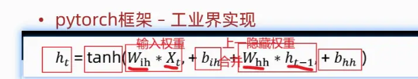

>**词映射器Tokenizer,形成词:索引 词表**
>
>实例化 t=Tokenizer()
>
>训练     tokenizer.fit_on_texts(cabs)
>
>得到词表     t.word_index()

~~~python
import os

os.environ['TF_ENABLE_ONEDNN_OPTS'] = '0'
from tensorflow.keras.preprocessing.text import Tokenizer

import joblib

# 有几个词就有几个维度，其中 一个位置为1，其余为0


cabs = {'关羽', '张飞', '赵云', '马超', '黄忠', '诸葛亮', '刘备'}


# 注意：集合是无序列表 所以要获取数据的话 每次打印出来都不一致
# # ----------手搓-------------
# # 1.转为词表(字典)
# # word_index={cab:i+1 for i,cab in enumerate(cabs)}
# # print(word_index) # 每次打印出来都不一致
# word_index={'黄忠': 1, '关羽': 2, '诸葛亮': 3, '赵云': 4, '刘备': 5, '张飞': 6, '马超': 7}
#
# # 2.将某一个词转为稀疏词向量
# for cab in cabs:
#     # 必须放循环里，否则1会累加，放循环中每次清空
#     one_hot_list = [0] * len(cabs)
#     # print(cab) # 词
#     # print(word_index[cab]) # 词对应的索引
#     index=word_index[cab]-1 # 词对应的位置（索引-1）
#     one_hot_list[index]=1  # 词对应位置为1
#     # 黄忠 [1,0,0,0,0,0]
#     print(cab,one_hot_list)


# -----------使用keras中的tokenizer-----------
# 1.通过tokenizer词映射器进行训练(将词和索引映射起来形成字典)
def train_tokenizer():
    tokenizer = Tokenizer()
    tokenizer.fit_on_texts(cabs)
    # print(tokenizer.word_index)
    # tokenizer训练结束
    # 保存训练结果
    joblib.dump(tokenizer, 'model/tokenizer.pkl')
    # 查看one-hot编码
    for cab in cabs:
        one_hot_list = [0] * len(tokenizer.word_index)
        index = tokenizer.word_index[cab] - 1
        one_hot_list[index] = 1
        print(cab, one_hot_list)


# 2.加载映射器查看one-hot编码
def use_tokenizer():
    tokenizer = joblib.load('model/tokenizer.pkl')
    for cab in cabs:
        one_hot_list=[0]*len(tokenizer.word_index)
        index=tokenizer.word_index[cab]-1
        one_hot_list[index]=1
        print(cab,one_hot_list)


if __name__ == '__main__':
    # train_tokenizer()
    use_tokenizer()

~~~

>读取：joblib.dump(tokenizer, 'model/tokenizer.pkl')
>
>加载：joblib.load(‘文件’)

### 4.2Word2vec稠密向量

>word2vec 搭建神经网络，用权重表示词向量，探索词与词之间的语义关系


>两种训练词向量方式：CBOW、Skip-gram


>CBOW 基于两侧预测中间
>
>基于上一个词的稀疏向量和下一个词的稀疏向量，经过神经网络的前向传播(加权求和上一个词和下一个词)，得到预测值，
>
>将预测值与真实值的损失进行自动微分，得到梯度进行反向传播；
>
>反向传播更新W权重，最终用W表示词的向量


>Skip-gram基于中间预测两端
>
>基于一个词的稀疏向量，经过神经网络的前向传播，得到上一个和下一个的预测值，再进行反向传播更新W权重，最终用W表示词的向量

简单来说就是：n个词向量->输入层n->经过m个隐藏层->输出n个


### 知识回顾

>sop三元组-实体与实体之间的关系 -》知识图谱，三维 每个实体都有坐标


>conda管理python环境- 终端和编辑器的python环境保持一致（否则安装和查看包会在之前的环境）
>
>新建python环境：conda create -n 名称 python=版本
>
>查看conda环境：conda env list
>
>切换：conda activate 名称

### 额外补充

>国外 huggingface
>
>国内 魔搭社区modelscope,有预处理数据

##

### 4.3文本张量表示方式

#### Word2vec静态!

基于one-hot做优化，主要有CBOW(连续词袋模式)，skipgram(跳字模式)，都是用**隐藏层权重矩阵充当词向量矩阵**

>**Skipgram和CBOW区别**
>
>1.CBOW
>
>原理简单，适合高频词处理，快速生成词向量
>
>2.Skip-gram
>
>原理复杂(计算2次)，适合低频词处理，训练速度相对比较慢
>
>具有上下文信息，理解复杂语义

>**代码实现!**
>
>import fasttext 将词变成词向量,以及文本分类工具
>
>1.直接训练
>
>fasttext.train_supervised(‘文件’)
>
>2.使用超参训练
>
>fasttext.train_unsuperviesd(‘文件’,model,lr,dim,epoch,theard)
>
>model:skipgram、cbow
>
>lr：学习率
>
>dim：维度，自定义，多个维度表达一个词
>
>epoch:训练轮次
>
>thread:线程
>
>3.保存模型
>
>save_model()
>
>4.加载模型
>
>load_model()
>
>5.查看某个词的词向量
>
>get_word_vector()
>
>6.查看某个词的邻近词(KNN邻近算法，相似度计算)
>
>get_near_neighbors()

~~~python
import fasttext
# 稀疏向量:one-hot 多少个维度就多少个词
# 稠密向量：
# word2vec(dim=100) 静态的训练好再使用，维度自定义（多少个维度表达一个词）
# nn.Embedding(单词数量，dim=维度) 动态训练，边训练边用


def dm01():
    # 1.使用fasttext训练模型(无监督学习)->得到词向量
    # 默认使用skip gram(跳字模式)方式训练词向量
    model = fasttext.train_unsupervised('./data/wh02aa')
    # 2.保存训练好的模型
    model.save_model('model/wh02aa.model')


def dm02():
    # # 1.使用fasttext加载模型
    # model=fasttext.load_model('model/wh02aa.model')
    # # 2.使用模型查看词的维度
    # vector=model.get_word_vector('the')
    # print(vector)
    # print(vector.shape)

    # 使用修改了超参的模型进行测试
    model = fasttext.load_model('model/wh02aa_new.model')
    vector = model.get_word_vector('two')
    print(vector)

    # 查看周边词（通过K近邻KNN，相似度计算，来判断相关性）
    result=model.get_nearest_neighbors('two')
    print(result)


def dm03():
    # 1.修改训练的超参数
    model = fasttext.train_unsupervised('./data/wh02aa', model='cbow', lr=0.01, epoch=3, dim=50, thread=10)
    model.save_model('model/wh02aa_new.model')


if __name__ == '__main__':
    # dm01()
    # dm03()
    dm02()

~~~

#### Word Embedding动态！

>1.作用：将词转为词向量，是深度神经网络中的一个层，通过torch.nn.Embedding(num_embeddings词典索引范围|词典页数,自定义维度)
>
>num_embeddings和输入的词数量可以不相等
>
>2.总结：
>
>输入-索引号序列（每个数字代表一个词，多个词可以共享同一个索引）
>
>输出-根据索引序号查表得到词向量
>
>核心-不同的词只要在词表\词典中索引相同，那么得到的词向量就相同
>
>原因-Embedding层不认识‘词’，只认识'数字'

~~~python
import os

os.environ['TF_ENABLE_ONEDNN_OPTS'] = '0'
import jieba
from tensorflow.keras.preprocessing.text import Tokenizer
import torch
from torch.utils.tensorboard import SummaryWriter

sentence1 = '传智教育是一家上市公司，旗下有黑马程序员品牌。我是在黑马这里学习人工智能'
sentence2 = "我爱自然语言处理"

# 1.分词-词列表
sentence = [sentence1, sentence2]
word_to_list = []
for word in sentence:
    result = jieba.lcut(word)
    word_to_list.append(result)
# print(word_to_list)

# 2.词和索引的映射tokenizer-词表
tokenizer = Tokenizer()
# 模型训练
tokenizer .fit_on_texts(word_to_list)
# print(tokenizer .word_index)  # 词表word_index

# 3.搭建embedding层-获得词向量
# 参数： 1.词数量 2.维度-自定义
embed = torch.nn.Embedding(len(tokenizer.word_index), embedding_dim=8)
# embedding默认使用 标准正态分布（均值0，方差1） 随机初始化权重矩阵，即每一维的值都是从 N(0, 1) 中采样的随机浮点数。
# 本质是查表操作 embedding索引从0开始（20，8）
# print('embed:',embed.weight.data.shape) # 20,8

# 4.通过词表索引获得词向量
# 索引必须转成 张量(1) 给embedding层获取词向量
for word in tokenizer .word_index:
    # 词：处理,词向量：tensor([ 1.6054, -0.3369, -0.6436, -1.7126, -0.0194,
    # 1.1691,  2.7937,  0.1816],grad_fn=<EmbeddingBackward0>)
    print(f'词：{word},词向量：{embed(torch.tensor(tokenizer.word_index[word] - 1))}')


# print(tokenizer.word_index.keys())
# 5.数据可视化
# 输出结果存放目录
summary=SummaryWriter('./logs')
# 参数：模型权重 展示label标签
summary.add_embedding(embed.weight.data,tokenizer.word_index.keys())
summary.close()

# 1.代码当前目录下，终端启动命令：tensorboard --logdir=logs（结果存放目录） --host 0.0.0.0
# 2.访问地址，将地址改成http://localhost:6006
~~~

#### Word2vec和Embedding区别

>相同点：将文本转|训练成词向量
>
>不同点：
>
>1.word2vec 静态，训练好了再使用 | embedding 动态，边训练边使用
>
>2.word2vec使用为2步：输入词得到词向量，再送给神经网络进行使用
>
>embedding使用1步：直接嵌入神经网络中->词嵌入层

~~~python
import os

os.environ['TF_ENABLE_ONEDNN_OPTS'] = '0'
import jieba
from tensorflow.keras.preprocessing.text import Tokenizer
import torch
from torch.utils.tensorboard import SummaryWriter

sentence1 = '传智教育是一家上市公司，旗下有黑马程序员品牌。我是在黑马这里学习人工智能'
sentence2 = "我爱自然语言处理"

# 1.分词-词列表
sentence = [sentence1, sentence2]
word_to_list = []
for word in sentence:
    result = jieba.lcut(word)
    word_to_list.append(result)
# print(word_to_list)

# 2.词和索引的映射tokenizer-词表
tokenizer = Tokenizer()
# 模型训练
tokenizer .fit_on_texts(word_to_list)
# print(tokenizer .word_index)  # 词表word_index

# 3.搭建embedding层-获得词向量
# 参数： 1.词数量 2.维度-自定义
embed = torch.nn.Embedding(len(tokenizer.word_index), embedding_dim=8)
# embedding默认使用 标准正态分布（均值0，方差1） 随机初始化权重矩阵，即每一维的值都是从 N(0, 1) 中采样的随机浮点数。
# 本质是查表操作 embedding索引从0开始（20，8）
# print('embed:',embed.weight.data.shape) # 20,8

# 4.通过词表索引获得词向量
# 索引必须转成 张量(1) 给embedding层获取词向量
for word in tokenizer .word_index:
    # 词：处理,词向量：tensor([ 1.6054, -0.3369, -0.6436, -1.7126, -0.0194,
    # 1.1691,  2.7937,  0.1816],grad_fn=<EmbeddingBackward0>)
    print(f'词：{word},词向量：{embed(torch.tensor(tokenizer.word_index[word] - 1))}')


# print(tokenizer.word_index.keys())
# 5.数据可视化
# 输出结果存放目录
summary=SummaryWriter('./logs')
# 参数：模型权重 展示label标签
summary.add_embedding(embed.weight.data,tokenizer.word_index.keys())
summary.close()

# 1.代码当前目录下，终端启动命令：tensorboard --logdir=logs（结果存放目录） --host 0.0.0.0
# 2.访问地址，将地址改成http://localhost:6006

~~~


## 5.文本数据分析-做决策的依据

>1.是什么：预处理的前置步骤，为了明白、看懂手里的数据，确保符合要求
>
>2.作用：（1）发现数据质量问题：错别字、语法错误、重复内容、缺失值
>
>​                 (2)  发现分布不均衡问题，指导预处理策略的选择：标签分布不均衡、句子长度分布不均衡
>
>​                 (3)  为模型选择提供依据：文本长度分布、词汇量大小
>
>3.举例：做菜前需要看下食材，有的菜发霉要扔掉，有的有农药需要泡盐水，有的很好只需要简单处理。不看食材直接下锅，做出来大概率是黑暗料理。

### 标签数量分布！

>**深度学习模型分类问题，一般要将正负样本比例维持在1:1左右，不符合进行数据删减或增强**

~~~python
import pandas as pd
import matplotlib.pyplot as plt
import matplotlib

# 获取标签数量，为了分析正负样本的比例是否接近1：1

# 设置引擎
matplotlib.use('TkAgg')
# 中文字体乱码解决
matplotlib.rcParams['font.sans-serif'] = ['SimHei']
# 解决符号问题
matplotlib.rcParams['axes.unicode_minus'] = False

# 1.获取训练数据和验证数据
train_data = pd.read_csv('./data/train.tsv', sep='\t')
dev_data = pd.read_csv('./data/dev.tsv', sep='\t')

# 2.展示训练数据的正负样本
# # label 0负样本 1正样本
# # print(train_data['label'].values) # dataframe 转为numpy
# print(train_data['label'].values==0) # 布尔索引
# print(len(train_data['label'].values[train_data['label'].values == 0])) # 通过布尔索引取出所有为0的数据
total0 = len(train_data['label'].values[train_data['label'].values == 0])
total1 = len(train_data['label'].values[train_data['label'].values == 1])

plt.bar(['0', '1'], [total0, total1])
plt.show()
~~~

### 句子长度分布！

>观察每个句子长度都为多少，规范长度
>
>如果模型对输入数据长度有要求，可以对句子进行截断和补齐操作

>**补充map方法**
>
>API：map(处理的函数,处理的数据)
>
>作用：将数据经过处理函数，返回新的数据
>
>返回类型：迭代器

>train_data['sentence'].str.len()
>
>也可以获取当前句子的长度

~~~python
import pandas as pd
import matplotlib.pyplot as plt
import matplotlib
import seaborn as sns

matplotlib.use('TkAgg')
# 准备数据
plt.style.use('fivethirtyeight')
train_data = pd.read_csv('./data/train.tsv',sep='\t')
dev_data = pd.read_csv('./data/dev.tsv',sep='\t')
# print(train_data[:5]) #sentence  label
# ------------------------------------------------
# TODO:数据添加一列，[句子的长度]
# train_data['sentence_length']=[]
# print(train_data['sentence'][0]) # 一个句子
# print(len(train_data['sentence'][0])) # 一个句子的长度
# for i in train_data['sentence']: #每一个句子的长度
#     print(len(i))
# map(处理的函数，处理的数据) 执行完成后会返回新的经过函数处理的数据
# print(map(lambda x: len(x), train_data['sentence'][:5])) # map返回的是迭代对象
sentence_length=list(map(lambda x: len(x), train_data['sentence']))
# train_data['sentence'].str.len() # 简化写法
train_data['sentence_length']=sentence_length
# ------------------------------------------------
# 绘制
sns.countplot(x='sentence_length',data=train_data)
plt.xticks([])
plt.show()
sns.histplot(x='sentence_length',data=train_data,kde=True)
plt.xticks([])
plt.show()
~~~

### 正负样本长度

>方便定位异常点，比如某个句子长度过长

~~~python
import matplotlib
import pandas as pd
import seaborn as sns
import matplotlib.pyplot as plt

matplotlib.use('TkAgg')

train_data=pd.read_csv('./data/train.tsv',sep='\t')
dev_data=pd.read_csv('./data/dev.tsv',sep='\t')
# print(type(train_data)) # pandas.dataframe
# print(train_data[:5]) # sentence  label
# print(type(train_data['sentence'][:5])) # pandas.series

# 训练集每个句子的长度
train_data['sentence_length']=train_data['sentence'].str.len()
# 验证集每个句子的长度
dev_data['sentence_length']=train_data['sentence'].str.len()
# 画散点图
sns.stripplot(x='label',y='sentence_length',data=train_data,color='red')
sns.stripplot(x='label',y='sentence_length',data=dev_data,color='blue')
plt.show()
~~~

### 词云!

>查看是**词**内容否违反语料**标签**,比如：负样本出现真棒、好等字样
>
>**API：**
>
>from wordcloud import WordCloud
>
>WordCloud(background_color,font_path,max_words,max_font_size).generate(字符串)
>
>background_color:背景色
>
>font_path:字体文件
>
>max_words:最大单词数量
>
>max_font_size:最大字体

~~~python
import pandas as pd
import jieba.posseg
import matplotlib
import matplotlib.pyplot as plt
from wordcloud import WordCloud

matplotlib.use('TkAgg')

# TODO-获取正样本数据
# 1.训练集
train_data=pd.read_csv('./data/train.tsv',sep='\t')
# 2.正样本
# print(train_data['label']==1) # 布尔值
# print(train_data[train_data['label'] == 1]) # 布尔索引
train_positive_data=train_data[train_data['label']==1]
# 3.将样本的句子取出来
train_positive_sentences=train_positive_data['sentence']
# print(type(train_positive_sentences)) # pandas.series

# TODO-分词
# 将列表转为字符串
text=''.join(train_positive_sentences)
# 带有(词,词性)的列表
cut_word_list=jieba.posseg.lcut(text)
# print(cut_word_list[:5])

# TODO-用于词云展示的列表-形容词
word_list=[]
for word in cut_word_list:
    # print(f'词：{word.word},词性：{word.flag}')
    if word.flag=='a':
        word_list.append(word.word)
# print(word_list)

# TODO-生成词云
# # 1.实例化词云生成器对象
# wc=WordCloud(
#     background_color='white', # 背景色
#     font_path='./data/SimHei.ttf', # 字体
#     max_words=100, # 最多显示的词数
#     max_font_size=100, # 最大字体大小
# )
# # 2.准备数据-列表转为字符串
# word_string=''.join(word_list)
# # 3.产生词云
# wc.generate(word_string)

# 1.产生词云
wc = WordCloud(
    background_color='white',
    font_path='./data/SimHei.ttf',
    max_words=100,
    max_font_size=100
).generate(' '.join(word_list))
# 2.绘制
plt.figure()
plt.imshow(wc,interpolation='bilinear')
plt.axis('off')
plt.show()

~~~

**补充API接口**

>1. *拆包：将最外层的括号进行拆包(移除)
>2. chain函数：将多个列表合并成1个列表(直接合并list1+list2)，返回结果是迭代器
>3. zip函数：将多个列表压缩成1个列表，按照相同维度(列)进行压缩(打包形成一个元组)，返回结果是迭代器

~~~python
# *拆包：将最外层的括号进行拆包(移除)
# chain函数：将多个列表合并成1个列表（直接合并list1+list2）

from itertools import chain

data = [[1, 2], [3, 4]]

# 1.* 拆包
print(*data)  # [1,2] [3,4]
# 2.chain函数 合并成新列表
result = chain(*data)
print(result)  # 返回对象itertools.chain
# 把itertools迭代器转换成列表
print(list(result))  # 返回列表[1, 2, 3, 4]
new_list=list(chain(*data))
print(new_list)
~~~

~~~python
# zip是压缩函数，将多个列表压缩成1个列表，按照相同维度(列的值)进行压缩(打包形成一个元组)
# eg:data1=[1,2,3,4,5]
# data2=[2,3,4,5]
# data3=[3,4,5]
# 压缩结果： [(1,2,3),(2,3,4),(3,4,5)]

def my_zip(data):
    result=[]
    # enumerate() 返回的是一个枚举对象（迭代器），
    # 每个元素是一个 (index, value) 的元组
    for index,item in enumerate(data):
        if index==len(data)-2:
            break
        result.append((item,data[index+1],data[index+2]))
    return result


if __name__ == '__main__':
    data1=[1,2,3,4,5]
    result=my_zip(data1)
    print(result)
    data2=[1,2,3]
    # print(zip(data1, data2)) # zip object
    print(list(zip(data1, data1[1:],data1[2:]))) # zip object
~~~

## 6.文本特征处理

目的：给语料添加特征，提升模型性能指标，常见方法如下

### 1.n-gram特征

>背景：如果只一个词一个词看句子，语义信息有的无法理解
>
>eg:一行行行行，这里一行和行、行、行、行分别需要从2歌词和3歌词角度理解
>
>n-gram：n个单词相邻并共现，可以作为一个特征(相邻的n个词组成一个新的词)
>
>分类：1-gram:uni-gram 2-gram:bi-gram 3-gram:tri-gram

~~~python
# 背景：如果只一个词一个词看句子，语义信息有的无法理解
# eg: 一行行行行，这里一行和行、行、行、行分别需要从2歌词和3歌词角度理解
# 文本特征处理-相邻的N个词组合成一个新词(添加新特征，理解语义)
# n=1 1-gram,uni-gram
# n=2 2-gram,bi-gram
# n=3 3-gram,tri-gram
# 需求：需要2个或3个词去理解句子，就需要给词添加新的特征（从N个词的维度理解词，就是ngram）

# 目标： 提取2-gram
data=['我','爱','学习','我','爱','生活']
print(data[0:])
print(data[1:])
n_gram=2
# [['我', '爱', '学习', '我', '爱', '生活'],
# ['爱', '学习', '我', '爱', '生活']]
print([data[i:] for i in range(n_gram)])
# *拆包成多个列表 [] []
# 再用zip()压缩 列合成一个元组，返回迭代器
print(zip(*[data[i:] for i in range(n_gram)]))
# 再用set()集合 去重，无序列表
print(set(zip(*[data[i:] for i in range(n_gram)])))

# 目标：提取3-gram
n_gram=3
print(set(zip(*[data[i:] for i in range(n_gram)])))
~~~

### 2.文本长度规范

>背景：模型训练语料长度固定，但文本长度参差不齐，所以补全或截断处理
>
>**API**：
>
>from tensorflow.keras.prepocessing import sequence
>
>sequence.pad_sequences(sequences,maxlen,padding,truncating)
>
>参数说明：
>
>sequences： 处理的数据
>
>maxlen：长度的标准
>
>padding：补全 ,默认值为pre前向补全, post后向补全
>
>truncating：截断，默认值为pre前向截断，post后向截断

~~~python
import os

os.environ['TF_ENABLE_ONEDNN_OPTS'] = '0'
from tensorflow.keras.preprocessing import sequence

# 背景：模型训练语料长度固定，但文本长度参差不齐，所以做补全或截断处理
# 4种场景
# 前面截断 # 前面补全# 后面截断# 后面补全
# sequence.pad_sequences()参数说明：
# sequences处理的数据 maxlen长度的标准
# （1）默认前面截断前面补全
# （2）补全属性padding 值为pre前 post后
# （3）截断属性truncating 值为pre前 post后
data = [
    [1, 2, 3, 4, 5],  # 补全
    [1, 2, 3, 4, 5, 6, 7, 8],  # 刚好
    [1, 2, 3, 4, 5, 6, 7, 8, 9, 10]  # 截断
]

result1 = sequence.pad_sequences(sequences=data, maxlen=8)
result2 = sequence.pad_sequences(sequences=data, maxlen=8, padding='post')
result3 = sequence.pad_sequences(sequences=data, maxlen=8, padding='post', truncating='post')
result4 = sequence.pad_sequences(sequences=data, maxlen=8, padding='pre', truncating='post')

print('前面截断，前面补全:', result1)
print('前面截断，后面补全:', result2)
print('后面截断，后面补全:', result3)
print('后面截断，前面补全:', result4)
~~~

~~~python
import copy
# 手搓
# 补全和截断 和方向控制
def pad_of_truncate(data, maxlen, padding=1, truncating=1):
    # padding 补全
    # truncating 截断
    # 0 头 1尾
    result = []
    # 深拷贝 保证不修改原来数据！！！
    copy_data=copy.deepcopy(data)
    for d in copy_data:
        # 每个列表进行操作
        # 截断
        if maxlen < len(d):
            if truncating == 0:
                # 头截
                # pop索引删除！！！
                # print(d[len(d) - maxlen:])
                result.append(d[len(d) - maxlen:])
            elif truncating == 1:
                # 尾截
                # print(d[:maxlen])
                result.append(d[:maxlen])
        elif maxlen > len(d):
            # 补全操作 用while循环
            if padding == 0:
                while maxlen > len(d):
                    d.insert(0,0)
                # 补全后
                result.append(d)
                # extend拼接
                # c1.extend([0] * len(count))
                # c1 += [0] * len(count)
            elif padding==1:
                # 尾补
                while maxlen > len(d):
                    d.append(0)
                result.append(d)
        else:
            result.append(d)
    return result


if __name__ == '__main__':
    data = [
        [1, 2, 3, 4, 5],  # 补全
        [1, 2, 3, 4, 5, 6, 7, 8],  # 刚好
        [1, 2, 3, 4, 5, 6, 7, 8, 9, 10]  # 截断
    ]
    # 0 头 1尾
    result=pad_of_truncate(data, 8, 1, 1)
    print('-----')
    print('前面补齐，前面截断',result)
    result=pad_of_truncate(data, 8, 0, 1)
    print(result)

~~~

## 7.文本数据增强

>回译数据增强法：通过将文本翻译新增语料
>
>优点：简单
>
>缺点：短文本语料易重复；连续翻译一般不超过3次，超过容易失真

## 8.RNN及其变体！

### 传统RNN

>1.概念：输入数据、输出数据均为序列，通过内部结构设计捕获**序列特征**（顺序）
>
>**2.特点：**上一个时间的隐藏输出h+输入数据 得到当前输出和当前时间的隐藏输出（两个输入两个输出）
>
>3.场景
>
>不适合：长文本理解，会梯度爆炸或消失，丢失信息，压缩之前内容
>
>适合：短序列任务，计算快；概率计算，歌词预测、情感分析、人类语言等
>
>4.按RNN内部构造分类
>
>传统RNN、LSTM、Bi-LSTM、GRU、Bi-GRU（双向）
>
>**5.RNN内部结构！**
>
>输入层->隐藏层（词嵌入层、循环网络层）->输出层
>
>2个输入通过隐藏层先加权求和再使用激活函数tanh计算得到2个输出，再去循环输入
>
>eg:
>
>输入 → [加权和 + tanh] → 输出（给下一时刻）
>         ↑              |
>         └── 循环（来自上一时刻输出）
>
>tanh作用：将值压缩再0-1之间

可以是多个神经元组成的？是


>**API接口！**
>
>1.构建RNN层
>
>rnn=torch.nn.RNN(input_size,hidden_size,num_layers)
>
>input_size输入维度|词向量维度 hidden_size隐藏层|输出维度 num_layers隐藏层层数
>
>2.使用RNN层
>
>output,hn=rnn(x,h0)
>
>x：seq_len 句子长度，batch每批样本数量，input_size输入维度
>
>h0：num_layers隐藏层层数，batch每批样本数量，hidden_size隐藏层维度
>
>output:seq_len句子长度，batch每批样本数量，hidden_size隐藏层维度
>
>hn：同h0
>
>3.结论：隐藏层为n的时候，当前隐藏层的最后一个结果就是输出结果

### LSTM

>1.目的：解决RNN长序文本理解不好的问题，有效捕捉长序列之间语义管理，缓解梯度下降和消失问题
>
>**2.工作原理：**
>
>输入层-隐藏层-输出层
>
>三个输入：输入、上一时间隐藏、上一时间细胞状态
>
>三个输出：输出、当前时间隐藏、当前时间细胞状态
>
>结构为三个门一个细胞状态：遗忘门、输入门、细胞状态、输出门
>
>口语化解释：遗忘门决定旧的信息要忘掉（从记忆细胞中获取，接近1保留，0忘记），输入门决定新的信息要保留哪些，细胞状态将遗忘门和输入门的输入进行长期保存，输出门决定从细胞状态中挑选重点给下一个（相册）

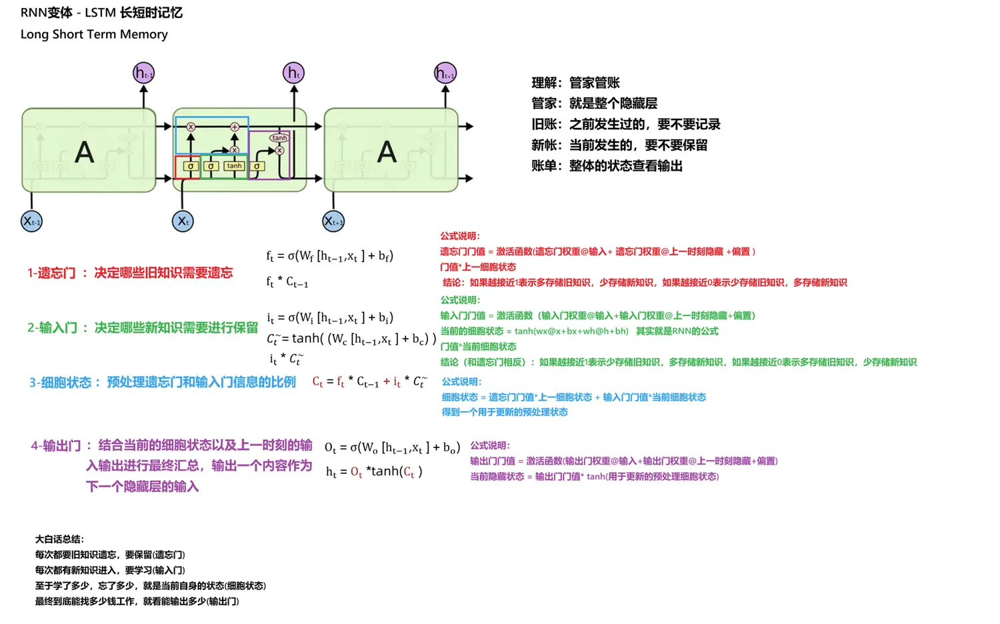

>双向Bi-LSTM模型
>
>不改变LSTM模型内部结构，只是把一句话从左往右和从右往左进行两次LSTM处理，最终结果进行拼接输出

>**API接口！**
>
>1.构建LSTM层
>
>rnn=torch.nn.LSTM(input_size,hidden_size,num_layers,bidirectional)
>
>input_size输入维度|词向量维度
>
>hidden_size隐藏层|输出维度
>
>num_layers隐藏层层数
>
>bidirectional=True代表双向Bi-LSTM,默认为False
>
>2.使用LSTM层
>
>output,(hn,cn)=rnn(x,(h0,c0)
>
>x：seq_len 句子长度，batch每批样本数量，input_size输入维度
>
>h0：num_layers隐藏层层数，batch每批样本数量，hidden_size隐藏层维度
>
>c0：同h0
>
>output:seq_len句子长度，batch每批样本数量，hidden_size隐藏层维度
>
>hn：同h0
>
>cn：同h0

### GRU门控循环单元结构

>1.目的：也能解决RNN长序文本理解不好的问题，有效捕捉长序列之间语义管理，缓解梯度下降和消失问题
>
>2.对比：结构比LSTM简单，比RNN要复杂（LSTM的部分门合并，但保留了智能记忆功能，训练更快，还能解决长序列问题）
>
>**3.工作原理：**
>
>输入层->隐藏层->输出层
>
>两个输入：输入数据、上一时间的隐藏
>
>两个输出：输出数据、当前时间的隐藏
>
>结构为2个门：重置门、更新门
>
>4.缺点：不可并行计算

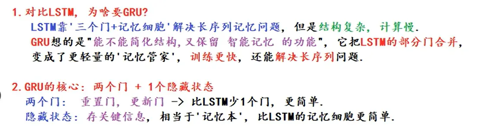

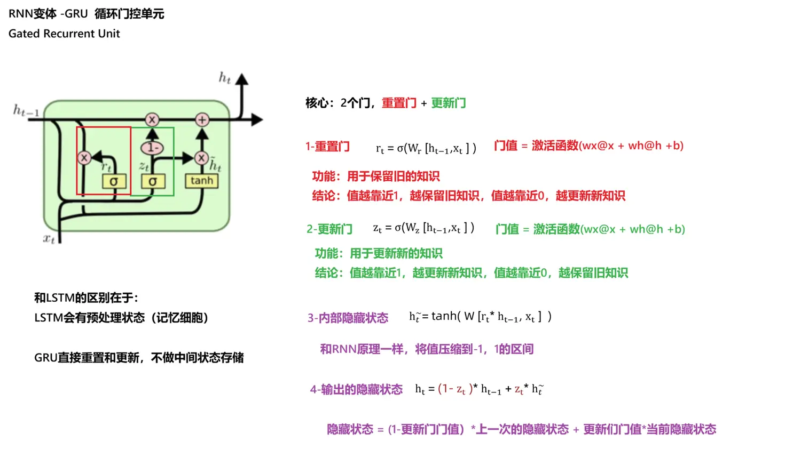

>**API接口！**
>
>1.构建LSTM层
>
>rnn=torch.nn.GRU(input_size,hidden_size,num_layers,bidirectional)
>
>input_size输入维度|词向量维度
>
>hidden_size隐藏层|输出维度
>
>num_layers隐藏层层数
>
>bidirectional=True代表双向Bi-GRU,默认为False
>
>2.使用GRU层
>
>output,hn=rnn(x,h0)

## 9.迁移学习

### 9.1fasttext模型介绍

#### 1.作用及优势

>1.fasttext简介
>
>**自然语言任务NLP的开源工具包,内置fasttext模型**
>
>2.fasttext模型作用：文本分类、训练词向量
>
>3.fasttext模型优势：快速训练和预测、精准
>
>4.优势原因：
>
>fasttext模型结构简单
>
>训练词向量时，使用层次softmax结构
>
>负采样，每次仅更新一小部分权重，降低梯度下降计算量
>
>n-gram特征提取文本特征，弥补缺陷提升精度
>
>**【是个高效工具箱，内部完成词向量、文本特征提取、负采样】**

#### 2.fasttext模型架构！

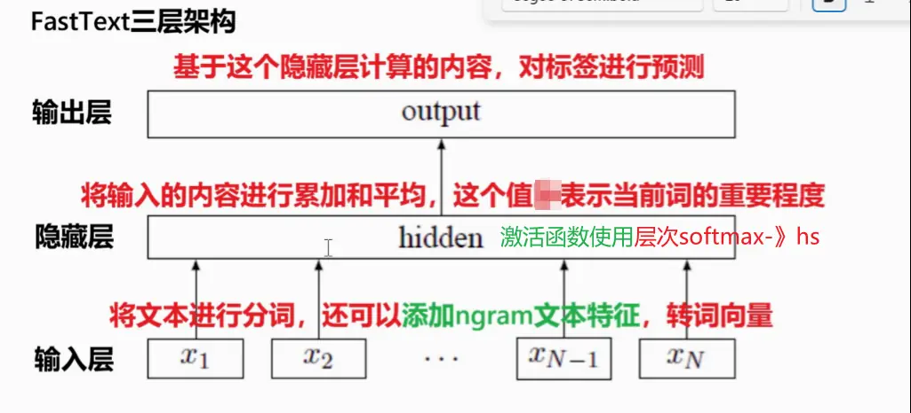

#### 3.层次softmax原理

>1.传统softmax ：大海捞针
>
>将数据映射成概率(总和为1)，相当于输入一句话，softmax会到词表中去计算**所有词**的概率，选取**最高**的那个作为预测结果
>
>2.层次化softmax：转成精准二分类问题(是否)
>
>（1）构建：
>
>通过哈夫曼树将词汇表中所以词表示成二叉树，每个叶子节点对应一个词汇，频率高的词里根节点近，频率低的词离根节点远，每次挑两个最低的形成新节点
>
>每条边打标签，左为1，右为0，得到哈夫曼编码，eg:110
>
>计算带权路径长度wpl=层级*频次（累计层级）
>
>（2）训练
>
>根据WPL路径，计算每次二分类的概率，并相乘
>
>
>
>总结：求每个单词的概率分布 转化为 求单词路径的概率乘积

[【word2vec】层次Softmax（Hierarchical Softmax）-CSDN博客](https://blog.csdn.net/u013172930/article/details/145688005)

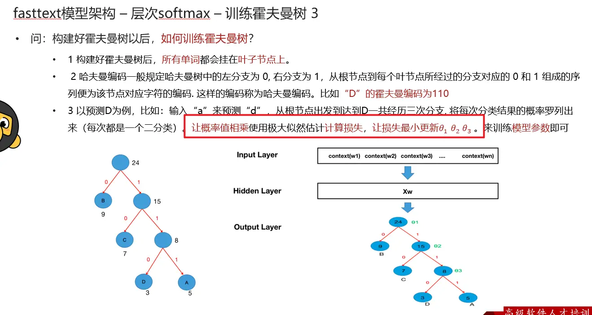

#### 4.负采样原理

>目的：解决消耗资源过多，训练慢的问题
>
>原理：通过仅更新一部分的权重(反向传播)，随机选取n个负样本+1个正样本来更新权重
>
>注意：小规模数据集, 选择5-20个negative words会比较好, 对于大规模数据集可选择2-5个negative words


### 9.2fasttext文本分类

#### 1.文本分类概念和种类

>将文档分配给一个或多个类别
>
>训练文本分类，是有监督学习，需要标签
>
>种类：二分类、单标签多分类、多标签多分类
>
>eg:判断一句评论是好评还是差评\: 输入一个人名, 判断它是来自哪个国家的人名\输入一段讨论，话题可以美食、体育新闻、游戏

#### 2.文本分类实现

>步骤：
>
>1.准备数据
>
>2.划分训练集和测试集
>
>3.模型训练
>
>model=fasttext.train_superviesd()
>
>4.模型预测、模型评估
>
>model.prediction('句子')
>
>model.test(‘训练集’)
>
>5.模型调优
>
>6.模型的保存与重新加载
>
>model.save_model('存储位置')
>
>fasttext.load_modell('存储位置')

~~~python
import fasttext
# 结果：效果差+有bug
# 可以进行优化-数据清洗(AI辅助+人工审核)等

# 1.准备模型
model=fasttext.train_supervised('./data/cooking_train.txt')
# 2.模型预测
# 单个样本测试
result=model.predict('Fan bake vs bake')
print(result)
# 3.模型评估-验证集测试
# valid.txt 验证集
result2=model.test('./data/cooking_valid.txt')
print('验证集：',result2)

# 执行结果解读！！
# Read 0M words # 读取数据大小
# Number of words:  14543 # 数据的单词数量
# Number of labels: 735  # 标签数量
# Progress: 100.0% words/sec/thread线程处理单词数:   42062 lr:  0.000000 avg.loss:  9.950153 ETA剩余时间:   0h 0m 0s
# (('__label__baking',)预测的标签, array([0.08008259]))模型预测的概率
# 验证集： (3000数据量, 0.13966666666666666准确率, 0.060400749603575034精确率)

~~~

#### 3.参数调优

>1.原数据-数据清洗（重复、错误、缺失）
>
>2.训练轮次epoch
>
>3.学习率lr
>
>4.修改n-gram,参数:wordgram
>
>5.修改损失计算方式loss：ns传统softmax改为hs层次softmax
>
>6.自动超参调优
>
>input 训练数据
>
>autotuneValidationFile 验证集数据
>
>autotuneDuration 超参数调参时长
>
>model.predict(k最大数量,threshold阈值)
>
>7.多标签多分类问题：使用loss='ova' one vs all 解决

~~~python
import fasttext


def dm00():
    # 1.准备模型(训练)
    model = fasttext.train_supervised('./data/cooking_train.txt')
    # 2.模型预测
    result1 = model.predict('How much does potato starch affect a cheese sauce recipe?')
    print('result1:', result1)
    result2 = model.test('./data/cooking_valid.txt')
    print('result2:', result2)
    # 执行结果
    # result1: (('__label__baking',), array([0.02251144]))
    # result2: (3000, 0.136, 0.05881504973331411)


# 基于直接训练，修改原数据(大小写、缺失值、重复、错误等)
def dm01():
    # 1.准备模型并训练
    model = fasttext.train_supervised('./data/cooking.pre.train')
    # 2.模型预测
    result1 = model.predict('How much does potato starch affect a cheese sauce recipe?')
    print('result:', result1)
    # 3.模型评估
    result2 = model.test('./data/cooking.pre.valid')
    print('result2:', result2)
    # result: (('__label__food-safety',), array([0.02711198]))
    # result2: (3000, 0.16533333333333333, 0.07150064869540147)


# 基于上次训练，增加训练轮次
def dm02():
    # 1.准备模型
    # epoch默认为5
    model = fasttext.train_supervised('./data/cooking.pre.train', epoch=30)
    # 2.模型预测
    result1 = model.predict('How much does potato starch affect a cheese sauce recipe?')
    print('result:', result1)
    result2 = model.test('./data/cooking.pre.valid')
    print('result2:', result2)
    # result: (('__label__cheese',), array([0.19458202]))
    # result2: (3000, 0.5353333333333333, 0.2315121810580943)


# 基于上次训练，新增 修改学习率
def dm03():
    # 1.准备模型
    # epoch默认为5
    model = fasttext.train_supervised('./data/cooking.pre.train', epoch=30, lr=0.3)
    # 2.模型预测
    result1 = model.predict('How much does potato starch affect a cheese sauce recipe?')
    print('result:', result1)
    result2 = model.test('./data/cooking.pre.valid')
    print('result2:', result2)
    # result: (('__label__sauce',), array([0.52427876]))
    # result2: (3000, 0.569, 0.24607178895776272)


# 基于上次训练，新增n-gram特征
def dm04():
    # 1.准备模型
    # epoch默认为5
    model = fasttext.train_supervised('./data/cooking.pre.train', epoch=30, lr=0.3, wordNgrams=2)
    # 2.模型预测
    result1 = model.predict('How much does potato starch affect a cheese sauce recipe?')
    print('result:', result1)
    result2 = model.test('./data/cooking.pre.valid')
    print('result2:', result2)
    # result: (('__label__sauce',), array([0.35157785]))
    # result2: (3000, 0.5716666666666667, 0.2472250252270434)


# 基于上次训练，修改损失计算方式 ns传统softmax->hs层次sotfmax
def dm05():
    # 1.准备模型
    model = fasttext.train_supervised('./data/cooking.pre.train', epoch=30, lr=0.3, wordNgrams=2, loss='hs')
    # 2.模型预测
    result1 = model.predict('How much does potato starch affect a cheese sauce recipe?')
    print('result:', result1)
    result2 = model.test('./data/cooking.pre.valid')
    print('result2:', result2)
    # result: (('__label__sauce',), array([0.55499268]))
    # result2: (3000, 0.5613333333333334, 0.2427562346835808)


# 自动超参数调参
def dm06():
    # 1.准备模型
    # 参数说明：input训练数据、autotuneValidationFile验证数据、autotuneDuration超参数调参时长
    model = fasttext.train_supervised(input='./data/cooking.pre.train',
                                      autotuneValidationFile='./data/cooking.pre.valid', autotuneDuration=60 * 2)
    # 2.模型预测
    result1 = model.predict('How much does potato starch affect a cheese sauce recipe?')
    print('result:', result1)
    # 3.模型评估
    result2 = model.test('./data/cooking.pre.valid')
    print('result2:', result2)
    # result: (('__label__sauce',), array([0.20633355]))
    # result2: (3000, 0.575, 0.24866657056364422)


# 修改损失方式,适配多标签问题ova!
# 多标签分类的解决方案补充：
# 多标签转化成单标签，每个标签是二分类
# eg:多标签
# __label__baking __label__peanuts how to seperate peanut oil from roasted peanuts at home ?
# x:特征
# how to seperate peanut oil from roasted peanuts at home ?
# y:标签（二分类）
# __label__baking
# y:标签（二分类）
# __label__peanuts
# 最后预测的结果标签可能1个或多个 [__label__baking] [__label__peanuts] [__label__baking,__label__peanuts]
# 所以在预测的时候标记以下到底要几个，以及标记下概率多少以上才要这个标签

def dm07():
    # 1.准备模型
    # loss = 'ova'one vs all 多标签
    model = fasttext.train_supervised('./data/cooking.pre.train', epoch=30, lr=0.3, wordNgrams=2, loss='ova')
    # 2.模型预测
    # k 2个标签（类似于top） threshold阈值
    result1 = model.predict('How much does potato starch affect a cheese sauce recipe?', k=2, threshold=0.5)
    print('result:', result1)
    # 全要(不带threshold时)
    result2 = model.predict('Regulation and balancing of readymade packed mayonnaise and other sauces', k=-1,
                            threshold=0.5)
    print('result2:', result2)
    result3 = model.test('./data/cooking.pre.valid')
    print('result3:', result3)
    # result: (('__label__sauce', '__label__cheese'), array([0.98637319, 0.93992335]))
    # result2: (('__label__mayonnaise', '__label__sauce', '__label__acidity', '__label__storage-lifetime'),
    #           array([0.94816452, 0.87748682, 0.76630366, 0.65842754]))
    # result3: (3000, 0.6043333333333333, 0.2613521695257316)


# 基于上一步，训练和保存模型
def dm08():
    model = fasttext.train_supervised(
        './data/cooking.pre.train',
        epoch=30,
        lr=0.3,
        wordNgrams=2,
        loss='ova')
    model.save_model('./model/cooking.model')
    print('模型保存成功！')


# 基于上步，加载模型并使用模型
def dm09():
    model = fasttext.load_model('./model/cooking.model')
    result1 = model.predict('How much does potato starch affect a cheese sauce recipe?', k=2, threshold=0.5)
    result2 = model.predict('Regulation and balancing of readymade packed mayonnaise and other sauces', k=-1,
                            threshold=0.5)
    result3 = model.test('./data/cooking.pre.valid')
    print('result1:', result1)
    print('result2:', result2)
    print('result3:', result3)


if __name__ == '__main__':
    # dm00()
    # dm01()
    # dm02()
    # dm03()
    # dm04()
    # dm05()
    # dm06()
    # dm07()
    # dm08()
    dm09()
~~~

### 9.3迁移学习

>概念：他人训练好的模型，下载使用

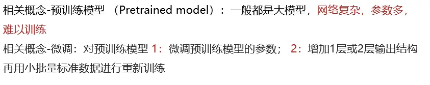

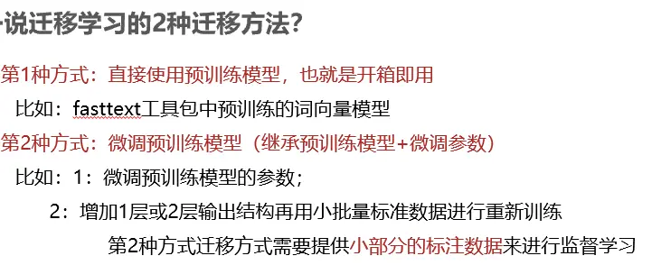

#### 1.Transformers库三层应用结构

>管道Pipline
>
>**自动模型AutoModel（常用）**
>
>具体模型

#### 2.管道

>优点：简单易上手，只需要更改任务&模型和输入内容即可获得结果
>
>**API接口**
>
>from transformers import pipeline
>
>1.准备模型  model=pipeline(task,model)  task:任务类型 model:预训练的模型
>
>2.模型预测  pre=model('文本')
>
>3.查看预测结果 print(pre)

D:\hm\my\zhengshi\7.NLP\ziliao\PretrainedModel\【模型】中config.json中查看模型配置，包括结果lable

##### 文本分类任务

>将文本内容进行分类，结果是5分类

~~~python
from transformers import pipeline
import numpy as np

# 模型路径
Model_path=r'D:\hm\my\zhengshi\7.NLP\ziliao\PretrainedModel'

def dm01():
    # 1.准备模型
    model=pipeline(task='sentiment-analysis',model=Model_path+r'\chinese_sentiment')
    # 2.模型预测
    output=model('这件衣服真好看')
    # 3.查看预测结果
    print(output) # [{'label': 'star 5', 'score': 0.5418374538421631}]
~~~

##### 特征提取任务

>提取文本的特征(词向量，多个维度来解释一个词)
>
>[cls]+[文本长度]+[sep]
>
>cls 开头标识符
>
>sep 结束标识符

~~~python
from transformers import pipeline
import numpy as np
def dm02():
    # 1.准备模型
    model=pipeline(task='feature-extraction',model=Model_path+r'\bert-base-chinese')
    # 2.模型预测
    output=model('今天天气不错，适合郊游') # len=11
    # 3.查看预测结果
    # print(output) # list
    print(np.array(output).shape) # (1, 13, 768)
    # 结果解读： 1个样本 文本长度13 768个词向量
    # 13原因：[cls]+[文本长度]+[sep]
    # 开头标识符+文本长度+结尾标识符
~~~

##### 完形填空任务

>又称**遮蔽语言建模任务** ，使用[MASK]遮住某个词，该词就是要预测的（一次只能预测一个词，多个词的话先预测第一个 第二个为[MASK]，再预测第二个 第一个为[MASK]）

~~~python
# TODO-完形填空任务
# 任务：'fill-mask'
# 模型：\chinese-bert-wwm
def dm03():
    # 1.实例化模型
    model = pipeline(task='fill-mask', model=Model_path + r'\chinese-bert-wwm')
    # 2.模型预测
    output = model('今天[MASK]不错，适合郊游') # 不支持两MASK ，一次只支持一个MASK 代表一个词
    # 3.查看模型预测结果
    print(output)
    # [{'score': 0.6463779807090759, 'token': 6820, 'token_str': '还', 'sequence': '今 天 还 不 错 ， 适 合 郊 游'},
    #  {'score': 0.14567358791828156, 'token': 738, 'token_str': '也', 'sequence': '今 天 也 不 错 ， 适 合 郊 游'},
    #  {'score': 0.03277166932821274, 'token': 2523, 'token_str': '很', 'sequence': '今 天 很 不 错 ， 适 合 郊 游'},
    #  {'score': 0.011290019378066063, 'token': 3717, 'token_str': '水', 'sequence': '今 天 水 不 错 ， 适 合 郊 游'},
    #  {'score': 0.01023552194237709, 'token': 1921, 'token_str': '天', 'sequence': '今 天 天 不 错 ， 适 合 郊 游'}]

~~~

##### 阅读理解任务

>任务：'question-answering'（已废弃）
>
>模型：\chinese_pretrain_mrc_roberta_wwm_ext_large

##### 文本摘要任务

>任务：'summarization'（已废弃）
>
>模型：\distilbart-cnn-12-6

##### NER命名实体识别任务

>识别文本中的 命名实体，比如：人名、地名等
>
>结果：B代表实体开始，I代表实体内部，O代表非实体（关注结果的BI即可）

~~~python
# TODO-NER任务 命名实体识别
# 任务：'ner'
# 模型：\roberta-base-finetuned-cluener2020-chinese
def dm06():
    # 1.实例化模型
    model = pipeline(task='ner', model=Model_path + r'\roberta-base-finetuned-cluener2020-chinese')
    # 2.模型预测
    output = model('我叫小王，我今年18岁，我来自中国上海')
    # 3.查看模型预测结果
    print(output)
    # 结果解读：B代表实体开始，I代表实体内部，O代表非实体
    # [{'entity': 'B-address', 'score': np.float32(0.6402123), 'index': 15, 'word': '中', 'start': 15, 'end': 16},
    #  {'entity': 'I-address', 'score': np.float32(0.6002913), 'index': 17, 'word': '上', 'start': 17, 'end': 18},
    #  {'entity': 'I-address', 'score': np.float32(0.9380027), 'index': 18, 'word': '海', 'start': 18, 'end': 19}]
~~~

#### 3.自动模型!!!

>**流程**
>
>导包
>
>1.准备配置文件 AutoConfig.from_pretrained('模型路径')
>
>2.准备tokenizer词映射器 AutoTokenizer.from_pretrained('模型路径')
>
>3.准备模型 AutoModel.from_pretrained('模型路径')
>
>4.数据转张量 tokenizer.encode(data,return_tensors,padding,truncation,max_length)
>
>data:要编码的数据
>
>return_tensors:返回的张量类型pt(pytorch)|tf(tensorflow)|np(numpy)
>
>------下面几个参数可省略，则会使用文本长度-----
>
>padding:是否补全，使用padding='max_lenght'
>
>最大长度:max_length
>
>是否截取:truncation=True
>
>5.预测，查看结果
>
>根据不同的任务，会对数据进行不同的处理
>
>
>
>**概念：** 根据任务类别选取对应模型，且模型的输入格式和输出格式已规定好，使用时需要遵守

##### 文本分类任务

>对文本进行分类
>
>**接口API：**AutoModelForSequenceClassification
>
>结果：先降维，argmax获取最大概率索引，再通过索引在config中找对应的类别

~~~python
from transformers import AutoConfig,AutoTokenizer,AutoModel
# AutoConfig 自动加载配置文件
# AutoModel 自动加载模型
# AutoTokenizer 自动加载tokenizer词映射器

from transformers import AutoModelForSequenceClassification,AutoModelForMaskedLM,AutoModelForQuestionAnswering
from transformers import AutoModelForSeq2SeqLM,AutoModelForTokenClassification

# AutoModelForSequenceClassification 文本分类模型
# AutoModelForMaskedLM 完形填空模型
# AutoModelForQuestionAnswering 阅读理解模型
# AutoModelForSeq2SeqLM 文本摘要模型
# AutoModelForTokenClassification NER模型

import torch
Model_path = r'D:\hm\my\zhengshi\7.NLP\ziliao\PretrainedModel'

# TODO-文本分类任务
def dm01():
    # 0.准备配置文件
    config=AutoConfig.from_pretrained(Model_path+r'\chinese_sentiment')
    # print(config.id2label) #{0: 'star 1', 1: 'star 2', 2: 'star 3', 3: 'star 4', 4: 'star 5'}
    # 1.准备tokenizer-词表-词映射器
    tokenizer=AutoTokenizer.from_pretrained(Model_path+r'\chinese_sentiment')
    # 2.准备模型
    model=AutoModelForSequenceClassification.from_pretrained(Model_path+r'\chinese_sentiment')
    # 3.准备数据，且数据转为张量
    # 使用tokenizer.encode()方法
    msg='小明真帅'
    # 参数说明：1.要编码的数据,2.返回的张量类型pt(pytorch)|tf(tensorflow)|np(numpy),3是否补全，4.最大长度，5.是否截取
    # 新版本的差异：padding='max_length'
    msg_tensor=tokenizer.encode(msg,return_tensors='pt',max_length=5,padding='max_length',truncation=True)
    # 4.模型预测,查看结果
    result=model(msg_tensor)
    print(result)
    # 降维
    print(result.logits[0])
    # 获取最大概率的索引
    index=torch.argmax(result.logits[0]).item()
    # 通过配置文件 将索引转为标签（预测的结果）
    print(config.id2label[index])


if __name__ == '__main__':
    dm01()

~~~

##### 特征提取任务

>获取文本的词向量
>
>**接口API：**AutoModel
>
>结果：**last_hidden_state最后一个隐藏层状态(词向量) **

~~~python
def dm02():
    # 0.准备配置文件
    config=AutoConfig.from_pretrained(Model_path+r'\bert-base-chinese')
    # 1.准备词表tokenizer
    tokenizer=AutoTokenizer.from_pretrained(Model_path+r'\bert-base-chinese')
    # 2.准备模型
    model=AutoModel.from_pretrained(Model_path+r'\bert-base-chinese')
    # 3.数据转张量
    msg=['今天晴天适合郊游','太阳真大']
    msg_tensor=tokenizer.encode(msg,return_tensors='pt',max_length=10,padding='max_length',truncation=True)
    # 4.预测，查看结果
    result=model(msg_tensor)
    # print(result) # last_hidden_state最后一个隐藏层状态(词向量) pooler_output池化层结果
    print(result.last_hidden_state.shape) # 2,10,768 2个样本 文本长度为10(max_length限制) 词向量维度768
~~~

##### 完形填空任务

>获取文本中使用[MASK]标记的词
>
>**接口API：**
>
>模型：AutoModelForMaskedLM.from_pretrained()
>
>获取索引对应词： tokenizer.convert_ids_to_token(index索引)
>
>返回TOP5：torch.topk(张量,k=5)

~~~python
# TODO-完形填空任务
def dm03():
    # 0.准备配置文件
    config=AutoConfig.from_pretrained(Model_path+r'\chinese-bert-wwm')
    # 1.准备词表tokenizer
    tokenizer=AutoTokenizer.from_pretrained(Model_path+r'\chinese-bert-wwm')
    # 2.准备模型
    model=AutoModelForMaskedLM.from_pretrained(Model_path+r'\chinese-bert-wwm')
    # 3.数据转张量
    msg='我[MASK]老潘的[MASK]能力'
    msg_tensor=tokenizer.encode(msg,return_tensors='pt')
    # 4.预测，查看结果
    result=model(msg_tensor)
    print(result.logits.shape) # 1,10,21128 1个样本 10文本长度 21128词表中每个词概率

    # TOP1获取
    # 先降维 再找到MASK的索引位置（索引+1，因为有cls）得到MASK对应的所有词的概率
    print(result.logits[0][2])
    # 找到最大概率的索引，之后手动去vocab表中查找对应词
    index=torch.argmax(result.logits[0][2]).item()
    print(index)
    # # 使用decode解码 自动获取vocab.txt文件中索引对应的词
    # print(tokenizer.decode([index]))
    # 使用conver_ids_to_tokens方法 获取索引对应的词
    print(tokenizer.convert_ids_to_tokens(index))

    # TOP5获取 使用topk 返回(values值,indices索引)
    result=torch.topk(result.logits[0][6],k=5)
    print(tokenizer.convert_ids_to_tokens(result.indices))
~~~

##### 阅读理解任务

>输入上下文和问题，让模型在上下文中找问题答案，输出答案（多问题for循环）
>
>模型：AutoModelForQuestionAnswering.from_pretrained（）
>
>结果：start_logits、end_logits
>
>流程：
>
>获取上下文+问题张量encode
>
>获取答案的起始索引和结束索引
>
>在上下文中根据起始和结束索引截取对应内容，即为答案
>
>把索引值转为对应的文字 tokenizer.conver_ids_to_tokens

~~~python
def dm04():
    #1-创建tokenizer
    tokenizer = AutoTokenizer.from_pretrained(Model_Path+r'\chinese_pretrain_mrc_roberta_wwm_ext_large')
    #2-创建模型
    model = AutoModelForQuestionAnswering.from_pretrained(Model_Path+r'\chinese_pretrain_mrc_roberta_wwm_ext_large')
    #3-数据转张量
    context = '老潘是一个很帅的男老师'
    questions = ['老潘是什么职业？','老潘长相如何？','老潘什么性别？']
    for question in questions:
        # 参数：1-问题，2-上下文
        question_context_tensor = tokenizer.encode(question,context,return_tensors='pt')
        print(question_context_tensor.shape)
        #4-模型预测
        model.eval()
        result = model(question_context_tensor) #start_logits,end_logits
        # 通过开始的概率预测开始的索引 ，通过结束的概率预测结束的索引 ，答案就是开始索引到结束索引的内容
        start,end = torch.argmax(result.start_logits.squeeze()),torch.argmax(result.end_logits.squeeze())
        # 把答案的张量找到，通过答案的张量去对应的位置
        # 1-需要获取上下文的张量(question_tensor) 2维，需要降维
        # 2-需要获取答案的起始和结束索引(torch.argmax(result.start_logits.squeeze()),torch.argmax(result.end_logits.squeeze()))
        # 3-在上下文中截取对应内容作为答案(索引值)：question_tensor[0][start:end+1]
        # 4-把索引值转化成对应的文字：tokenizer.convert_ids_to_tokens(索引)
        print('问题：',question,'答案：',tokenizer.convert_ids_to_tokens(question_context_tensor[0][start:end+1]))

~~~

##### 文本摘要任务

>**接口API：**
>
>模型：AutoModelForSeq2SeqLM.from_pretrained（）
>
>生成摘要： result=model.generate(张量文本) # 会有特殊字符和空格
>
>获取摘要内容：tokenizer.decode(result,skip_special_tokens=True,clean_up_tokenization_spaces=True)
>
>skip_special_tokens 去除特殊字符
>
>clean_up_tokenization_spaces=True 去除空格

~~~python
def dm05():
    # 0.准备配置文件
    config = AutoConfig.from_pretrained(Model_path + r'\distilbart-cnn-12-6')
    # 1.准备词表tokenizer
    tokenizer = AutoTokenizer.from_pretrained(Model_path + r'\distilbart-cnn-12-6')
    # 2.准备模型
    model = AutoModelForSeq2SeqLM.from_pretrained(Model_path + r'\distilbart-cnn-12-6')
    # 3.数据转张量
    text = "BERT is a transformers model pretrained on a large corpus of English data " \
           "in a self-supervised fashion. This means it was pretrained on the raw texts " \
           "only, with no humans labelling them in any way (which is why it can use lots " \
           "of publicly available data) with an automatic process to generate inputs and " \
           "labels from those texts. More precisely, it was pretrained with two objectives:Masked " \
           "language modeling (MLM): taking a sentence, the model randomly masks 15% of the " \
           "words in the input then run the entire masked sentence through the model and has " \
           "to predict the masked words. This is different from traditional recurrent neural " \
           "networks (RNNs) that usually see the words one after the other, or from autoregressive " \
           "models like GPT which internally mask the future tokens. It allows the model to learn " \
           "a bidirectional representation of the sentence.Next sentence prediction (NSP): the models" \
           " concatenates two masked sentences as inputs during pretraining. Sometimes they correspond to " \
           "sentences that were next to each other in the original text, sometimes not. The model then " \
           "has to predict if the two sentences were following each other or not."
    text_tensot = tokenizer.encode(text, return_tensors='pt')
    # 4.预测，查看结果
    # 开启评估
    model.eval()
    # 使用generate生成摘要
    result = model.generate(text_tensot)
    # print(result) # 得到词表的索引，会有特殊字符和空格
    # 使用decode解码，不能使用tokenizer.convert_ids_to_tokens()
    # skip_special_tokens=True 忽略特殊字符 clean_up_tokenization_spaces=True去除空格
    res=tokenizer.decode(result.squeeze(),skip_special_tokens=True,clean_up_tokenization_spaces=True)
    print(res)

~~~

##### NER命名实体识别

>本质是个分类问题，文本中都有哪些命名实体（人名、地名等）

~~~python
def dm06():
    # 0.准备配置文件
    config=AutoConfig.from_pretrained(Model_path+r'\roberta-base-finetuned-cluener2020-chinese')
    # 1.准备词表tokenizer
    tokenizer=AutoTokenizer.from_pretrained(Model_path+r'\roberta-base-finetuned-cluener2020-chinese')
    # 2.准备模型
    model=AutoModelForTokenClassification.from_pretrained(Model_path+r'\roberta-base-finetuned-cluener2020-chinese')
    # 3.数据转张量
    msg='我是老潘，我爱北京天安门，我在天安门当保安'
    msg_tensor=tokenizer.encode(msg,return_tensors='pt')
    # print(msg_tensor.shape) # [[ 101, 2207, 3209, 3221,  671,  702, 2523, 2358, 4638, 4511, 1278, 4495,
          # 102]] # [1, 13]
    # 4.预测，查看结果
    model.eval()
    result=model(msg_tensor)
    # print(result.logits.shape) # [1, 13, 32] 32个分类
    # 降维获得字
    input_tokens=tokenizer.convert_ids_to_tokens(msg_tensor[0])
    # 最后结果：(字,字概率) 通过zip将他们对应拼起来
    zip_data=zip(input_tokens,result.logits.squeeze())
    output=[]
    for index,result in zip_data:
        # print(index)
        print(result)
        # 获取最大概率索引
        idx=torch.argmax(result).item()
        output.append((index,config.id2label[idx]))
    print('最后结果：',output)
~~~

#### 4.具体模型

>具体模型和自动模型基本一样，只是模型加载的API发生了变化
>
>from transformers import BertForMaskedLM, BertTokenizer

~~~python
from transformers import BertForMaskedLM, BertTokenizer
import torch

# 指定模型和自动模型基本一样，只有模型加载的API发生了变化
Model_path = r'D:\hm\my\zhengshi\7.NLP\ziliao\PretrainedModel'


# TODO-完形填空任务
# 预测[MASK]这个词是什么
# 模型：\chinese-bert-wwm

def dm03():
    # 1.准备tokenizer-词表
    tokenizer = BertTokenizer.from_pretrained(Model_path + r'\chinese-bert-wwm')
    # 2.准备模型
    model = BertForMaskedLM.from_pretrained(Model_path + r'\chinese-bert-wwm')
    # 3.数据转张量
    # msg = '今天[MASK]不错，适合郊游'
    # 两个mask
    msg = '今天[MASK]不错，适合[MASK]游'
    msg_tensor = tokenizer.encode(msg, return_tensors='pt', padding='max_length', truncation=True, max_length=10)
    # 4.模型预测和查看结果
    result = model(msg_tensor)
    # print(result.logits.shape) # [1, 10, 21128] 样本,词长度,词向量维度 1句话10个词，每个词的概率
    # 虽然是预测MASK 但是原句子每个词都会有对应的21128个词向量(维度)->也就是每个词 对应的有词表中所有词的概率
    # 我们只要MASK位置的 降维1-》【10，21128】
    # [cls] 句子 [seq] 所以从1开始是句子索引  获取对应的词向量[-9.4805, -9.6348, -9.4039,  ...,
    # -6.5548, -5.8879, -4.0827]
    print(result.logits.squeeze()[3])
    print(torch.argmax(result.logits.squeeze()[3]))  # 取最大概率的词索引top1 #6820 之后手动去词表中找这个索引对应的词
    print(torch.argmax(result.logits.squeeze()[9]))  # 找到概率最大的词 top2

    # top5 获取值最大的前五个
    l_top_5 = torch.topk(result.logits.squeeze()[3], k=5)
    # 结果为：torch.return_types.topk(
    # 概率 values=tensor([12.1784, 11.7285, 11.1623,  9.6228,  9.3854], grad_fn=<TopkBackward0>),
    # 索引 indices=tensor([6820,  738, 2523, 8024, 4696]))
    print(l_top_5)
    s_top_5 = torch.topk(result.logits.squeeze()[9], k=5)
    print(s_top_5)
    # convert_ids_to_tokens 索引转词!
    print(tokenizer.convert_ids_to_tokens(l_top_5.indices))  # 多个词的索引转词
    print('s_top_5', tokenizer.convert_ids_to_tokens(s_top_5.indices))
    # 单个索引转词 item()获取张量为一个常量时的项
    print(tokenizer.convert_ids_to_tokens(torch.argmax(result.logits.squeeze()[3]).item()))


if __name__ == '__main__':
    dm03()
~~~

## 10.注意力机制

>关注核心\重点\最具辨识度，是一个强大的工具
>
>在自然语言处理中，注意力机制作用是：帮助模型集中关注输入不同的部分

seq2seq 句子到句子-》因为最早应用在机器翻译

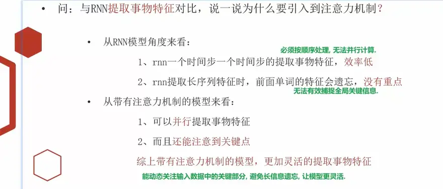

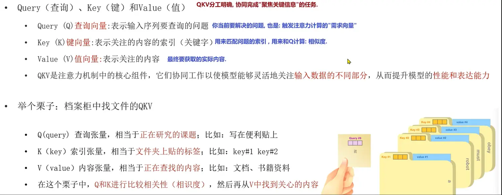

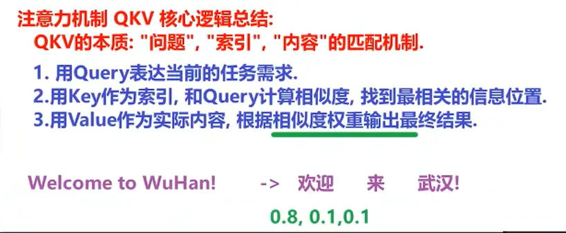

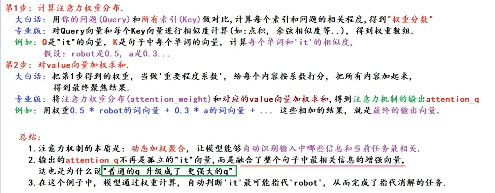

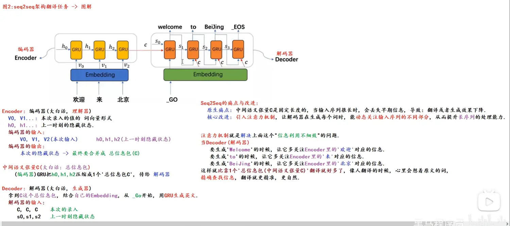

## 11.bert模型

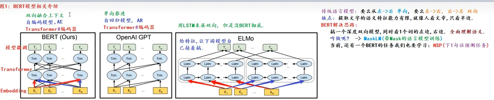

3+2+12+12+768

>3个embedding文本向量化：
>
>token单词 segment句子 position位置PE
>
>2个训练策略：
>
>MLM掩码语言模型
>
>NSP下个句子预测
>
>12：编码器 12：自注意力机制头

## 12.transformer

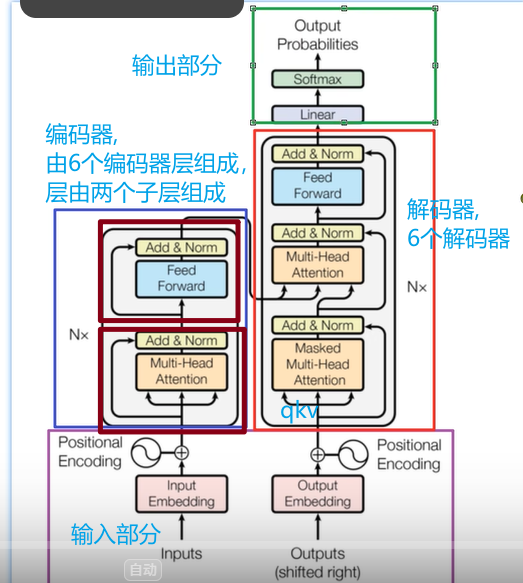

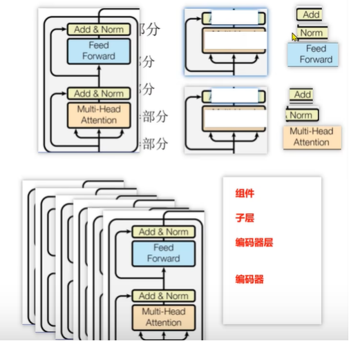

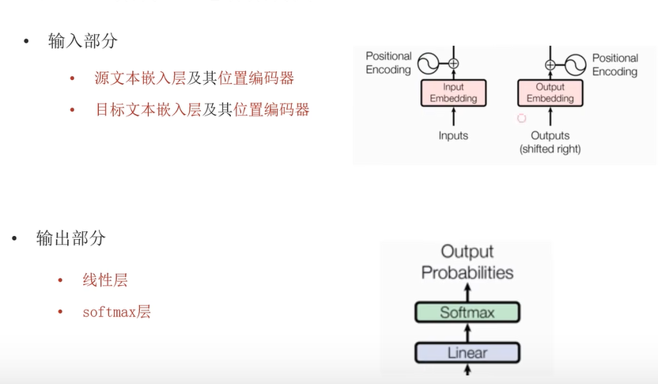

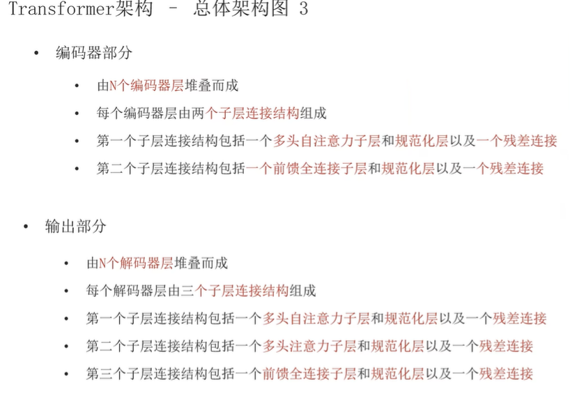

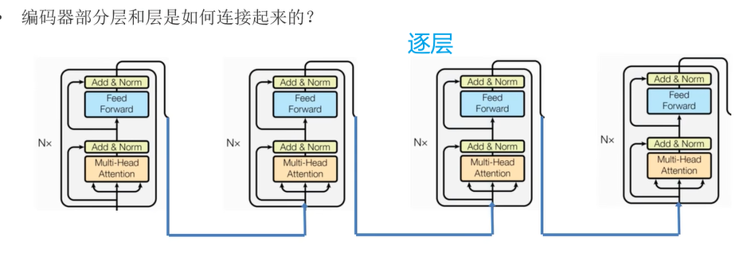

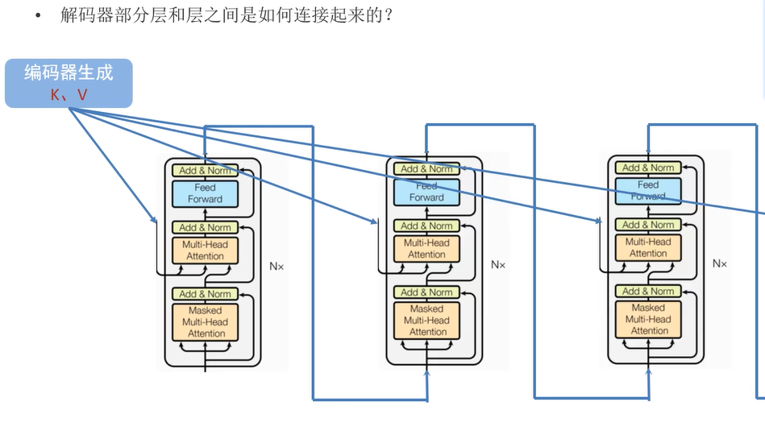

输入：input embedding、positional encoding位置编码

局部特征：多头自注意力机制

掩码多头自注意力机制: softmax（(q@k逆置)*mask/开跟号dk） * v

注意力：softmax(q*k逆置/开号dk) * v=z

输入-向量化-位置编码(使用三角函数，奇数余弦，偶数正弦)-输入*w得到qkv-多头自注意力 softmax(q*k逆置/开号dk) * v-残差结构+x