## A.基础概念

## 一、 前置知识

### 1.FAQ

（1）是什么：高频问答对(常见问题)

（2）来源：上线后业务人员整理

（3）两次FAQ直出

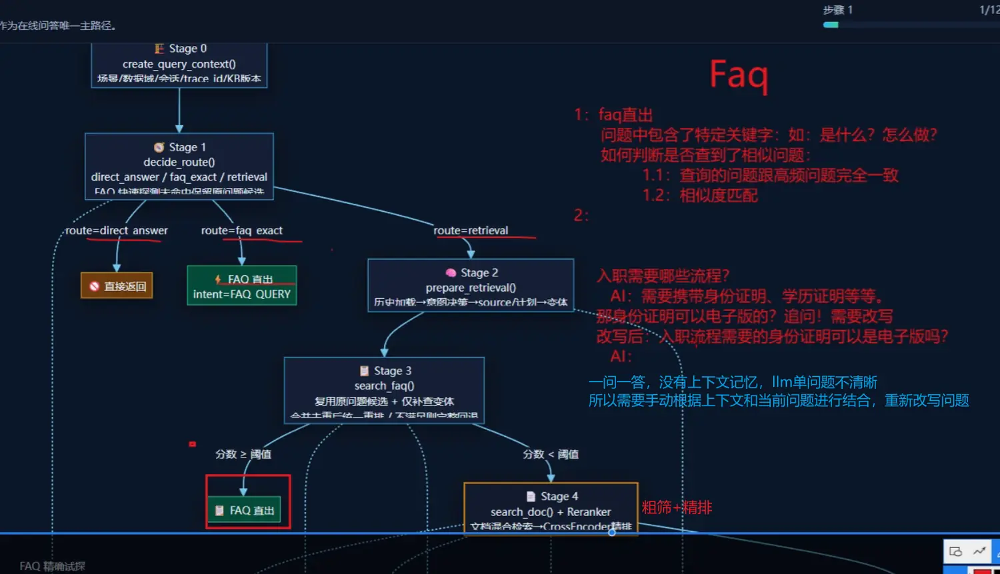

### 2.rag

### （1）什么是rag?

>检索-增强-生成
>
>用户输入问题->转成向量->向量知识库中检索文档->将检索到的文档和问题作为上下文给llm(增强)->llm汇总生成答案

### （2）为什么要有rag?

>大模型有以下几个问题：
>
>信息过时、幻觉问题、缺乏垂直领域信息(私有知识)
>
>而rag可以解决上述问题，rag优点：
>
>知识实时更新、答案可溯源、减少幻觉

### （3）rag系统链路

>两条：离线链路、在线链路
>
>离线链路：文档加载-文档切分-向量化-向量化存储
>
>在线链路：用户提问-意图识别(判断是什么类型问题)-向量化-语义检索-rerank重排序-上下文构建-llm生成
>
>本项目做rag目的：尽可能减少大模型的调用(慢)，但又能解决问题

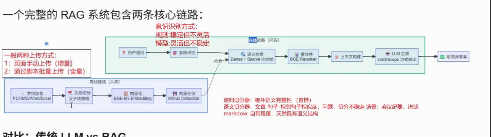

递归文字切分器是按照固定分块大小、特殊字符进行切割，按第一个特殊字符分割，分割后如果比固定分块大，那么按下一个特殊字符分割，直到<=固定分块

## 二、 项目架构

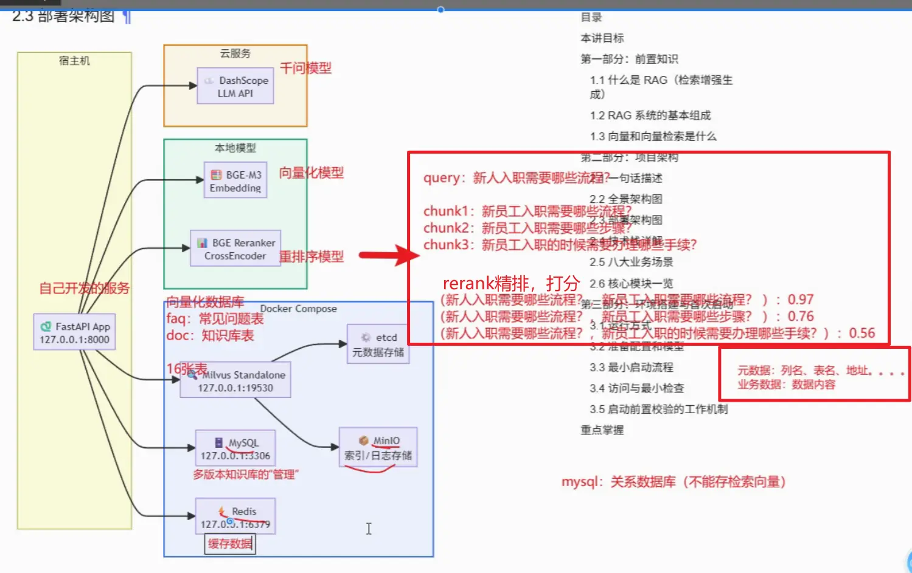

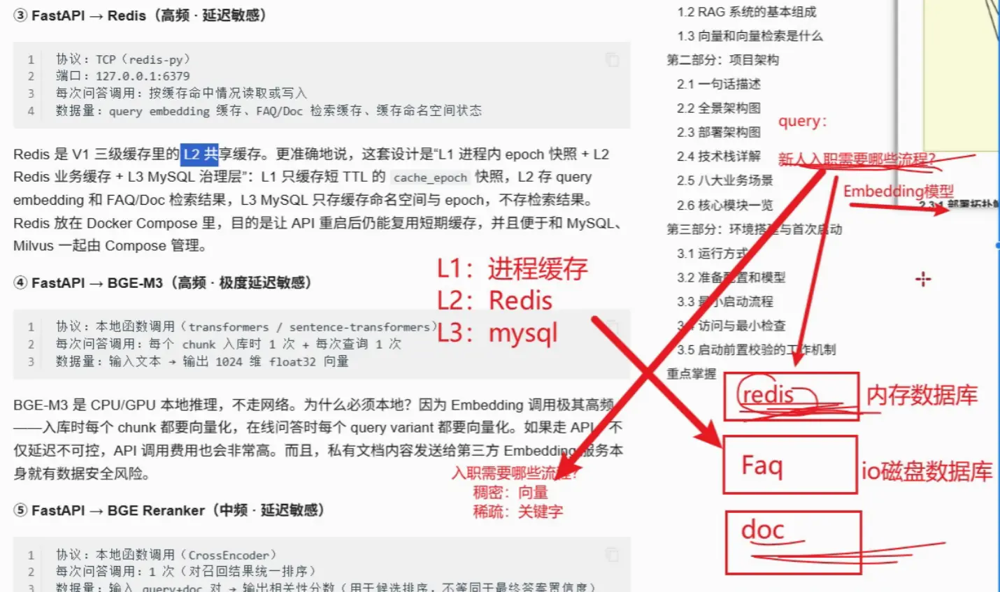

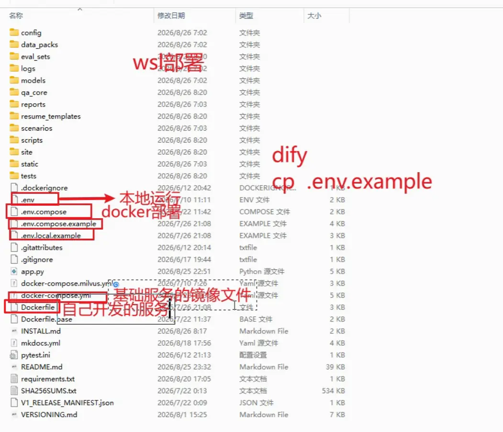

### docker是什么？

>是一个部署工具，能够将项目的代码和依赖 构建成镜像，运行时通过容器，这样项目可以在任何宿主机或服务器上运行，不会出现环境不一致导致的问题，并且可以版本控制和回滚（线上出问题，只需把旧镜像**重新启动**成一个新容器，秒级回滚）
>
>**镜像（只读模板）+ 容器（运行沙箱）+ 仓库（版本管理）**

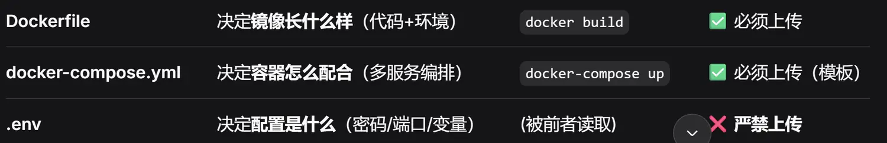

## 三、rag核心概念

### 一、embeding模型

#### 1.为什么选择bge-m3模型？

>开源、支持多语言、支持稀疏&稠密&多向量混合检索、部署要求低-cpu即可

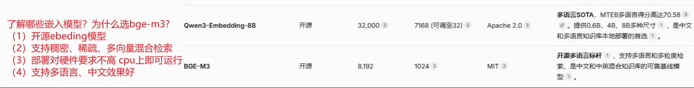

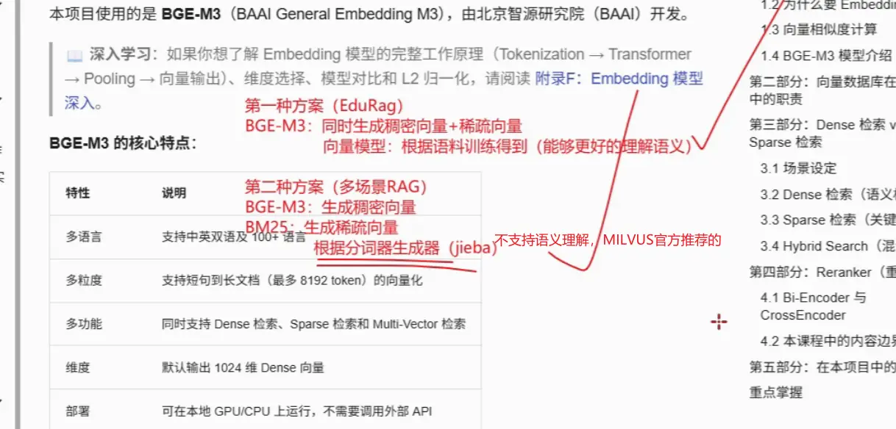

#### 2.为什么要embeding？

>计算机底层都是数字，想让计算机理解文字，就需要通过embeding转为数值，底层是transformer架构

#### 3.向量相似度方法

>余弦相似度cosine
>
>欧几里得距离L2
>
>内积IP

### 二、向量数据库在RAG职责

#### 1.为什么milvus选择2.5版本？

>2.5版本内置了全文检索bm25能力
>
>本身Milvus 内部自动融合 Dense 和 Sparse 的分数

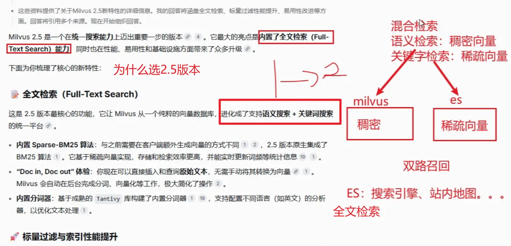

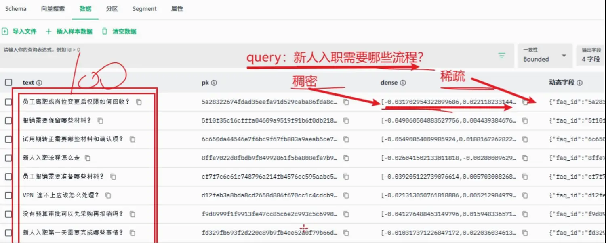

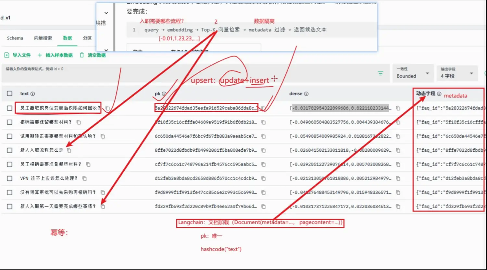

#### 2.职责

>保存和检索向量

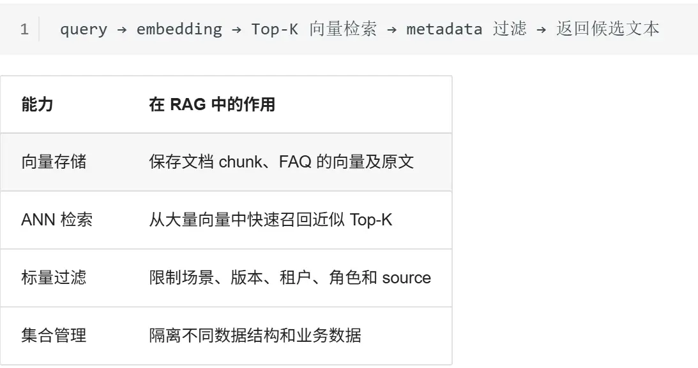


### 三、dense检索和sparse检索

#### 1.dense语义相似度检索

优点：理解语义，同义词和改写都能识别

缺点：不能根据关键词精确匹配

项目：BGE-M3

#### 2.sparse关键词(全文)检索

优点：根据关键词进行精确匹配，计算效率高，不需要gpu

缺点：不能理解语义

项目：BM25

#### 3.Hybrid Search混合检索

语义+关键词召回结果，合并从重排(本项目中，也可以是语义+语义)

#### 4.Reranker重排器

>Reranker：少量候选精排，Reranker（CrossEncoder）解决 Bi-Encoder 召回精度不足的问题：先粗排后精排
>
>为什么需要重排？
>
>向量检索适合从大规模知识库中快速召回候选，但 Top-K 的顺序不一定足够准确。Reranker 的职责是在候选集已经很小之后，把 `(query, document)` 成对送入模型，再判断“当前问题与每条候选文本是否真正相关”。

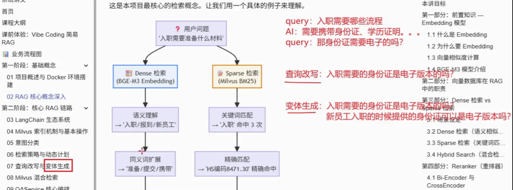

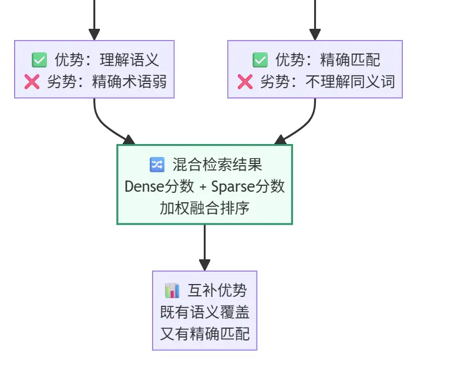

# B.核心RAG链路

## 一、Langchain生态系统

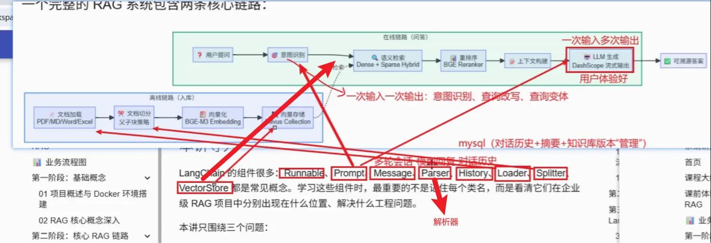

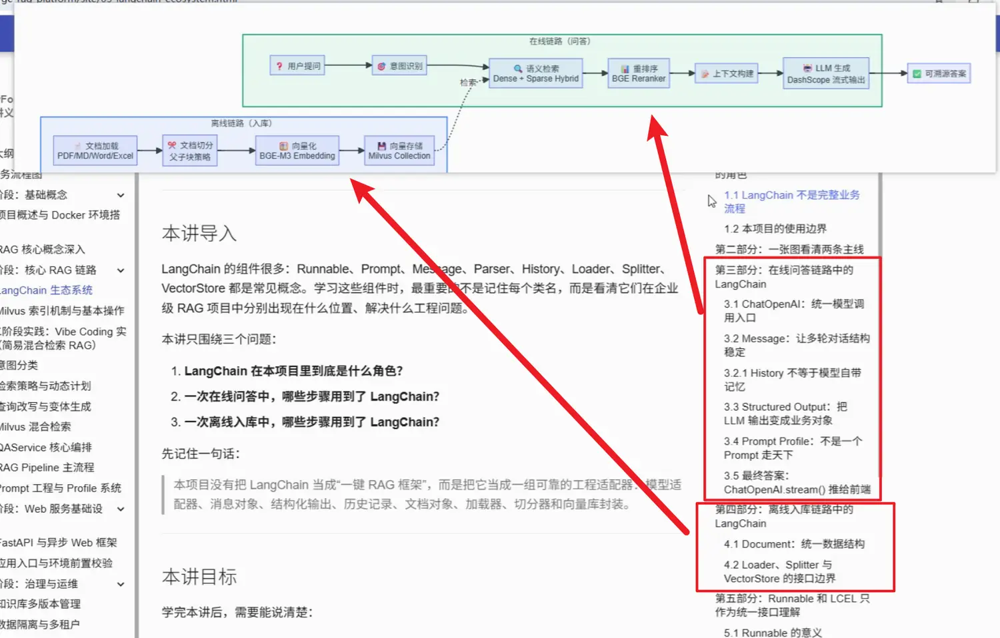

>langchain:封装模型接口，将llm和组件进行编排、链接
>
>**大模型开发框架，便于开发**

### 1.在线问答链路中的Langchain

#### (1)model

>一问一答、多轮对话、向量模型
>
>chatopenai:调用oepnai接口访问大语言模型(统一模型调用入口)
>
>ollamaLLM:调用本地部署的大模型
>
>chatollama+message(聊天对话):带有systemprompt的多轮对话
>
>ollamaEmbedding:文本转向量模型

@lru_cache(maxsize=2)

#### (2)message

message多轮对话中的消息类型

| LangChain 对象  | API role    | 项目用途                           |
| :-------------- | :---------- | :--------------------------------- |
| `SystemMessage` | `system`    | 设定助手身份、回答边界、风险约束   |
| `HumanMessage`  | `user`      | 用户问题、改写请求、检索上下文问题 |
| `AIMessage`     | `assistant` | 历史回答，进入多轮上下文           |

>对话历史的记忆：
>    ChatMessageHistory：内存对话历史+序列化存储  SQLChatMessageHistory：将对话历史持久化存储到sql
>
>message_to_dict 消息对象转json、message_from_dict json转消息对象
>
>在实际的业务中需要将对话历史保存到数据库中进行存储，后续需要加载数据库中存储的历史聊天记录作为提示词的上下文一起提交到大语言模型
>**面试题：多轮对话中的历史对话信息是如何管理的？**
>    将所有的对话历史分成最近聊天记录+摘要（LLM生成，上下文压缩）结合当前问题一起向大语言模型提问生成的上下文

#### (3)Structured Output：把 LLM 输出变成业务对象

>切记：让llm按照用户的要求的格式输出返回结果（提示词）。
>1：StrOutputParser默认是生成的字符串格式的数据（大语言模型输出数据的格式）
>2：CommaSeparatedListOutputParser逗号分割的列表解析数据
>3：JsonOutputParser json格式的解析器
>4：PydanticOutputParser：PydanticOutputParser结构的数据（校验）
>
>项目中使用pydantic解析器，用于查询变体、改写
>
>其实底层都是提示词工程约束输出

#### (4)prompt profile

>项目没有把所有问题都塞进同一个 Prompt，而是按意图和风险类别选择不同模板
>
>prompt template目的：（1）复用 （2）可以使用 | ，因为管道符要求输入输出是组件而不是字符串
>
>根据场景使用：字符串、模板对象

```python
demo01：PromptTemplate           — 最简单：单变量文本模板
demo02：FewShotPromptTemplate    — 带示例：给模型提供输入→输出范例
demo03：ChatPromptTemplate       — 对话模板：简化的多角色消息构建
demo04：System + Human 组合      — 双角色：系统指令 + 用户模板
demo05：MessagesPlaceholder      — 动态历史：不固定数量的对话历史插入
```

### 2.离线入库链路中的Langchain

```python
1：TextLoad/UnstructredLoad - 加载文本文件
2：CharacterTextSplitter - 按照字符分隔符切分文件内容
3：RecursiveCharacterTextSplitter - 递归降级切分器（项目中使用的方式）
4：SemanticChunker - 语义切分器
5：MarkdownHeaderTextSplitter - markdown切分器
```

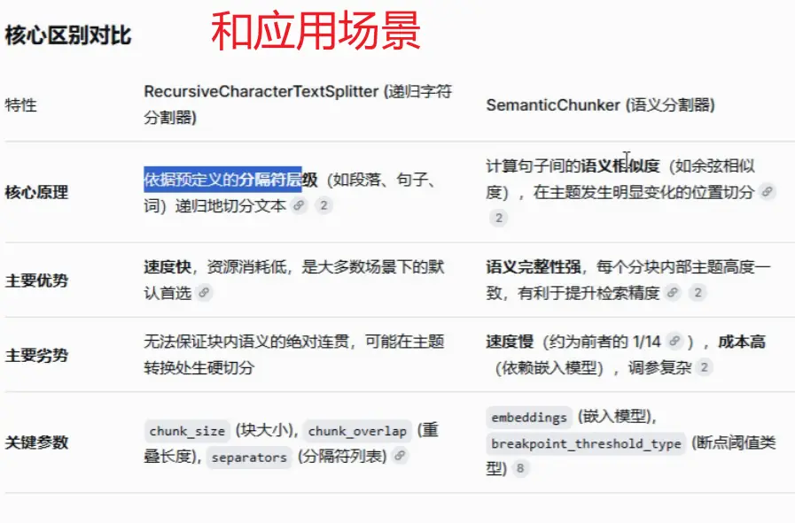

适用场景：通用文本处理（长篇文章、报告、新闻）               高价值、高复杂度文档（科学论文、法律文书）

### 3.Runnable和LCEL

> LangChain ChatOpenAI 的三种核心调用模式：
>
>    1. invoke()                → 完整结果（用于需要完整回复才能继续的场景）
>    2. stream()                → 逐 token 流式输出（用于前端实时渲染）
>    3. batch()                  →多个输入，批量处理

>LCEL 很适合教“组件怎么串起来”，但企业 RAG 主链路有大量分支、阈值、提前退出和诊断信息，所以本项目不用一条 LCEL 链包到底。


## 二、milvus索引机制与基本操作

### 1.milvus

>面向向量相似度检索的数据库
>
>职责：向量存储、相似度检索、元数据过滤、混合检索

#### 为什么选择milvus？

>本项目选择 Milvus，是因为需要服务端 BM25、混合检索、多集合、多版本和企业级部署能力。

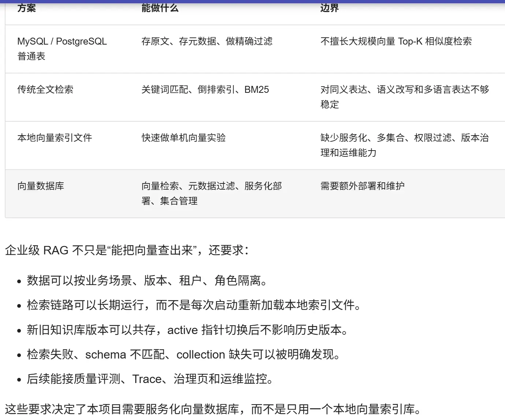

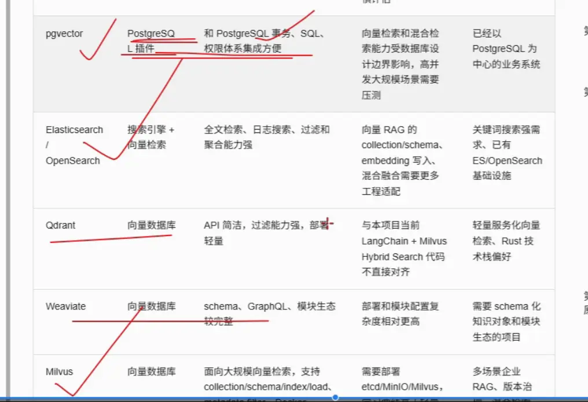

### 2.检索

>**索引的本质**：用额外的存储空间和构建时间，换取查询时的大幅加速。

#### 索引类型

FLAT暴力检索

>逐条计算问题q和每个向量的距离

IVF_FLAT

>倒排索引+暴力检索
>
>1.构建索引
>
>（1）聚类：对全部向量做kmeans聚类，生成nlist个聚类中心(所有聚类中心点坐标列表和ID)
>
>（2）建立倒排：遍历所有向量，计算每个向量聚类哪个簇心最近，就属于哪个簇，将该向量挂在到该聚类中心对应的倒排列表上
>
>（{‘聚类中心A’：[向量ID，原始向量值]}）
>
>| 聚类中心 (Key)   | 倒排列表 (Value) —— 存储该桶下所有向量的 **ID 和 原始向量值** |
>| :--------------- | :----------------------------------------------------------- |
>| **桶 0 (中心A)** | `[(0, [0.1, 0.1]), (1, [0.2, 0.1]), (3, [0.15, 0.18]), (6, [0.12, 0.15])]` |
>| **桶 1 (中心B)** | `[(5, [5.0, 5.1]), (8, [5.2, 4.8]), (9, [4.9, 5.3])]`        |
>| **桶 2 (中心C)** | `[(2, [9.0, 9.2]), (4, [8.8, 9.1]), (7, [9.1, 8.9])]`        |
>
>2.检索
>
>（1）计算问题向量距离每个簇心的距离(nlist中的簇心坐标)
>
>（2）选出距离最近的nprobe 个簇心
>
>（3）在这nprobe个簇下，对其全部向量进行暴力搜索（中心ID->倒排索引列表）
>
>（4）返回TOP-K
>
>3.分的桶越多，越精细，那么查询速度越慢

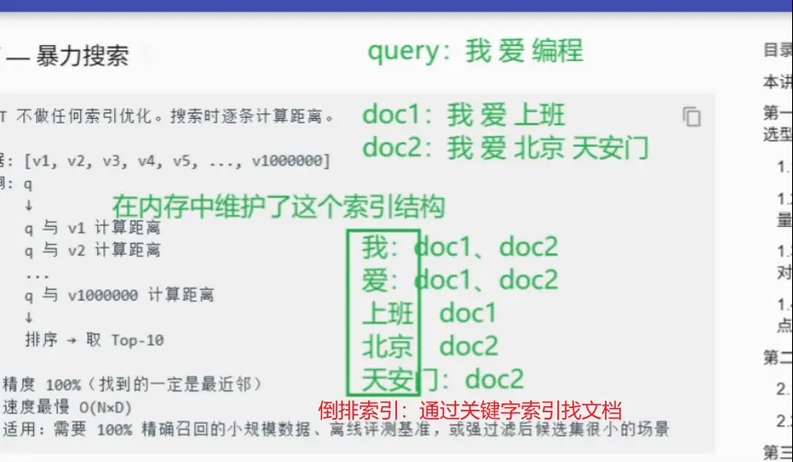

IVF_SQ8 &IVF_PQ

>倒排检索+量化压缩
>
>IVF_SQ8：逐维压缩，每个维度量化成int8，内存下降，精度少量损失
>
>IVF_PQ：分段压缩，维度切段后分别量化([0.1,0.4] [0.3,0.5] )，内存下降更多，精度损失多
>
>因为精度有损失所以都需要测评是否能接收

HNSW

>分层导航
>
>1.图构建
>
>① 为每个节点随机分配层级 L（指数衰减概率分布）→ ② 从顶层到底层，每层插入节点并连接 M 个最近邻 → ③ 层内连接形成 "小世界" 特性（短路径 + 高聚类）
>
>2.检索
>
>① 从顶层入口点 (entry point) 开始 → ② 贪婪搜索当前层，找到最近节点 → ③ 下降一层，以上层找到的最近节点为起点继续贪婪搜索 → ④ 重复至第0层（最稠密层）→ ⑤ 在第0层返回 Top-K

#### 如何索引选型？

>特点和选择原因

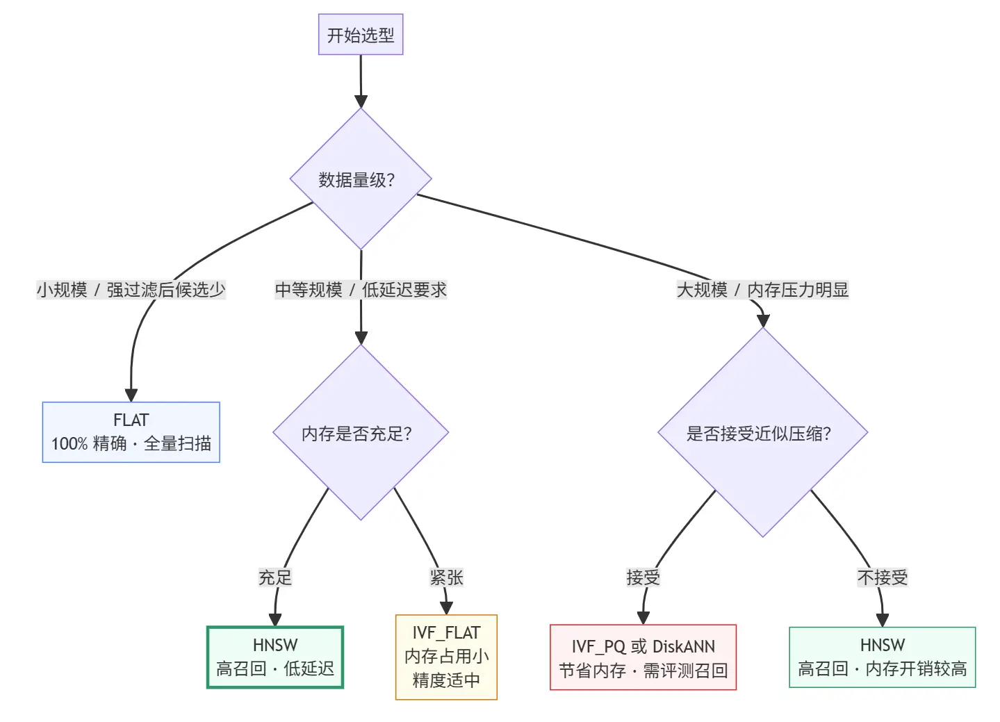

幂等写：主键存在则更新，不存在添加

### 3.pymilvus基本操作与原生混合检索

#### 基本操作

详情见代码

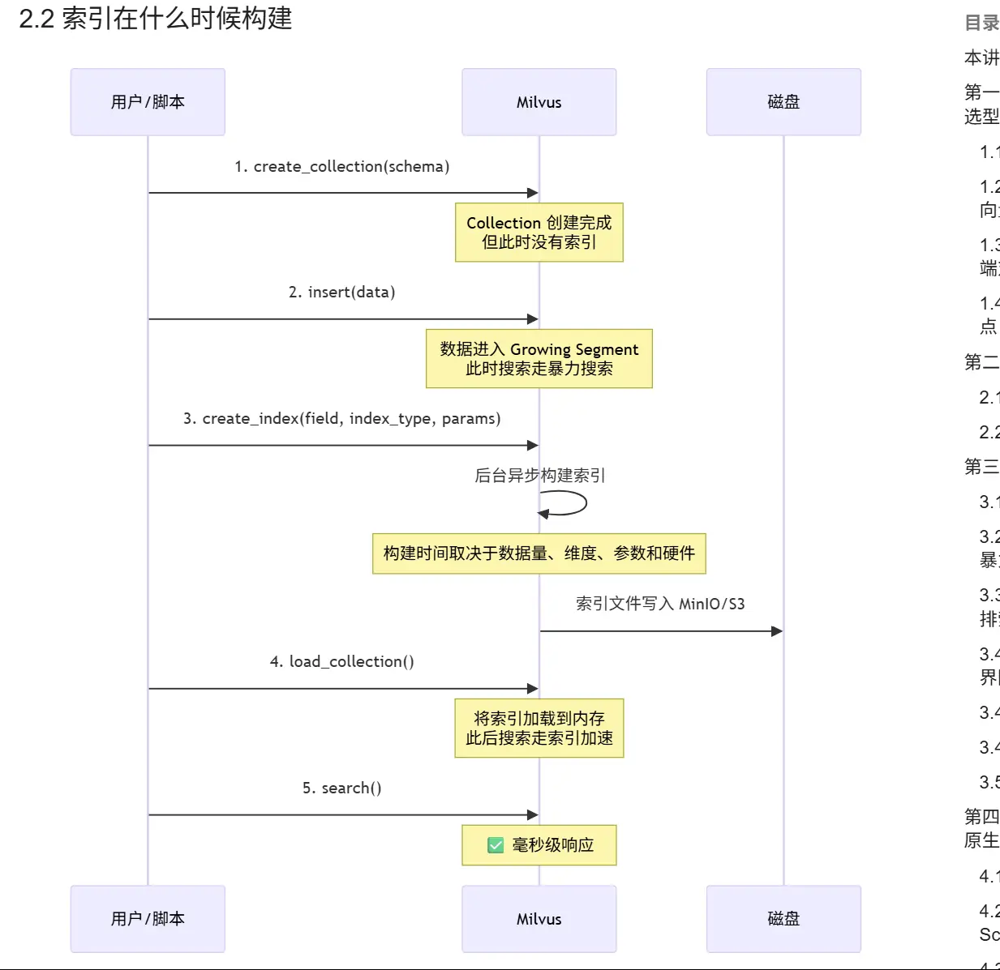

##### (1)建立连接并建库

>两种方式（项目用第一种,但第二种简单）
>
>connections.connect(alias="lecture04", uri=MILVUS_URI, db_name=MILVUS_DB)
>
>MilvusClient(uri)

`MilvusClient` 会自动创建、维护和复用与 Milvus 服务端之间的 gRPC 连接。调用 `insert()`、`search()` 等方法时，会复用已有连接，而不是每次请求都重新建立连接。

##### (2)建表

>**Schema（表结构定义）**：规定数据有哪些字段，以及字段的名称、类型和约束，不保存具体业务数据。
>
>**Collection（集合/物理表）**：Milvus 中真正存储数据的对象。它按照 Schema 接收和保存数据。

##### (3) 建索引

索引文件是索引算法运行后生成的数据结构(书的目录)

索引文件保存的是索引算法基于原始数据构建完成的索引结构，用于加速后续查询。

>建立索引时需要相似度度量原因：在构建索引的时候，索引类型需要用到向量相似度计算方法，比如IVF_FLAT计算每个向量到簇心得距离、HNSW计算邻近关系
>
>检索时是否需要？检索时也需要，保持一致

```python
# 为 dense 字段添加 HNSW 索引
index_params.add_index(
    field_name=field_name,        # 对哪个向量字段建索引
    index_name=index_name,        # 索引名称（用于后续管理）
    index_type=index_type,        # 索引类型：分层可导航小世界图
    metric_type=metric_type,      # 相似度度量：余弦相似度
    params=index_params_values,   # HNSW 构建参数
)
```

>`prepare_index_params()` 创建索引配置容器，类似先准备一张空表单,
>
>`add_index()` 向容器添加索引说明，
>
>`create_index()` 才让 Milvus 根据说明创建索引。

ps:索引类型和选型见前一章节

##### (4)插入数据

>1. client.upsert() → 数据写入 Milvus
>2. client.flush() → 强制持久化到磁盘（避免数据留在内存缓冲区）,也就是minio中

```python
# Upsert = Update + Insert：
#   - 主键（pk）已存在 → 按输入值更新记录
#   - 主键不存在 → 插入新记录
#   - 幂等性：使用相同 pk主键 和相同数据重复执行任意次数，
#             最终结果与只执行一次相同，不会重复插入
```

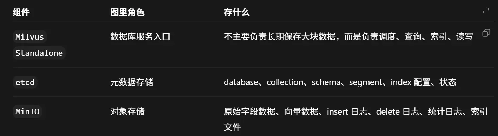

##### (5)加载数据

>未 load 的 Collection 无法 search！load 后索引和数据加载到内存，开始加速


##### (6)检索

>可以检索多个文本[1,2],检索结果为每个文本的top-k[[{},{},{}],[{},{},{}]]

##### 补充：为什么要加载到内存中？

>因为搜索是“计算密集型”的操作，尤其是向量搜索。Milvus 要在大量向量之间算相似度，如果每次都从 MinIO 这种对象存储里边读边算，会非常慢。
>
>搜索时 Milvus 会在这个图里不断跳转、比较、更新候选结果。这个过程如果每跳一步都去 MinIO 拉一次文件，速度会崩掉。
>
>MinIO 负责“存得住”，内存负责“算得快”。

##### (7)过滤、删除、释放内存

>执行完查询&搜索操作后，释放内存，之后如果需要查询&搜索则需要重新加载表

任务会异步”可以理解为：**删除操作与物理清理分成两个阶段，互不等待。**删除请求只负责标记，不阻塞等待磁盘清理；物理清理由后台任务稍后独立完成。

>发出删除请求
>    ↓
>立即标记为已删除（逻辑上不可见）
>    ↓
>删除请求返回，程序继续运行
>    ↓
>Milvus 后台稍后执行 Compaction
>    ↓
>重新整理数据段并清除已标记数据，最终释放空间

~~~python
# 释放 Collection 的查询资源，将已加载的数据从内存卸载
# 不会删除 Collection 或持久化数据；之后可重新 load
client.release_collection(collection_name=BASE_COLLECTION)
~~~

##### (8)pymilvus整体流程

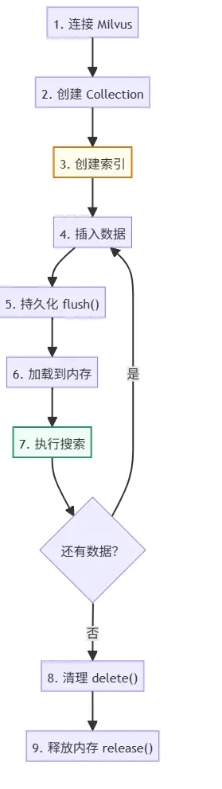

##### (9)混合检索

>多路召回结果(单路搜索请求，在内存索引中，使用索引算法搜索)，选择重排策略，对结果进行合并重排

~~~python
  # 请求1：在filmVector向量字段上搜索
    film_request = AnnSearchRequest(
        data=[normalize([0.08, 0.1, 0.94, 0.22, 0.04])],
        anns_field="filmVector",
        param={"metric_type": "COSINE", "params": {"ef": 64}},
        limit=3
    )
~~~

##### (10)Reranker重排器

>用交叉编码器对候选文档重新打分，选出最相关的 TopK
>
>（query,doc1）查询问题和候选文档成对送入编码器，一一进行相关性打分，返回top-k

##### (11)prompt提示词

>top-k和query问题组成上下文，具体如下：
>
>构造完整 Prompt=系统指令 + 上下文资料 + 用户问题 + 输出要求
>
>eg:
>
>[资料1]
>标题：员工入职材料清单
>内容：员工入职前需要提交身份证、学历证明、银行卡信息、体检报告，并完成劳动合同签署。

##### (12) 调用llm大模型

>llm通过提示词生成结果

**ps:1-12全部流程是完整rag查询闭环：Milvus 混合召回 → Rerank 重排序 → 本地大模型回答**

#### 混合检索-合并重排策略！！

##### weightedRanker加权排名融合

>对多路召回的**分数**归一化后
>
>按权重**加权求和**重排，根据业务偏好，哪路更重要权重更大

##### RRFRanker互译排名融合

>1/(结果名次+k ），再各路求和，之后重排
>
>优点：按各路结果的**名次计算**，不依赖 Dense 与 Sparse 的原始分数尺度，更稳健，无业务偏好，有效平衡每个向量场重要性

ps:如果两路召回结果有差异，那么计算时为0即可，正常重排

#### 为什么需要rerank?

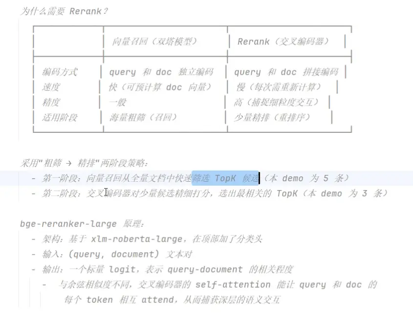

### 4.pymilvus与langchain_milvus混合检索对比

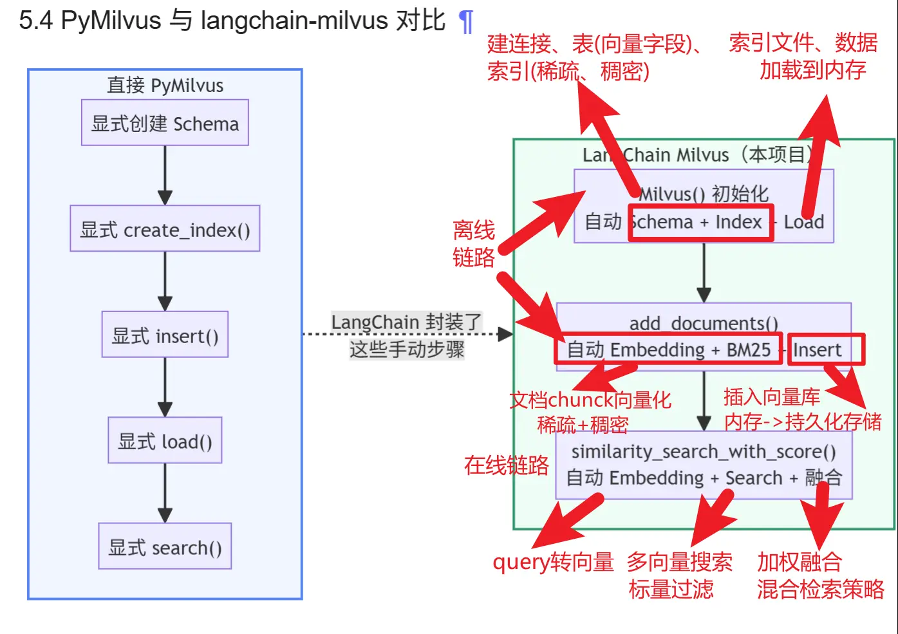

ps:项目中主要使用langchain-milvus做混合检索、文档向量化

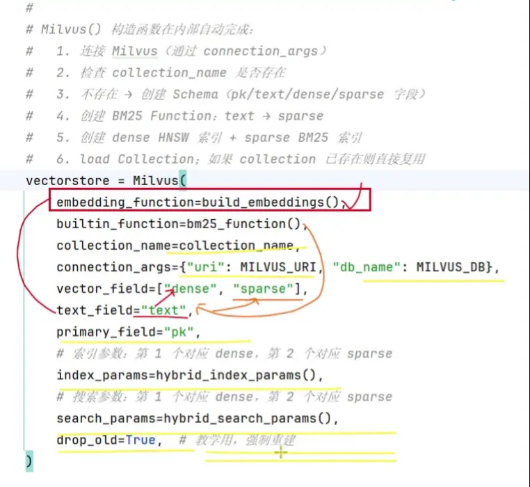

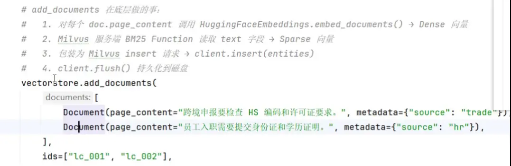


### 5.milvus完整架构

#### Milvus：负责“处理”

Milvus 是整个系统的计算和协调中心，负责：

- 接收 `insert`、`upsert`、`delete`；
- 执行查询和向量搜索；
- 建立索引；
- 调度数据加载；
- 执行 Compaction；
- 协调 etcd、MinIO 和查询节点。

可以将它理解成“数据库服务本身”。

#### etcd：负责“记住数据在哪里”

etcd 主要保存元数据，例如：

- Collection 是否存在；
- Collection 的 Schema；
- Partition 信息；
- 索引定义；
- 数据段状态；
- 数据段存放位置；
- Collection 是否已加载等协调信息。

etcd 通常不保存真正的向量数据。

```
etcd：这是 docs Collection，它有哪些字段，
      数据被分成哪些段，这些段现在是什么状态。
```

#### MinIO：负责“保存真正的数据文件”

MinIO 是对象存储，主要保存：

- 向量和标量数据段；
- 索引文件；
- 插入日志；
- 删除日志；
- Compaction 生成的新数据段。

```
MinIO：真正长期保存数据和索引文件。
```

即使 `release_collection()`，MinIO 中的数据也不会被删除。

#### 总结

>etcd    → 保存“Collection 是什么、数据在哪里”的元数据
>MinIO   → 保存真正的数据段、索引文件和日志
>load    → 从 MinIO 加载查询资源到 QueryNode 内存
>release → 只卸载 QueryNode 内存，不删除 etcd 或 MinIO 中的数据

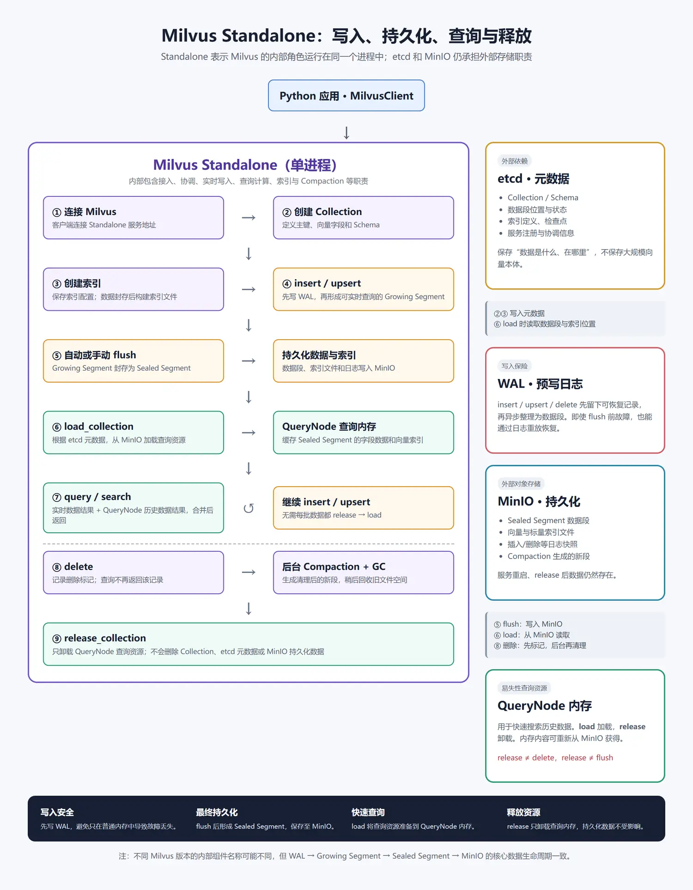

## 三、rag在线链路

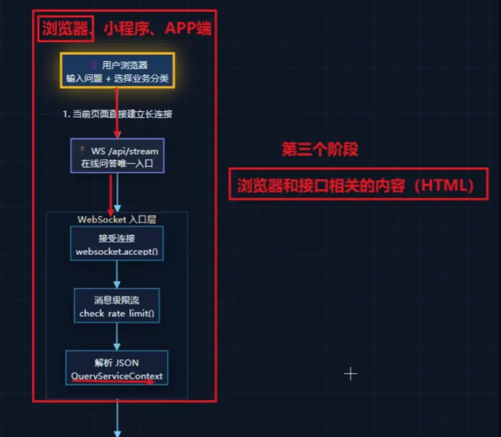

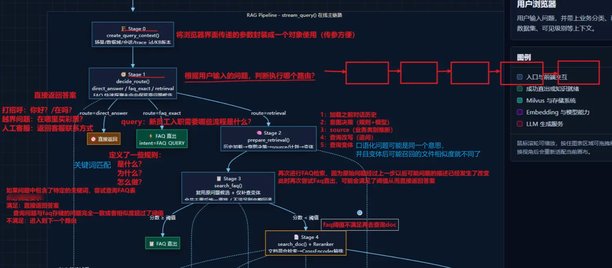

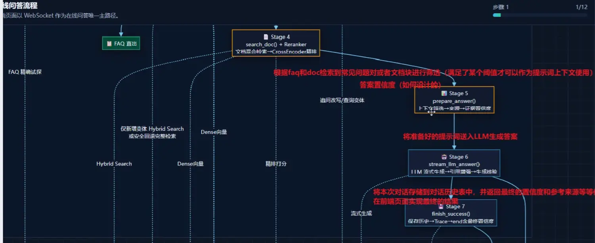

### 1、websocket api接口

>详情见C.web服务基础设施

### 2、QAservic服务编排

>软件架构的一种模式，用一个中心化的编排器来协调多个子服务的调用顺序和数据流转；意图识别-历史-检索-生成-存储，不会直接处理http或milvus细节
>
>ps：总厨，决定做菜的顺序

>两个核心方法:
>
>stream_query() 主干链路-在线检索
>
>debug_retrival() 检索诊断半链路，不调用llm，只输出检索结果

>注意：：WebSocket 路由只负责接入和转发，真正的业务编排在 `QAService.stream_query()` 和`pipeline.rag.stream_query()` 里。

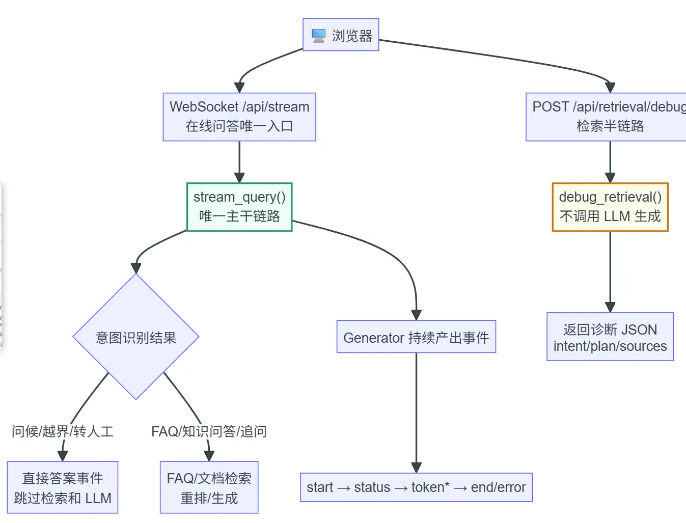

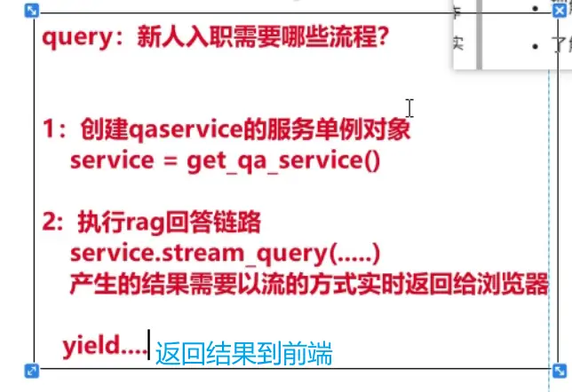

>RAG 流式体验如何实现？
>
>Generator（生成器）模式在流式问答中的应用：惰性求值，每个 yield 产生一个可立即推送给前端的事件

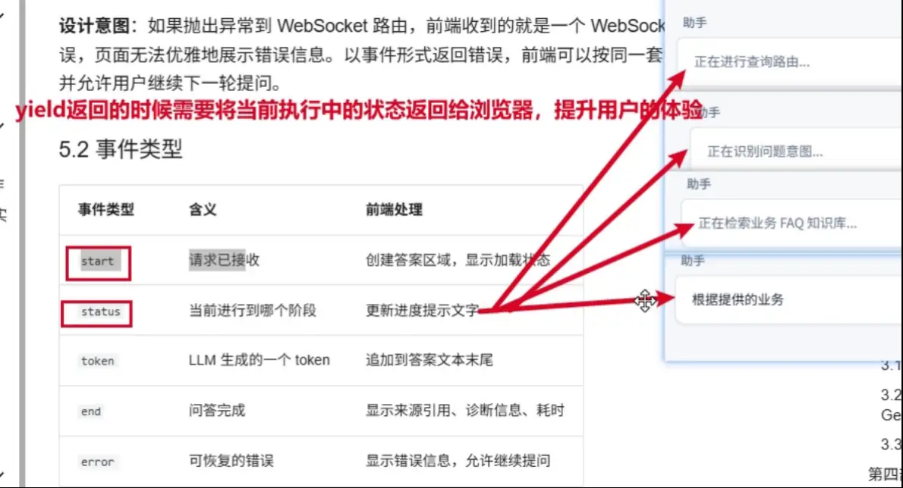

### 3、RAG Pipeline 主流程

#### Pipeline vs Chain

>**Chain（链）**：固定的步骤序列，A → B → C → D，没有分支。
>
>**Pipeline（管道）**：有分支、有快慢路径的流程。每一步可以提前结束（如 FAQ 命中时跳过文档检索），也可以根据上一步的结果调整下一步的参数。
>
>模块化拆分：项目将 Pipeline 拆分为多个职责单一的文件

为什么不缓存LLM答案：[10 RAG Pipeline 主流程与 Prompt 生成 - KnowForge RAG Platform — 系统讲义](../courseware/10-rag-pipeline.html#_5)

### 4.意图识别！

#### 什么是意图识别？

>确认用户要干什么，属于哪个分类的技术
>
>本项目中主要是作为决策层，决定走哪条路由，并影响后续决策
>
>**intent 描述用户想做什么，route 描述系统下一步怎么处理**

意图识别与检索策略漏斗

>入口判断是漏斗模型，漏斗的含义是：越靠前的层越确定、越便宜、越应该提前收口；越往后的层越不确定，需要保留更多证据，交给检索计划和 RAG 生成链路继续处理。
>
>按确定性逐层过滤风险，把确定的问题提前结束；检索类问题先形成规则候选，再由 BERT 模型校验，最后由网关把 `confidence`、`decision_policy` 和风险标签传给检索策略和动态计划，让检索计划根据不确定性变得更保守。

### stage0

把浏览器传递参数封装成一个对象（kb_version\数据域\场景\trace_id）

判断是否为‘问候语|礼貌用语前缀+业务有效问题’,如果是的话，则进行剥离，去掉问候语|礼貌用语前缀，只保留业务有效问题；如果剥离完发现为空，则说明只有问候语，则返回原问题即可

>清洗会先把连续空白（包括换行）合并成一个空格，最多循环剥离前缀 4 次。并不是自然语言模型识别所有礼貌表达，只处理正则覆盖的前缀。

### stage1路由判断

根据用户问题判断执行哪个路由

#### （1）direct_answer

判断是人工/问候/越界问题，则返回固定答案

判断source与问题是否一致，一致FAQ，不一致返回提示(source_score=命中次数*10+命中文本长度，得到置信度  具体忘记怎么转成置信度？)

~~~python
def rank_source_matches(query: str, scenario: ScenarioDefinition) -> tuple[SourceMatch, ...]:
    """按分数排序 source 匹配结果，附带归一化置信度标签。（★★ 理解）

    confidence 是归一化的诊断值，不是模型概率。它帮助 trace 面板解释
    最佳 source 是否明显领先其他候选。

    参数：
        query: 用户原始问题。
        scenario: 当前业务场景。

    返回：
        按分数降序排序的 SourceMatch 元组；没有任何命中时返回空元组。

    调用顺序：场景解析入口 -> rank_source_matches()。
    """

    scores = score_source_map(query, scenario)
    # 没有任何 source pattern 命中时，返回空元组而非 None，避免调用方做 None 检查
    if not scores:
        return ()
    # 以最高分为基准计算置信度，用于前端 trace 面板解释最佳 source 是否明显领先其他候选
    best_score = max(scores.values())
    source_order = {source: index for index, source in enumerate(scenario.valid_sources)}
    return tuple(
        SourceMatch(
            source=source,
            score=score,
            # 置信度 = 当前得分 / 最高分，best_score 为 0 时兜底为 0.0
            confidence=round(score / best_score, 4) if best_score > 0 else 0.0,
        )
        # 相关性按分数降序；完全同分时才按 valid_sources 配置顺序稳定决胜。
        for source, score in sorted(scores.items(), key=lambda item: (-item[1], source_order[item[0]]))
    )
~~~

#### （2）FAQ精准直出

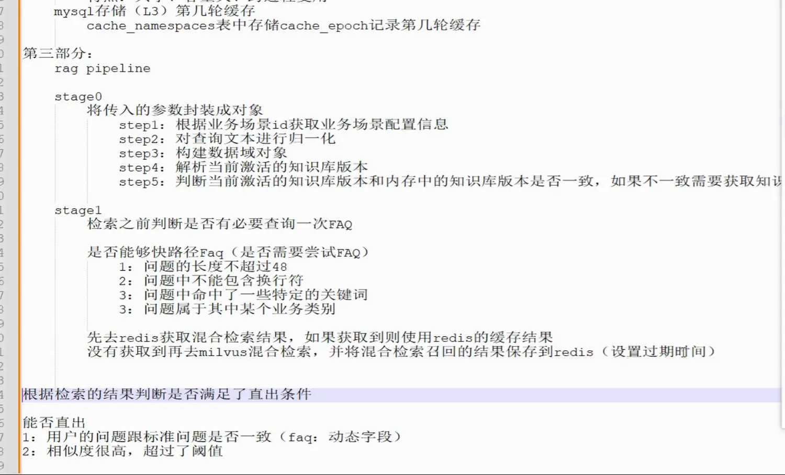

>条件：长度<48且无‘\n’&命中FAQ关键字或业务分类合规，尝试直出
>
>先获取检索策略-复用之后的检索策略和动态计划，faq_query+doc_query，但被faq_query要求覆盖，得到最终的诊断计划仅faq_query且不进行rerank
>
>先去redis缓存中查找是否有faq_query混合检索结果，有则使用；
>
>没有则在milvus中进行混合检索，稠密向量走 embedding，稀疏检索走 Milvus 内置 BM25，再用 weighted ranker 融合两路结果。按 source、知识库版本、DataScope 等过滤，快路径不生成变体、不做rerank精排、不选 Prompt。检索结果返回到redis缓存中。
>
>检索结果是否和标准问题一致或达到阈值，达到了则返回对应结果，否则保存候选集（复用），进入retrieval检索

>**精准直出为什么不用rerank精排？**
>
>因为得到粗排结果过后，使用标准问题进行判断是否完全一致，再使用精排收益率比较低，rerank只是判断相似度最匹配，调整顺序
>
>**粗排序和一致性？**
>
>第一步：粗排序/召回
>作用：从 FAQ 库里找出一批“可能相关”的候选
>
>第二步：一致判断
>作用：在候选里面检查有没有 standard_question 和用户问题完全相等

>**为什么只允许精确匹配**： - 还没做意图识别，不知道这是 FAQ_QUERY 还是 KNOWLEDGE_QUERY - 如果是知识咨询但 FAQ 相似分数高，可能误答。所以只允许用户问题和 FAQ 标准问题完全一致时才直出。

#### （3）retrieval检索

FAQ失败，则走这个

>检索规则1-追问：会话历史+命中关键词/长度<=8（那、这个、内个）
>
>检索规则2-领域规则-追问未命中：关键词+命中句式，识别faq_query、doc_query
>
>四个匹配方式都可能命中，最后选rule_score最高的那个，这个rule_score是通过后期评测得来得
>
>检索规则3-默认知识库查询，当上述两个均为命中，则说明规则无法进行细分，使用它，rule_score=0.6

~~~python
        rule_result = IntentResult(
            intent="FOLLOW_UP",
            rule_score=0.8,
            reason="follow_up_rule",
            requires_rewrite=True,
            **source_details.intent_kwargs(),
        )
~~~

网关仲裁

>规则 加字段 统一结构
>
>检索意图使用规则命中后，再使用本地bert模型进行意图识别，两者最终使用网关仲裁，得到最终分类
>
>不同分类的召回、阈值不同决定后续不同的检索计划

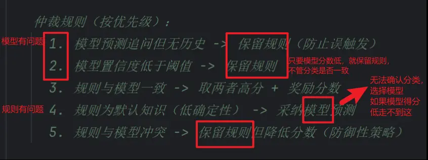

### stage2 检索准备

历史、意图、source、按需改写、检索计划、查询变体、Prompt Profile

#### 历史记录

为什么要保存最近对话会话原文？

>保证语义完整性，和当前问题相关性较大

历史消息最近对话n条

>mysql的chat_message中读取历史消息n条，如果>=n，则取最近n=8条，如果<8,则取所有

历史消息压缩策略-历史摘要：

>(1)总历史记录数>14条，则进行压缩，否则只使用最近8条
>
>(2)大于14条时，已有历史摘要+最近对话历史，给llm大模型让其生成新摘要，通过session_id保存到mysql数据库表中
>
>（3）每轮回答后，异步刷新历史摘要
>
>ps:历史压缩策略："摘要（200-1200 字符）+ 最近 8 条完整消息"，第 15 轮开始触发压缩

ps:如果没有历史摘要，则返回最近对话即可

#### 查询改写

>条件：历史记录+意图识别结果为改写
>
>历史先加载“已有摘要 + 最近消息”，但改写函数只取该列表最后 8 条，再格式化交给非流式聊天 LLM。
>
>llm基于提示词生成改写后结果

#### 检索决策和动态计划

>基础参数-意图分支-短句保护-决策分保护-风险类别-表格偏好


#### 查询变体

(1)为什么只有追问和doc_query才能改写变体？

>查询变体的目标是提升“召回覆盖率”，FAQ 查询倾向于高频、标准、短而明确的问题，更重视精准命中和低延迟，生成多个变体可能：
>
>- 增加 LLM 和检索成本；
>- 引入语义偏移；
>- 让原本可以精确命中的 FAQ 被相似结果干扰；
>- 降低 FAQ 直出的可靠性。
>
>因此 FAQ 默认只使用原 query，优先精确匹配。

(2)查询变体条件

>。**KNOWLEDGE_QUERY
>├─ 普通长问题：允许变体**
>└─ 短且结构明确：跳过变体，避免过度扩写
>
>**FOLLOW_UP
>└─ 即使短：仍允许变体，因为上下文依赖和表达缺失风险更高**
>
>FAQ_QUERY
>└─ use_query_variants=False，直接不进入变体生成
>
>ps:短句保护的主要目的，是防止对本来已经非常明确的问题进行不必要的扩写
>
>短结构化问题：len<=24 and 命中短结构列表(eg：是什么)

(3)查询变体

>先用确定性规则(关键字替换)要求改写2个，如果规则没有命中则llm大模型兜底变体
>
>输出列表：原问题+变体后2个问题

#### Prompt Profile

优先级：

| 层次         | 注册位置                   | 作用                                             |
| :----------- | :------------------------- | :----------------------------------------------- |
| 风险类别模板 | `CATEGORY_PROMPT_PROFILES` | 费用、合规、排障、总结等问题使用更严格的回答口径 |
| 意图模板     | `PROMPT_PROFILES`          | FAQ、知识查询、追问使用对应的回答结构            |
| 默认模板     | `DEFAULT_PROMPT_PROFILE`   | 新增意图或未知类别的安全兜底                     |

返回PromptProfile类：

| 字段              | 作用                                            |
| :---------------- | :---------------------------------------------- |
| `name`            | 当前使用的模板档位名称，例如 `knowledge_answer` |
| `system_template` | 角色、回答边界、引用规则和风险约束              |
| `user_template`   | 历史、问题和检索上下文的拼接格式                |
| `reason`          | 解释为什么选中该档位，供 Trace 和调试使用       |

>先根据意图、风险类别和场景选择 Prompt Profile，但此时还没有把检索结果填入 User Prompt。
>
>所有回答模板都会强调：只能基于上下文回答、不能编造不存在的业务事实、引用编号必须来自当前上下文、资料不足时必须明确说明无法确认。

**为什么不使用LLM选择模板？**

>这里没有再次调用 LLM 选择模板。模板选择是确定性的规则判断，原因有三点：
>
>1. 检索策略和回答口径必须一致，不能检索阶段认为是 FAQ，生成阶段又随机改成综合分析模板。
>2. 少一次 LLM 判断，减少延迟、成本和不稳定性。
>3. 费用、合规等高风险问题必须稳定使用保守模板，不能把模板选择交给模型自由判断。

ps：风险类别识别一定会有结果。但只有 pricing / compliance / troubleshooting / summary 会覆盖意图模板。
default 类别不会覆盖，继续按 intent 选模板。

### 混合检索

#### 1.milvus2.5+内置bm25和之前版本手撕bm25区别？

>内置的自己会把text转为稀疏向量，查询用户问题自动转换
>
>手撕的需要分词后使用bm25转稀疏向量，用户问题也需要手动转稀疏向量
>
>总结：开发效率更高(开箱即用|手撕)、 性能更好(实时更新|手动更新且无索引机制)、维护成本低

#### **2.BM25 sparse vs BGE-M3 sparse区别？**

| 方案                         | 写入方式                                                     | 查询方式                                               | 优点                                                         | 缺点                                                         |
| :--------------------------- | :----------------------------------------------------------- | :----------------------------------------------------- | :----------------------------------------------------------- | :----------------------------------------------------------- |
| Milvus `BM25BuiltInFunction` | 业务只写 `text + metadata`，Milvus 根据 `text` 自动生成 `sparse` | 业务直接传自然语言 query，Milvus 自动生成 sparse query | 写入/查询最省事，BM25 规则清晰，可解释，和当前增量版本/删除重建最一致 | 依赖 BM25 词项匹配，对同义改写和复杂语义的上限不如学习型 sparse |
| BGE-M3 sparse 向量           | 业务侧调用 BGE-M3，同时拿到 dense 和 sparse，再写入普通 `SPARSE_FLOAT_VECTOR` 字段 | 业务侧也要用 BGE-M3 对 query 生成 sparse 再搜索        | sparse 权重来自模型学习，理论上更擅长语义化关键词权重和复杂表达 | 写入/查询链路更复杂，需要自己维护 sparse 字段、query 编码和 schema 兼容，调试成本更高 |

#### 3.第一步确认检索范围-过滤表达式！

>目的：为了限制检索的范围，**通过milvus标量过滤表达式实现**，再去向量检索，提升检索精度和效率，
>
>- 同一个 collection 中存了多个场景的数据 → 只搜当前场景的
>- 同一个场景中有多个知识库版本 → 只搜 active 版本的(传参或当前激活版本)
>- 开启了数据隔离 → 只搜当前租户/数据集的
>- 前端选择了业务分类 → 只搜该分类的

~~~python
# FAQ 场景：HR 分类，active 版本，默认租户
faq_expr = (
    'source == "hr"'
    ' and kb_version == "kb_enterprise_knowledge_20260506_103000_9f2a1b3c"'
    ' and tenant_id == "default"'
    ' and dataset_id == "default"'
    ' and visibility in ["public", "internal"]'
)

# 文档场景：按 active version_seq 解释有效期窗口
doc_expr = (
    'source == "hr"'
    ' and (valid_from_seq <= 8 and (valid_to_seq == 0 or valid_to_seq > 8))'
    ' and tenant_id == "default"'
)
~~~

之后进入faq查询

#### 4.三级缓存机制！

redis缓存的是 查询问题向量 而不是查询问题的答案，也可以存储，但是答案可能会发生改变，本项目中没有

>（1）L1 为进程内缓存
>
>存储当前 namespace 对应的 `cache_epoch`，也就是当前缓存批次，类似在代码中定义一个带 TTL 过期时间的字典来存储 `epoch`。它是 MySQL 中 `cache_epoch` 的临时副本，用于避免每次检索都查询 MySQL。不同 API 进程分别维护自己的 L1 缓存。
>
>（2）L2 为 Redis 业务缓存，主要保存两类内容：
>
>- 对于 FAQ 和知识库 Doc 混合检索结果，系统先从 L1 获取 `epoch`，再结合用户问题或查询变体、知识库版本、场景、租户、数据集、用户权限、`source_filter`、`top_k`、是否重排以及模型版本等字段生成 Redis Key。这里不是简单地使用这些字段过滤，而是通过这些字段生成并隔离不同的缓存 Key。然后使用 Redis Key 查询 FAQ 混合检索结果或知识库 Doc 混合检索结果。
>- 对于 query embedding，不需要使用 `epoch`，因为查询向量不跟随知识库缓存批次变化。它主要通过 query 原文、embedding 模型版本和模型路径等字段生成 Redis Key。
>
>如果 FAQ 或 Doc 检索结果在 Redis 中没有命中，则会查询 Milvus，将 Milvus 返回的混合检索结果序列化后写入 Redis，供后续满足相同缓存边界的请求复用。如果只是 query embedding 没有命中，则会调用 embedding 模型计算向量，并将向量写入 Redis。
>
>（3）L3 是基于 MySQL 的缓存治理层，保存每个 namespace 当前权威的 `cache_epoch`。如果进行了知识库更新、版本激活或回滚，那么对应的 `cache_epoch + 1`。执行版本切换的当前进程会主动清空自己的 L1；其他 API 进程中的 L1 会在超过 TTL 后失效。当这些进程再次收到请求时，会从 MySQL 获取最新的 `cache_epoch` 并写回 L1。需要注意，TTL 到期本身不会主动查询 MySQL，必须由下一次请求触发获取。
>
>（4）作用：因为 Redis 和 MySQL 可以被多个 API 进程共享访问，所以当用户的问题重复出现，并且知识库版本、租户、权限和检索参数等缓存边界一致时，可以直接从 Redis 获取对应的 query embedding 和 FAQ/Doc 混合检索结果，从而减少 embedding 模型计算、Milvus 检索次数和接口响应时间。如果问题相同，但租户、权限或知识库版本不同，则检索结果通常不能共享；不过只要 embedding 模型相同，query embedding 一般仍然可以复用。
>
>整体来说，这套三级缓存是在保证知识库版本正确、租户隔离和权限安全的前提下，复用 query embedding 和混合检索结果。它缓存的是检索过程中的稳定结果，不是 LLM 生成的最终答案。
>
>ps:redis是用户问题+其他字段条件通过哈希生成固定key来查询的，是唯一的，所以只有字段都一样才能命中

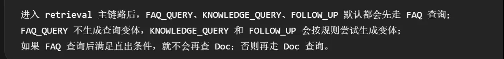

### stage3 faq查询

>如果之前满足FAQ精准直出条件但未满足一致性，则保存原问题候选集；再次进行faq时，是doc_query的非短问题或追问则生成变体，只针对变体进行混合检索(redis中获取，没有再混合检索，返回到redis中)，合并通过faq_id去重，相同保留最高分，然后再进行精排rerank
>
>判断相关性分数是否>阈值(检索策略)，满足直出，否则doc_query
>
>如果是faq_query，则针对原问题结果进行阈值判断
>
>ps：按检索计划在执行faq混合检索，并把耗时、最高分写入检索诊断信息

### stage4 doc查询

>doc_query的非短问题或追问则生成变体，且faq查询没有标准直出，则进行doc查询，先在redis缓存中查询，没有再去milvus中检索，检索到返回redis
>
>ps：按检索计划在执行faq混合检索，并把耗时、最高分写入检索诊断信息

### stage5 上下文

>Stage 5 的 `prepare_answer()`：先筛选和格式化上下文，再把历史、问题和证据填入 Stage 2 已选定的 Prompt Profile，形成真正发送给 LLM 的 User Prompt。

>如果faq标准直出没有满足阈值，则把faq候选集和doc候选集均写入提示词

**从FAQ+文档候选中，按分数、长度和条数约束筛选最终进入LLM prompt的上下文片段**

>FAQ 命中：过滤分数hit.score >= plan.min_context_score → 取前 2 条 → 转成"常见问题 + 标准答案"格式
>
>文档命中：过滤分数 → prefer_table 时表格行优先 (判断是表格类问题，那就把表格结果排到上下文前面，因为表格答案比普通文本更精准)→ doc优先用 parent_content

>去重：同一个 FAQ 或同一个父文档块，只进入一次。
>
> final_context_top_n最多片段数约束
>
>max_context_chars单条长度约束并metadata标记截断 max_context_doc_chars总上下文长度约束
>
>取faq和doc两个中的较高值为最终的分数

>最终如果为空，则hit_type = insufficient_context，不走 LLM 生成，直接返回“信息不足，无法确认”。

**总结：**

Stage5 按“分数达标 → FAQ最多2条 → 表格问题表格优先 → Doc用父块 → 去重 → 限片段数 → 限单条长度 → 限总长度”的规则，筛出最终进入 Prompt 的上下文。

### stage6 llm流式生成

>调用langchain chatmodle 流式生成答案片段，包括系统提示词和用户提示词(上下文和问题)
>
>llm.stream()一次输入多次输出

缺少答案置信度！

### stage7 结束收口

>不负责再检索或生成内容，而是保证所有分支都以一致的方式结束：保存最终答案、补齐诊断信息、写入 Trace，并向前端发出 `end` 或 `error` 事件。它是整条在线链路的出口。
>
>保存一轮完整对话：问题+助手回答
>
>向trace和前端发送结束：耗时、来源列表、意图、检索诊断信息、答案置信度

不走llm的没有答案置信度，将之前的置信度作为答案置信度即可

**Stage 7 就像问答请求的交付台。前面不管走的是模型生成、FAQ 直出，还是信息不足，最后都要在这里把最终答案、诊断和 Trace 统一交出去；如果失败，也在这里把内部错误变成用户可理解的提示。**

# C.Web服务基础设施

## 一、FastAPI与异步Web框架

### 1.同步与异步

#### 同步与异步

>同步：线程处理单个请求时会被I/O占住，cpu处理完A，才能去处理B
>
>异步：当一个操作在等待时，让cpu先去处理其他请求

#### 为什么rag系统要异步？

>rag系统是IO密集型，以下操作，大部分时间都在等待外部系统响应，异步处理可以让服务器在等待期间处理其他用户的请求：查milvus\读mysql历史\加载embedding\计算embedding\调用LLM api

### 2.fastapi

#### fastapi作用

>fastapi是python web框架或应用，通过使用uvicorn轻量级、异步服务器部署，对外提供api接口

#### fastapi特点

>原生异步支持：直接使用async/await
>
>自动生成api文档: api/docs
>
>基于pydantic的数据校验
>
>websocket支持

#### 路由

>单文件写所有api会导致文件过程，fastapi提供了apirouter来做模块化拆分（其实就是分类）
>
>eg:
>
>app.include_router(pages.router) app.include_router(chat.router)

#### padantic数据校验

>用 Python 类型注解定义数据结构，运行时自动校验类型。
>
>FastAPI 使用 Pydantic 模型做请求/响应的自动校验。当前项目里，在线问答只走 WebSocket payload；HTTP 请求模型只保留给检索诊断接口

#### cors中间件

>跨越资源共享，浏览器的安全机制
>
>跨域：协议、域名、端口不同
>
>作用：后端响应里自动加上合适的 CORS 响应头，告诉浏览器“哪些前端来源可以访问我”。
>
>允许配置列表里的前端站点，带着登录/认证信息，用 GET、POST、DELETE、OPTIONS 方法，携带任意请求头来访问这个 FastAPI 后端。

#### 应用声明周期于依赖注入

>BGE-M3、Reranker 和 Milvus Collection 在独立预热线程中加载；`lifespan` 的启动阶段再通过 `wait_for_retrieval_warmup()` 等待结果。这样不是“后台慢慢加载、用户先提问”，而是“模型和连接就绪后服务才开始接收问答流量”。

#### 静态资源挂载

>把服务器的某个文件夹，映射成浏览器可以访问的路径

### 3.websockert协议

#### 为什么需要websocket

>LLM生成结果是逐token显示，流式输出；如果等完整答案生成后再去给用户，时间久5~10s、体验不好。

#### http和websocket区别

>http建立连接后，客户端发送，服务端响应后，通信就结束了
>
>websocket协议-**全双工通信协议**，建立连接后，服务端可以持续向客户端推送消息(逐token)，不需要客户端反复请求

#### websocket的限流

>目的：防止恶意攻击
>
>设置1分钟内的同一个用户同一个id...的访问次数

#### 流式事件协议

>本项目定义了一套事件协议，主流程通过 Generator 产出不同事件：start、status、token、end、error
>
>{"type": "start", "session_id": "..."} # ↓ 告知前端：请求已接收，准备展示答案区域
>
>{"type": "status", "message": "正在识别问题意图..."} # ↓ 告知前端：当前进行到哪一步了
>
>{"type": "token", "content": "入职"} {"type": "token", "content": "流程"} {"type": "token", "content": "包括"} # ↓ 逐字推送，前端实时渲染
>
>{"type": "end", "sources": [...], "answer_confidence": {...}, "intent": {...}, "retrieval": {...}} # ↓ 告知前端：回答完毕，附带来源引用和诊断信息

## 二、应用入口和环境前置校验

**该项目的优化点！**

### 1.前置校验Preflight Check

#### 目的!

>启动时(服务器正式启动前)花费几百毫秒做全面检查，保障线上无配置事故，提前暴露问题(只用知道目的即可)

#### 检查顺序

让最快速的检查先阻断，网络层面的问题最后暴露

>1.占位符检测
>
>环境配置文件中配置值校验(api key、admin token 管理后台token)
>
>2.本地路径检查
>
>校验本地目录或文件存在（模型、场景文档、faq csv等文件）
>
>3.网络依赖连通性
>
>tcp连接校验，uri格式是否合法和连接是否可达(milvus、mysql、redis)
>
>5.mysql url 校验

>一次性初始化运行期mysql表结构
>
>是否存在active知识库版本
>
>意图模型，并样本测试
>
>llm大模型
>
>在线程中预热 BGE、Reranker 和全部场景 Milvus Collection，但 `lifespan` 的启动阶段会等待 `ready`。预热失败或超时会让服务启动失败，不能把冷启动成本留给第一个用户。

### 2.检索栈预热

#### 目的

>bge-m3 embedding模型加载和milvus的连接初始化都有首次访问延迟，有了预热后，第一个提问用户就不会有这些延迟，体验更好

#### 为什么在线程中预热、但启动必须等待？

>预热没完成：服务还不算真正就绪，问答入口不开放
>
>预热完成：lifespan 放行，服务正式可用

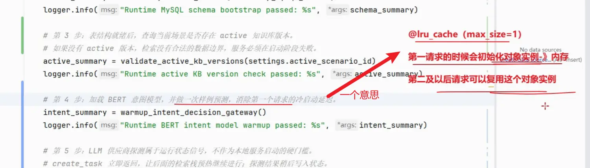

## 三、在线链路前端和后端交互

1.流程

>1.用户浏览器
>
>输入问题+选择业务分类
>
>⬇ websocket建立长连接
>
>2.WS api/stream
>
>在线问答唯一入口
>
>⬇
>
>3.websocket入口层
>
>接受连接
>
>消息级别限流
>
>解析json QAserver->stream_query

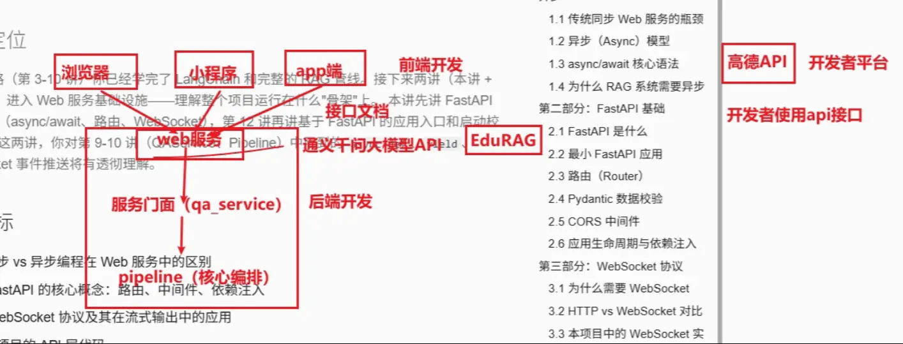

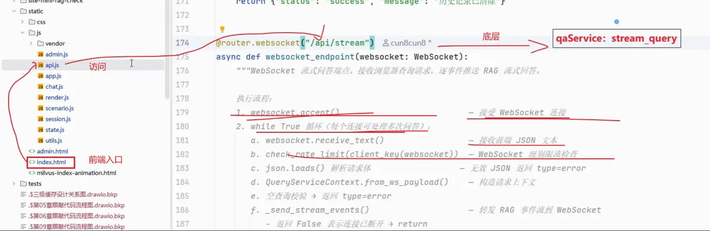

# D.治理与生产化

## 一、rag离线链路

### 1.rag离线入库流程

>0.上传文档pdf\md\word\excel\csv...
>
>创建/确认知识库版本(mysql中)
>
>⬇
>
>1.文档加载
>
>不同文件使用不同加载器textloader
>
>结果为Document对象(page content,metadata)
>
>⬇
>
>2.文档标准化
>
>给元数据增加业务数据，比如：场景id、因为分类等
>
>去重检测，添加指纹(哈希code 唯一标识)
>
>⬇
>
>3.文档切分
>
>使用markdown切分，因为md切分器是**按标题层级切分的**
>
>父块切分 用来召回
>
>子块切分 用来检索
>
>⬇
>
>4.子块向量化
>
>beg-m3稠密向量、bm25稀疏向量
>
>⬇
>
>5.文档入库
>
>使用langchain_milvus实现
>
>建表、建索引、insert&upset+flush从内存持久化到磁盘 、加载到内存方便之后查询
>
>离线入库加载时机：手动或自动定时
>
>⬇
>
>6.索引清单！                                                                             |                             7.faq 入库(并行,加载、向量化)
>
>引入式增量更新，只对发生改变文件入库
>
>mysql中索引清单，包括文件名、路径、修改时间、指纹等
>
>一旦发生资料更新，则指纹发生变化
>
>未变化 chunk 继续被有效期视图引用，
>
>变化文件才重新 embedding、版本序列发生变化。
>
>​                   ⬇                                                                                                                 ⬇
>
>​                                                                 8.生成入库质量报告
>
>​                                   合格则激活，不合格则不激活修复后重跑(使用本次不合格的知识库版本)
>
>​                                                                                ⬇
>
>​                                                                      9.知识就绪

[KnowForge RAG Platform - 业务流程动画](../courseware/animation/business-flow.html)

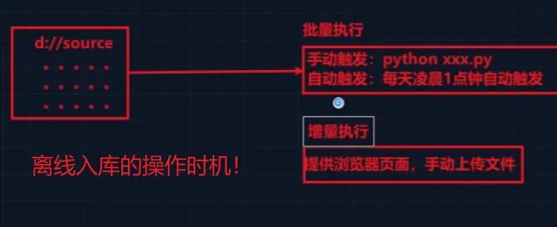

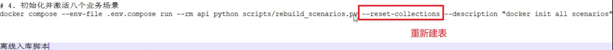

注意：生产环境 场景配置和代码文件应该是分开的，不能在同一个服务器上，否则如果发生变化，每次都要构建

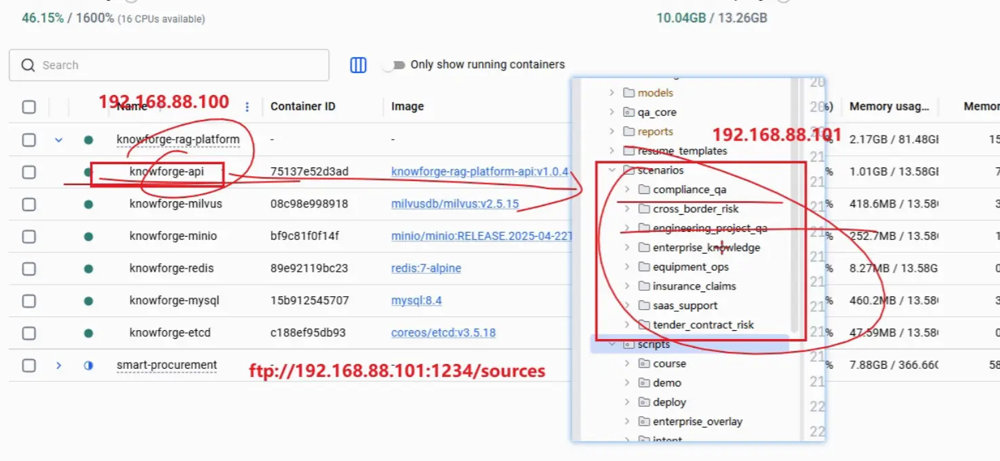

### 2、前置知识

#### 离线链路和在线链路的边界

>离线链路（入库）                                          在线链路（问答）
>─────────────────                    ─────────────────
>定时/手动执行                                              每次用户提问时执行
>修改 Milvus 数据                                          只读 Milvus 数据
>可以慢（几分钟到几十分钟）                      必须快（秒级响应）
>可以重试、可以回滚                                    必须一次成功
>解析文件、切分、向量化                             只做检索、不解析文件

#### 引用式增量

>引用式增量版本doc：增量式更新，因为数据量大
>
>全量faq：每次更新覆盖之前的所有的，因为数据量少

文档检索表达式不再等价于 `kb_version == active`，而是用 active 版本序号解释有效视图：

>valid_from_seq <= active_seq
>and (valid_to_seq == 0 or valid_to_seq > active_seq)

注意：kb_version是知识库的指纹，在kb_version表中能根据指纹找到对应的vaild_from_seq和vaild_to_seq，知识库的更新、回滚通过它

### 3.按阶段拆解

>ps:文档入库有三种情况：第一次、新增、质量门禁未过修复后重新入库
>
>mysql数据库用来进行知识库的版本控制
>
>milvus向量库是用来存储知识库的具体内容
>
>所以入库两个都会用到

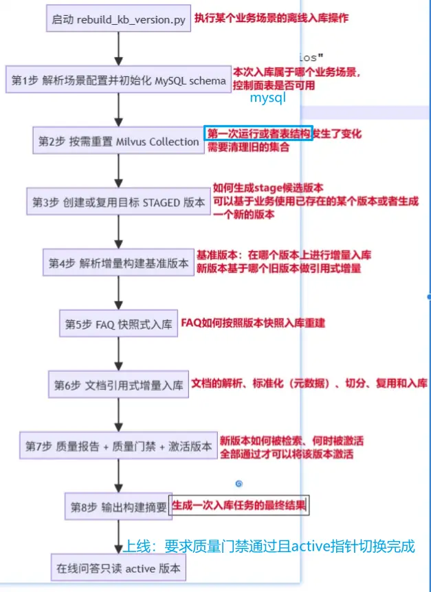

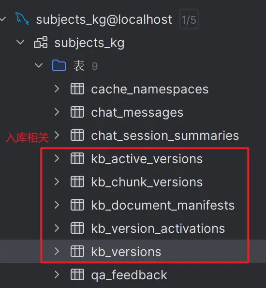

#### 第一阶段 解析场景配置并初始化mysql表结构

- 场景配置如何决定资料目录、FAQ 文件、Milvus collection 和 source 白名单。

  >通过scenarios结构可以知道，准备faq.csv、scenario.toml、data(ppt、doc...)

  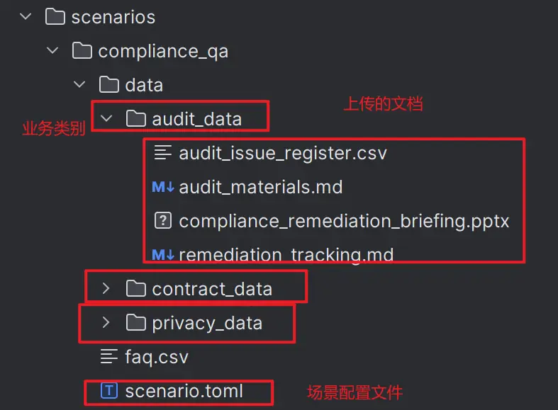

- 为什么入库开始前必须初始化 MySQL schema?

  >存储版本号管理、控制面表？

- 为什么场景配置是离线入库的第一道业务边界?

  >需要知道入库属于哪个业务场景才能创建对应的表等..
  >
  >入库时作为动态字段写入向量数据库，检索的时候过滤

##### 详细步骤

>1.解析场景配置文件
>
>根据args.scenario扫描配置目录并加载scenario.toml文件，返回字典{scenario_id: ScenarioDefinition}字典
>
>2.初始化mysql表结构，上述图中的表均初始化了
>
>读取配置setting中mysql的uri和数据库引擎
>
>对所有运行时表名做 SQL 防注入标识符转义（反引号包裹）。
>
>调用 run_runtime_schema_sql()执行ddl sql语句建表，返回数据库名、表、sql语句文件路径、语句数量

#### 第二阶段 按需重置milvus collection

- 什么情况下需要 reset collection？

  >第一次运行时
  >
  >milvus表结构发生变化了（schema 变化、索引变化、BM25 BuiltInFunction 迁移时）

- 为什么 reset collection 不能和引用式增量同时使用？

  >reset collection后就没表或数据了
  >
  >增量时不知道基准版本

- Milvus collection schema 和当前 Hybrid Search 实现之间的关系。

  >milvus表结构中需要有稀疏、稠密向量字段

##### 详细步骤

>确保库存在和按需删milvus表!
>
>`--reset-collections`参数不存在则直接返回跳过该步骤；
>
>存在则先判断是否有milvus数据库，没有库则创建，有则跳过；
>
>再判断milvus库中是否有faq_collection和doc_collection表，有则删除，没有则跳过
>
>对于第一次运行来说目的是：确认库存在
>
>对于结构发生变化来说目的是：删表

>  - 如果配置了 MILVUS_DATABASE 且 Milvus 里没有这个 database：创建 database
>   - 如果已经有：跳过
>   - 如果没配置 MILVUS_DATABASE：默认库逻辑，不额外创建

#### 第三阶段 创建或复用目标stage版本

- `kb_version` 和 `version_seq` 的区别。

  >kb_version是知识库版本
  >
  >version_seq是版本序列号，版本查询的边界，在版本回滚或更新的时候使用

- 为什么新版本先是 STAGED？

  >入库质量报告和质量门禁通过后，才可以激活，激活后版本才可以线上查询

- `ensure_version()` 如何决定创建新版本还是复用已有版本？

>见下方

##### 详细步骤

>目的：第一次运行时创建知识库版本、之前知识库版本入库失败时再次写入
>
>是否创建新版本条件：（1）有new_version参数时，创建新知识库版本
>
>（2）无new_version、kb_version参数、未查到激活知识库版本时，创建新知识版本库
>
>创建：
>
>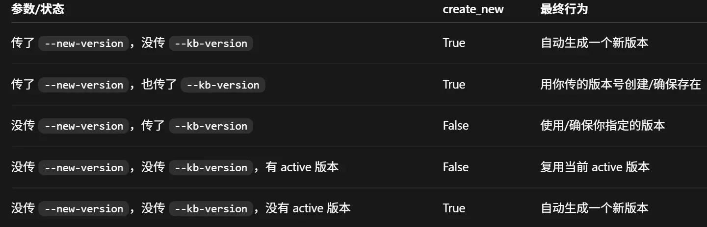
>
>判断：版本号是否存在mysql数据库表中，存在直接返回；否则插入数据(所有字段构建，包括新建版本的`version_seq`版本序列)到kb_versions表中
>
>最终：得到stage知识库版本、kb_version插入数据成功，后续faq&doc入库均使用它

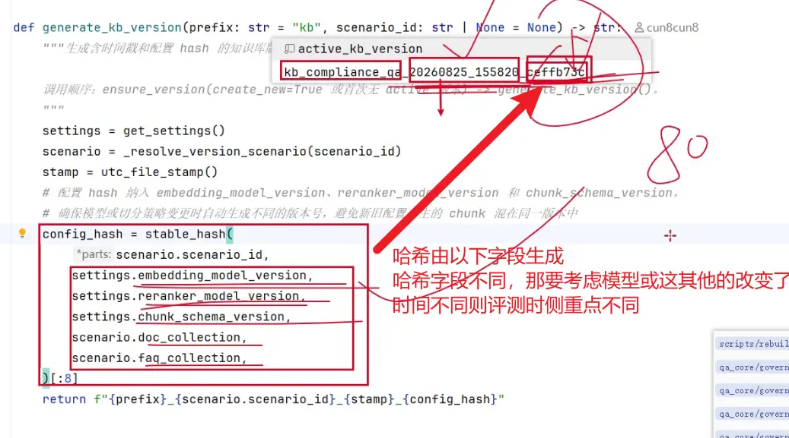

#### 第四阶段 解析增量构建基准版本

- `--incremental-from active` 和显式版本号的区别。

  >增量基准版本为active

- 为什么增量基准版本不能等于目标版本。

  >等于就是全量入库，不是增量

- 增量基准如何影响第 6 步的文档入库。

  >与基准对比，哪个文件变化了，哪个没变化

##### 详细步骤

>目的：为了解析并记录增量基准版本
>
>读取当前激活版本或指定版本为基准版本，创建增量版本，写入mysql中的kb_version表的stats_json字段，并记录其基准版本
>
>如果基准版本和目标版本相同base_kb_version == target_kb_version，则报错
>
>目的：进行对比，新版本基于哪个旧版本进行引用式增量，有哪些文件进行了变动
>
>问题：基准版本查询的时候，用的是版本序列还是什么？

总结：上一步创建目标版本的控制面记录；这一步补充目标版本和基准版本的继承关系；真正入库时才根据两者的 `version_seq` 设置或更新 chunk 的有效区间。

#### 第五阶段 FAQ入库

用第三阶段的知识库版本号，进行全量入库

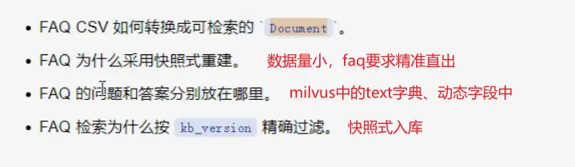

##### 详细步骤

加载faq_csv文件，生成document对象获得数据，langchain_milvus转为向量入库，入库完成mysql记录操作

>把当前场景的 FAQ CSV 转成“问题向量 + 答案 metadata”的 FAQ 文档，写入该场景的 FAQ Milvus collection，并把本次写入数量记录到对应 `kb_version` 的版本统计里。

>（1）解析场景配置，获取当前知识库版本号（新建或传入知识库版本号或使用active）
>
>（2）加载、解析csv文件，构造document对象，为入库准备
>
>faq_csv文件每行生成一个document，question放入page_content,metadata元数据包括标准答案、source、数据域隔离信息(租户id、数据集、可见级别 、角色)、版本；重复(问题+答案)自动跳过，因为不能保证csv文件是很标准、无重复的
>
>faq_id是由场景id、kb_version、source、问题组成哈希值（每行为一个faq_id）
>
>如果问题一样，但答案不同，则将答案也加入哈希值
>
>（3）向量化入库，使用add_documents()隐式入库
>
>text对应问题、动态字段对应元数据
>
>（4）入向量库成功后，根据知识库版本号在kb_versions中的stats_json字段中写入内容，见图
>
> ps：新增kb_version的话 就是全量生成，旧版本上重新入库的话，就是先删除本次入库相同id，再新建

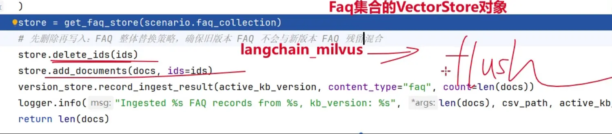

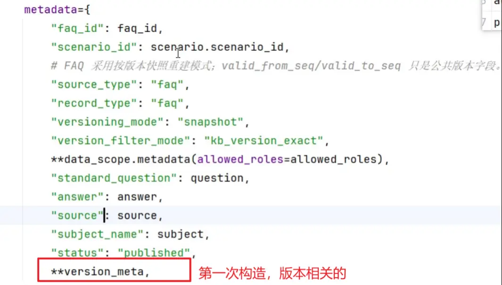

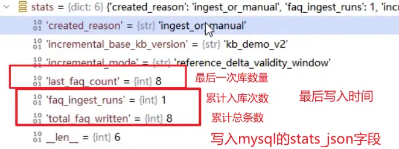

#### 第六阶段 文档入库

>按场景 source 目录批量入库文档”的入口；核心业务逻辑是通过 fingerprint + manifest 判断每个文件是否需要重新 embedding，并用 `kb_version/version_seq` 管理新旧版本文档 chunk 的可见性。
>
>`chunk_schema` 是切片规则和切片时的相关信息
>
>`chunk_id` 是每个文档切片的唯一 ID

##### 详细步骤

（1）判断是跳过、复用、重建哪种，只有重建需要加载、切分...

文件是否变化，来判断是否重新入库：通过指纹(路径、修改时间、文件大小)+配置（embedding模型版本、chunk schema version）

如果同一 `kb_version` 下文件无变化，则跳过；如果跨版本增量且文件 fingerprint、embedding 版本、chunk schema 都一致，则复用基准版本 chunk，把基准版本的 `chunk_ids` 写入目标版本 manifest；如果跨版本增量中文件变化，则先把基准版本旧 chunk 的 `valid_to_seq` 设置为目标版本 `version_seq`，再重新加载、标准化、切分、入库，生成新 `chunk_id`，新 chunk 的 `valid_from_seq` 为目标版本 `version_seq`；如果基准版本有文件但目标目录已删除该文件，也把该文件旧 chunk 的 `valid_to_seq` 设置为目标版本 `version_seq`。

（2）加载和标准化

原生加载器、docling

docling加载器：比原生的更加智能，融入计算机视觉，对资源和性能消耗大，作用是把复杂的文件转成markdown

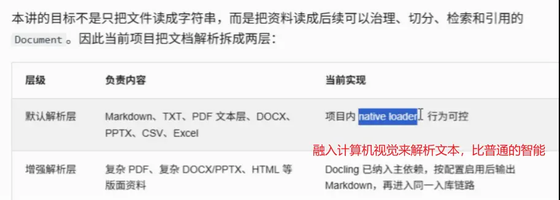

面试：使用多模态大模型识别图片，转成语义，而非ocr

不需要考虑事务一致性，写入失败，再来一次即可

(3)切分

表格行和已复核ocr不切分，整行或整段作为唯一块

markdown：标题切分再递归文本切分

其他文本：递归文本切分

(4)转向量入库

表格入库重点！ 一行数据就是一个文档块，携带表格字段和内容一起入库add_documents()，类似key:value，kb_chunck_version插入对应记录数据

#### 第七阶段


## 二、质量评测

### 1.为什么需要系统化评测

传统软件测试通常是二元的（通过/失败）。但 RAG 系统的输出是**自然语言文本**，不能简单地用 `assertEqual(expected, actual)` 来判断。

>问题："入职流程有哪些步骤"
>
>预期行为：
>  ✅ 召回了正确的文档片段（检索质量）
>  ✅ 答案包含了流程的完整步骤（完整性）
>  ✅ 答案基于提供的资料而非幻觉（忠实性）
>  ✅ 来源引用正确（可溯源性）
>
>❌ 这些指标不能用一个简单的 test case 覆盖

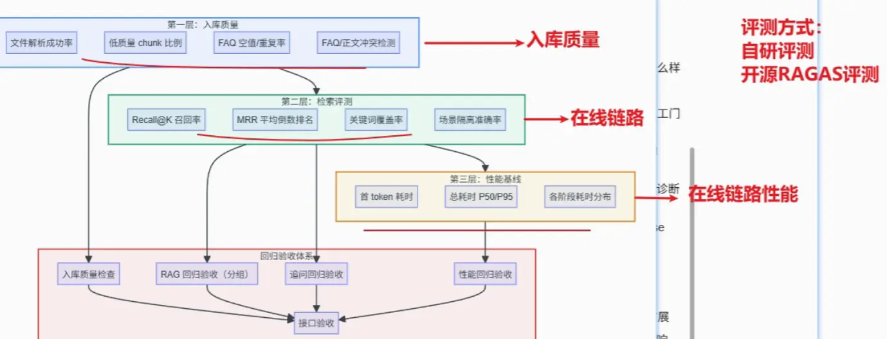

评测数据集合来源：人工标注的、线上用户真实数据

具有典型代表意义的才能放入评测数据集合，比如再哪类问题上效果不好

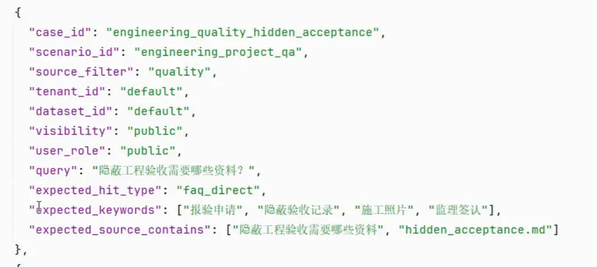

自研评测为主：自定义评测样本，有业务信息；可以评测检索和生成

开源评测为辅：ragas开源评测框架，核心思想用llm模型评估llm

因为需要看到更加详细的信息


